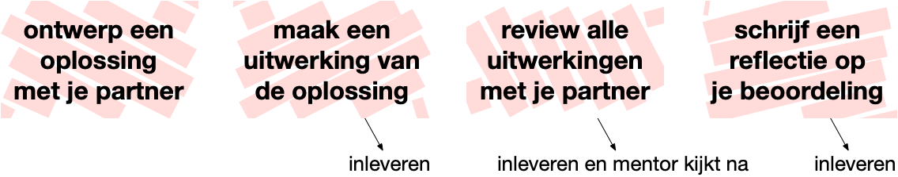
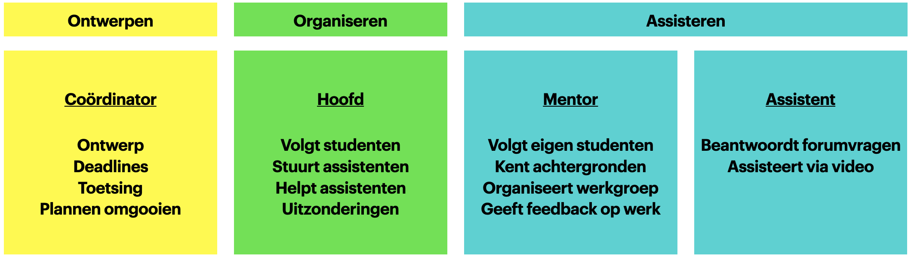
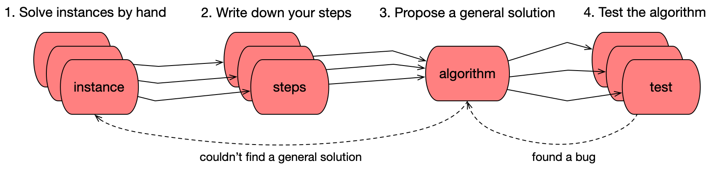
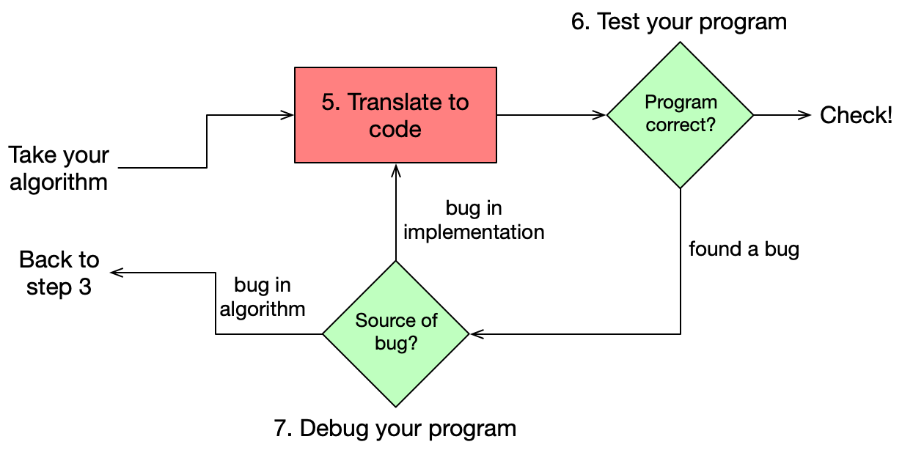
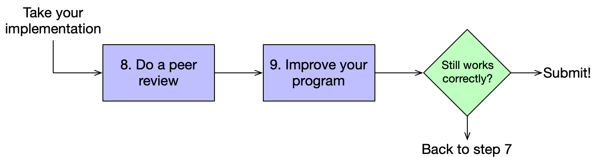
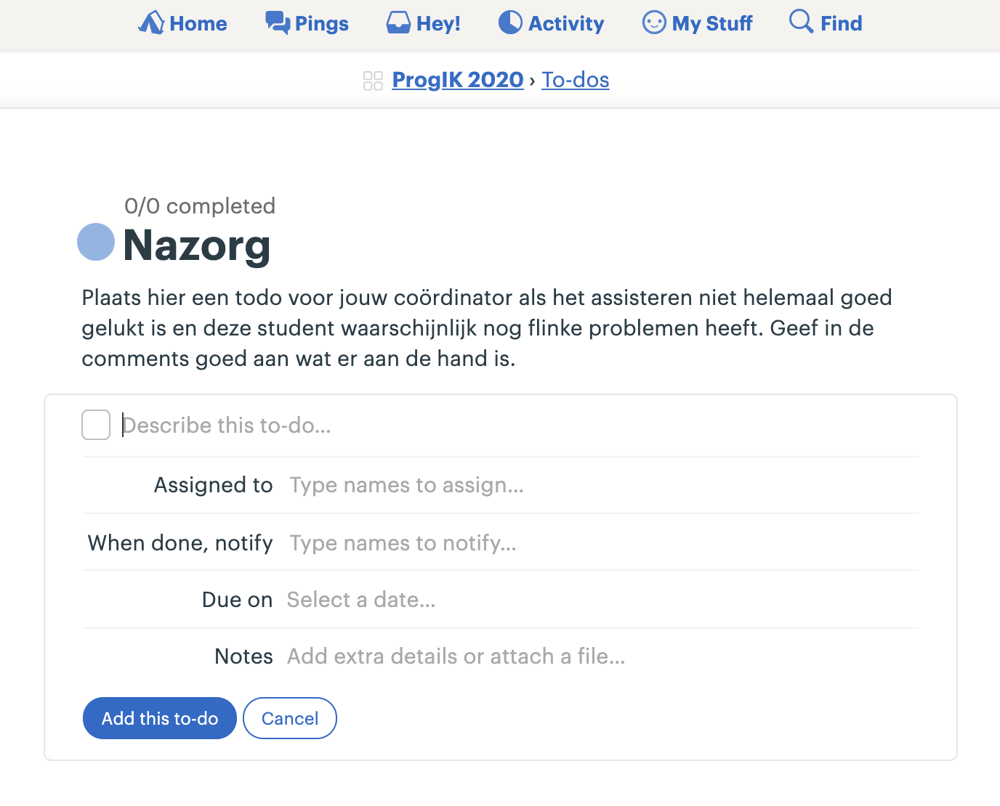
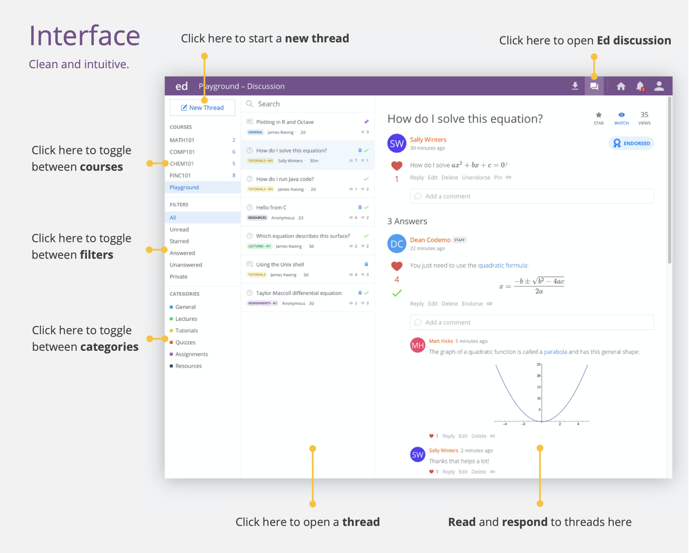
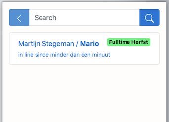
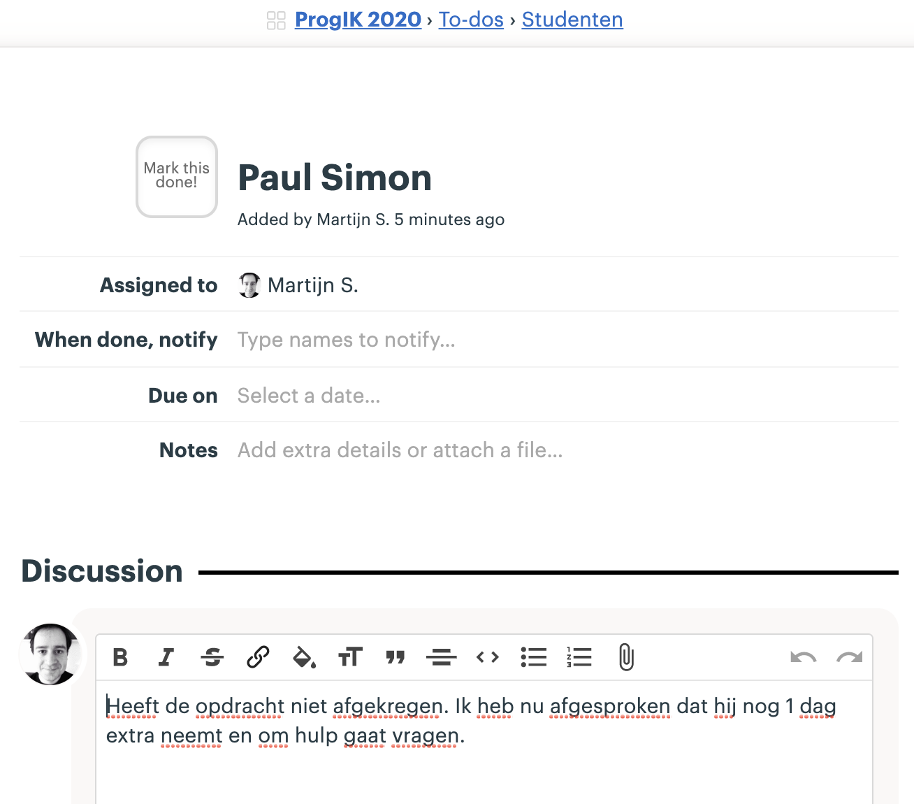

<meta http-equiv="Content-type" content="text/html;charset=UTF-8">

# Assistentenhandboek Minor Programmeren

## Martijn Stegeman versie augustus 2020

<small>Gebaseerd op versie 2016 door Hella Haanstra en de instructies uit 2018 van Wouter Vrielink.</small>

⌧ De onderdelen met dit symbool gelden **niet** voor de programmeervakken van Informatiekunde/Kunstmatige intelligentie.

# 0 What's new

Voor studenten/assistenten die er vorig jaar bij waren.

- De meeste assistentie wordt weer aangevraagd via het "Hands"-systeem, zelfs al doen we alles online.
- Mentoren hebben een kleinere groep (8--12) studenten maar nemen meer verantwoordelijkheid: zij zorgen dat elke student goed de cursus kan volgen.
- Studenten uit de verschillende groepjes hebben vrijwel geen onderling contact: elke groep is in feite een eigen "klas".
- Er is een nieuw stappenplan voor het uitwerken van opdrachten. Het verzinnen van een oplossing is losgekoppeld van het implementeren in code.
- Er is meer expliciete samenwerking tussen studenten, namelijk bij het verzinnen van oplossingen en het reviewen van code. Maar: de implementatie blijft individueel.
- Geen toetsjes maar enerzijds korte opdrachtjes voor de werkgroepen en anderzijds random oefeningen online.
- Hackeropdrachten heten nu "extra opdrachten".
- Er is nog maar één extra opdracht per module, namelijk de "moeilijke". De relatief makkelijke hacker-opdrachten gaven vorig jaar de indruk dat het voor alle studenten bedoeld was, wat dan weer tot teleurstelling leidde bij latere opdrachten.
- Nieuwe opdrachten:
  - Module 4 **Filter**, was vorig jaar al nieuw
  - Module 6 ... hier worden misschien een paar andere opdrachtjes gebruikt
- De website is veel sneller door gebruik van [Turbolinks](https://github.com/turbolinks/turbolinks).

# 1 De Minor Programmeren ⌧

Het doel van de Minor Programmeren is om studenten die **geen** programmeerervaring hebben een **veilige** omgeving te bieden om te leren **programmeren**, om kennis te maken met ideeën uit de **informatica**, en om ervaring op te doen met **technieken** uit de software engineering.

Het programma is als volgt:

- **Programmeren 1**

  0. Scratch
  1. C
  2. Crypto
  3. Fifteen
  4. Graphics
  {: start="0"}

- **Programmeren 2**

  5. Mispellings
  6. Python
  7. Hangman
  8. Adventure
  {: start="5"}

- **Programmeerplatform**

  1. Homepage
  2. Blog
  3. Books
  4. Pizza
  {: start="0"}

- **Programmeerproject**: een volledig zelfgedefinieerd project

- **Programmeertheorie**: een project uit de heuristiekencatalogus, met teamwork

De meeste vakken kunnen naar keuze in fulltime of parttime gevolgd worden. Studenten maken deze keuze al bij de aanmelding. Alleen Programmeertheorie wordt uitsluitend in de 4-weekse periodes in januari en juni aangeboden en is dus voor alle studenten fulltime.

# 2 Wat is CS50?

CS50 is een cursus *Introduction to Computer Science* van Harvard[^2]. Bij de minor Programmeren splitsen we de cursus in twee delen waarvoor studenten zich afzonderlijk inschrijven: Programmeren 1 en Programmeren 2. Ook bieden we enkele vakken buiten de minor aan die op dit materiaal gebaseerd zijn. In deze handleiding gaan we voornamelijk in op de wijze van assisteren die voor deze vakken van belang is, omdat beginnende assistenten allereerst bij deze vakken aan de slag gaan.

- Programmeren 1 is een echte inleiding tot het programmeren, waar basisconcepten zoals loops, arrays en algoritmen voorbij komen. Er wordt geoefend met **problemen oplossen** en met de werking van een **programmeertaal** (C).

- Programmeren 2 behandelt de basis van **datastructuren** en **objectgeorienteerd** programmeren. Eerst datastructuren "met de hand" opbouwen in C, en dan kijken hoe Python een heleboel kant-en-klaar aanbiedt.

- Daarnaast zijn er enkele aangepaste versies van de cursus die ingekort zijn, of waar het tweede deel vervangen is door andere Python-opdrachten (Programmeren Beta-gamma, Programmeren IK, Introductie in Programmeren).

De meeste studenten die onze vakken volgen hebben weinig tot geen ervaring met programmeren. Precies voor hen is CS50 ontworpen. Toch kan het niveau van studenten erg uiteen liggen, en daar moeten we rekening mee houden bij het ontwerp en de begeleiding.

Studenten zullen verreweg de meeste tijd besteden aan het maken van grotere **programmeeropdrachten**. Elke cursusmodule bestaat uit enkele van deze opdrachten. De werkwijze voor studenten is vastgelegd in een schema:

De werkwijze bij andere vakken in de Minor Programmeren is steeds aangepast op de verschillende soorten opdrachten die daar gegeven worden. Bovenstaande werkwijze wordt later in deze handleiding verder toegelicht.

Naast de opdrachten worden studenten geacht diverse **oefeningen** te maken. Het doel van de oefeningen is om studenten nadrukkelijk kennis te laten nemen van de basisconcepten van het programmeren. Deze concepten krijgen bij het maken van alleen grote opdrachten vaak minder aandacht.

Er is geen tentamen, maar wel systematische plagiaatcontrole, voorlichting naar studenten en de eis om zichtbaar te maken dat men bezig is met de stof, bijvoorbeeld de oefeningen en deelname aan de werkgroepen.

# 3 Taakverdeling

Bij de uitvoering van de cursus zijn de verantwoordelijkheden verdeeld over de stafleden. Als assistent heb je allereerst de verantwoordelijkheid om een aantal uur per week studenten uit de hele groep te **assisteren** met hun programmeeropdrachten, via een forum (Ed) of direct in een videogesprek. Daarnaast ben je voor een vaste groep studenten de **mentor**. Als mentor ben je het eerste aanspreekpunt voor de studenten in jouw groep. Het is daarom belangrijk dat je als mentor precies weet hoe de cursus in elkaar steekt en welke regels van toepassing zijn, voor zover die in de studiewijzer vermeld staan. Je leert de studenten uit je groep goed kennen en houdt nauwkeurig hun voortgang bij---zij melden bijvoorbeeld ziekte allereerst bij jou. Dit is bovendien de groep studenten van wie je het werk nakijkt.

De **coördinator** van een cursus werkt met de mentoren om de voortgang van alle studenten bij te houden. De coördinatie kan gedelegeerd zijn aan één of meer docenten of ervaren assistenten. De coördinator heeft toegang tot de resultaten en inzendingen van alle groepen, en kan zo de verschillen goed zien en makkelijk de lastigere gevallen vinden. Voor inlichtingen over studenten zal altijd de mentor worden geraadpleegd. De coördinator is ook degene die assistenten helpt om goed hun werk te kunnen doen en heeft wekelijks contact met ze. Zo wordt het nakijkwerk altijd even nagelopen voordat de coördinator deze publiceert, en zo nodig worden assistenten om aanpassingen gevraagd. Tot slot verzorgt het coördinator de wekelijkse plagiaatcheck en eventuele gesprekken met studenten hierover.

De **examinator** heeft het totaaloverzicht over hoe de cursus in elkaar zit en heeft de verantwoordelijkheid om te zorgen dat elke student de cursus goed kan doorlopen en daarvoor uiteindelijk een passend cijfer ontvangt. Ook kan de examinator studenten helpen die niet goed meekomen en tussentijds hun plannen willen omgooien. De examinator dient bovendien als contactpersoon voor studieadviseurs, examencommissie e.d.

# 4 Contact

Er zijn vier manieren waarop studenten actief betrokken worden bij de cursus: hoorcolleges, werkgroepen, checkups en assistentie. Deze worden hier kort besproken. Over al deze onderwerpen staat uitleg voor studenten in de studiewijzer.

## 4.1 Videocolleges

De hoorcolleges worden grotendeels gegeven door David J. Malan van CS50 en zijn per video beschikbaar[^2]. Elke week worden de colleges die bij de problem set horen beschikbaar gesteld via de website. De hoorcolleges zijn vrij self-explanatory, van de studenten verwachten we dat hij/zij het in zijn/haar eigen tijd kijkt. Voor alle videocolleges zijn uitgewerkte aantekeningen beschikbaar op de cursuswebsite.

## 4.2 Werkgroepen

Werkgroepen worden online georganiseerd door de mentoren. In de werkgroepen krijgen studenten de kans om samen de voortgang te bespreken, de oefeningen door te nemen, tips uit te wisselen over het aanpakken van problemen en medestudenten en mentor beter te leren kennen. Gebruik van een camera is verplicht bij de werkgroep. Mentoren krijgen inhoud voor de werkgroepen aangereikt.

## 4.3 Checkup ⌧

Fulltimestudenten doen elke dag om 9:30 een video-checkup met hun mentorgroep, maar zonder de mentor. De bedoeling is om kort te reviewen hoe iedereen ervoor staat met de opdrachten en wat de plannen voor vandaag zijn. Dit is ook het moment waarop studenten weer even met elkaar kunnen afspreken, bijvoorbeeld om elkaar te helpen. Aanwezigheid kan niet gecontroleerd worden anders dan er regelamatig naar vragen. De mentor doet dit.

## 4.4 Assistentie

Elke student zou regelmatig hulp nodig moeten hebben tijdens het programmeren (maar niet teveel). Er zijn drie mogelijkheden:

- Vragen plaatsen op het online forum **Ed** kan op elk moment. Medestudenten worden geacht deze vragen zoveel mogelijk te beantwoorden. Waar dat niet lukt zullen assistenten reageren. Het is echter moeilijk om als beginner een goede vraag schriftelijk in te dienen. Dat betekent dat een vraagsteller soms uitgenodigd moet worden voor mondelinge assistentie om tot wederzijds begrip te komen.

- Elke werkdag tussen 13 en 17 uur is er **video-assistentie**. Studenten geven via de cursuswebsite aan dat ze hulp nodig hebben. Assistenten die aan het werk zijn krijgen inzage in de lijst met vraagstellers en werken deze op volgorde af. Zodra ze aan de beurt zijn krijgen studenten een linkje naar de videochat van de assistent die hen gaat helpen.

- Voor meer technische hulp (bijvoorbeeld met installatie) is het mogelijk een losse afspraak te maken. Hiervoor is een planningstool op **Calendly** beschikbaar.

## 4.5 Informatievergaring

Het contact dat we met studenten hebben is een belangrijke bron van informatie over hun welzijn en hoe het met de cursus gaat. Assistenten moeten daarom deze informatie (vermoedens/feiten) delen met hun coördinator via Basecamp.

# Nieuw: het stappenplan

> Deze uitleg over probleemoplossen is een nieuwe handleiding voor studenten. Zij gaan deze vanaf module 1 direct toepassen. Mentoren helpen studenten nadrukkelijk bij het volgen van dit proces en zorgen bovendien tijdens de werkgroepen voor het matchen van partners voor de delen waar samengewerkt zal worden.

Below you'll find three phases that you are going to move through will solving some module's programming problems. For each problem, you will first perform an **analysis** together with your partner. Then, you will **implement** a solution in program code by yourself (with generous help from the course's staff, of course). Finally, for all of the problems together, you will do a **review** with your partner to learn how to improve code.

## Phase 1: Analyzing the problem

Problems in this course are fairly large. Most of these problems have a couple of parts that work together. The first thing to do is to roughly identify those parts, because you can apply the method below on each of those separate parts. For example, many programs have a section that is responsible for getting user input, separate from the main algorithm. Having done that, proceed to step 1.

**Step 1. Solve instances by hand (with partner)**

You have read the problem description and are ready to start analyzing. To do this, come up with a number of **instances** of the problem, each of which combines some **input** with the expected **output**.

Most likely, your problem description already contains one or two examples of running the program, with accompanying solutions. Take two other examples and try to solve these by hand, predicting the outcome for each and carefully thinking how you actually get to the solution.

Do you have a problem getting to the right solution or finding how to make some calculation? That means that either the problem is **underspecified** or you might lack a tiny bit of **knowledge** from the problem domain. Try to figure out which one it is and ask for help if needed!

> **Intermezzo: Watch the walkthrough**
>
> Some of our problems come with a **walkthrough** movie in which some of the core assumptions and ideas are explained. If it appears that you lack some domain knowledge, it is likely that this is explained in the walkthrough.
>
> Ideally, you watch the walkthrough just after you have tried solving some of the problem instances yourself. Note that the walkthroughs often also explain practical matters of getting input and formatting output. The Steps only concern the core algorithm, so be sure to get back to the walkthrough as soon as you are ready to code your solution.

**Step 2. Write down your steps (with partner)**

The real analysis happens when you try to retrace your steps for solving the problem. Try to find which exact steps you are taking and writing those down. You would do this in plain language, writing instructions that you might give to someone else to work out the problem.

You might find that it's hard to do for some examples, because you can too easily "see" the answer, which prevents you from deeply analyzing it. In that case it is advisable to find more complicated example problems. This is also something you could ask help with if needed!

**Step 3. Propose a general solution (with partner)**

If you have three or four examples worked out, you should be able to start composing a more general solution. Carefully compare the different examples, finding which steps are similar and which are different. Especially note if you did something multiple times (how often?) and how this relates to the example.

If you can't quite find a difference, chances are that your steps are still too **abstract** and you may try specifying smaller steps. Also, try to work some more examples when you get stuck. Then, try comparing the steps again.

Your algorithm should again be written in plain language, but this time clearly specify what kind of input the algorithm can work with. If the algorithm is based on a number, what kind of numbers would be acceptable? If it is based on a string, what kinds of strings would be reasonable to use the algorithm with?

**Step 4. Test the algorithm (with partner)**

Now you can have a look if you can verify that your algorithm is correct. Take a few new test cases and very carefully trace the steps. To ensure that steps aren't **ambiguous**, you might also want to have someone else test the steps for you. Having precise steps that are not open to interpretation will make it easier to translate the steps into code.

Testing thoroughly might also reveal some fundamental problems in your algorithm. You may have made an **assumption** about the input that makes the solution easier to find, but prevents your algorithm working with other input. Ideally, you are able to fix these bugs before you actually start coding your solution.

## Phase 2: Implementing the solution

**Step 5. Translate to code (separately)**

Once you are satisfied that your algorithm is general enough, and you have tested it thoroughly with your partner, you can start translating it into a working program. Some actual program code may already be provided by us, so make sure that you download that and use it as a starting point. Identify the place where you should be implementing your algorithm.

For this step, you can switch from working with domain knowledge to working with knowledge of the programming language. You have already specified the steps to take and now need to translate these into the **constructs** that are available in your programming language. If you can't quite figure out how to translate a step, be sure to ask for help!

**Step 6. Test the program (separately)**

The simplest way to test your program is to use exactly those problem instances that you used in steps 1 and 2. You already know the correct solutions to those instances and should be able to verify that your program now provides the same solution when run.

However, if you see a difference, you may have made a **mistake** somewhere while specifying the algorithm or while implementing the solution in code. At that point, your job it to figure out where the problem might be. Again, this is an excellent point to ask for help if needed.

As soon as you find that your program appears to be functioning correctly, use the provided test tools to double-check that the course staff agrees that your program works according to the specification. At this point, you may unexpectedly find that the tool doesn't think it works! In that case, take special notice of the **formatting** of your program's output. Is everything exactly as expected?

**Step 7. Debug the program (separately)**

Have you found an apparent problem with the program? Then find out what is going on, either tracing it back to a **bug** in your implementation, or a more fundamental problem in the steps of your algorithm.

One thing to check is if you have a **systematic** error in your program or that it doesn't work for only part of the test cases. This may help you find the source of the problem.

## Phase 3: Reviewing the code

**Step 8. Peer review your programs (with partner)**

When everything is in order, and your program is found to be correct, you are going to do a peer review with your partner. The idea is not to compare your solutions per se, but more to **improve** each solution as it is.

The **goal** of improvement is to make the programs easier to read and to understand. For each module, several aspects are listed to look out for. Read the explanations about these aspects before doing the actual review. Try to stick to these aspects, and especially take care not to try to influence your partner too much with your own ideas. The goal of this part of the course is to have you practice with techniques to make code better.

First, take the programs of your partner and browse through them. Your partner listens to what you say as you are trying to read their programs. Try not to give advice, but instead **think aloud** about what happens when you read the programs. Your partner makes notes of what they would like to change or any problems that appear during the review. When you're done, your partner asks you about things that were not quite clear.

Then, your partner takes your programs and browses through those. Again, your partner will be thinking out loud while trying to understand your code, and you will be making notes. You will not be changing your code during the review, but ask for clarifications and even propose ideas when your partner is done.

**Step 9. Improve your programs (separately)**

After you have reviewed each other's code, you can each take to actually improving your own code. Always keep in mind that your partner's opinions don't matter as much as how they struggle to read or understand your code. This is not the time to do a complete overhaul of your algorithm to make it more efficient, but instead, to make note of small things that you can improve to make the code itself better.

## Phase 4: Feedback and reflection

After everything has been handed in, your work will be assessed by your mentor. This results in a couple of feedback points; these you could try to take into account for the next problems that you are going to submit.

As a final step, after reading and comparing your feedback with your own ideas, you will answer a few questions that are designed to help you incorporate the feedback into your own ideas. Your mentor will also check out the answers to your questions before assessing the next module.

# 5 Mentoren

Mentoren krijgen een groep van 8--12 studenten voor wie zij het **eerste aanspreekpunt** zijn bij de cursus.

## 5.1 Aanspreekpunt

Mentoren leren alle studenten uit hun mentorgroep goed kennen. Dat betekent dat ze na een paar weken het volgende weten over deze studenten:

- Eigen hoofdopleiding
- Programmeerervaring
- Comfort met programmeren, naar eigen gevoel
- Thuissituatie die wel/niet handig is voor online leren programmeren
- Werkt graag samen of niet
- Levert tijdig in
- Neemt goed deel aan de cursus en de werkgroepen

Hoewel mentoren de belangrijke details over hun studenten kennen, beperkt het contact met hun studenten zich wel tot zaken die van belang zijn voor het onderwijs.

Bij meer persoonlijke problemen proberen we altijd goed gebruik te maken van de faciliteiten van de universiteit, zoals studieadviseurs en studentendecanen. De examinator weet meer over de mogelijkheden en kan studenten verwijzen. De mentor hoeft dat niet zelf te doen, maar is vaak wel de eerste die de problemen signaleert.

Aan de andere kant ligt het voor de hand dat een mentor ook aanspreekpunt is voor klachten en voor grote frustraties die studenten opbouwen tijdens het programmeren. Dit kan naar boven komen tijdens de werkgroepen. Dat is geen probleem! Zie het niet als een persoonlijke aanval, maar als een noodzakelijke uitlaatklep. Ga er vooral niet in mee, en ga ook zeker niet in de verdediging. Het belangrijkste is dat studenten het kunnen uiten.

## 5.2 Groepsvorming

Bij online onderwijs is het vooral de groepsvorming die een stuk lastiger is dan bij onderwijs waar studenten continu met elkaar aan één tafel zitten. Daarom maakt elke mentor een **Slack** aan voor de eigen studenten, die zich daar allemaal moeten registreren. Slack is de plek waar praktische afspraken worden gemaakt en waar snelle vragen worden uitgewisseld. Contact is laagdrempelig. Maar: mentoren zullen *niet* permanent beschikbaar zijn via Slack. Dit wordt in de studiewijzer verteld en ook de mentor zelf zal dit bij de eerste werkgroep duidelijk maken. Coördinatoren zijn helemaal niet in de Slack te vinden.

Whatsapp is hiervoor geen alternatief. Sommige mensen geven hun telefoonnummer liever niet af (waaronder mentoren), dus Slack is de norm zodat hier geen enkel misverstand over kan ontstaan. Blijf de studenten verzoeken om alle onderwijsgerelateerde zaken via Slack ter sprake te brengen en zorg dat je zelf daar bereikbaar bent.

## 5.3 Werkgroepen

De werkgroepen zijn een plek om kennis te maken met je studenten, maar vooral om de studenten elkaar te laten kennen. In het volgende hoofdstuk staan de onderwerpen per werkgroep.

- Gebruik van de **camera** is voor de mentor en alle studenten vereist (ze laten weten als hun omgeving niet geschikt is om te kunnen videobellen, dan kijken we of we een alternatieve werkplek kunnen vinden).

- Indien het **minder goed gaat** met een student, zorg je voor een melding in Basecamp. Doe zelf geen beloftes en maak niet zomaar uitzonderingen, buiten wat er standaard in de studiewijzer staat. Laat de student zelf ook een mail sturen naar help@mprog.nl.

- Je hebt een belangrijke rol bij de **planning** van het samenwerken. Voor de ontwerpfase van de opdrachten hebben ze (bij voorkeur) een partner nodig. Voor de code reviews zorg jij voor een roulerend schema.

- De werkgroep is de plek waar de **feedback** en de **oefeningen** belangrijk worden gemaakt. Jij zorgt dat studenten van elkaars feedback kunnen leren door een aantal belangrijke patronen aan te stippen. En je bespreekt enkele van de gedane oefeningen (die bovendien vooraf zijn ingeleverd).

## 5.4 Doorverwijzen

Je hoeft je als assistent niet bezig te houden met:

- plagiaat
- serieuze studieproblemen
- persoonlijke problemen

Komt een van deze dingen naar voren, verwijs dit altijd door naar de cursuscoördinator. Vraag de student **ook** om zelf een mail te sturen naar <help@mprog.nl>. Maar studenten vinden het vaak moeilijk om verdere hulp te vragen, dus de mentor moet het ook direct melden. Het is belangrijk dat wij vanaf de eerste vraag om hulp medeverantwoordelijkheid nemen en een student niet aan z'n lot overlaten.

# 6 Assisteren

Zoals eerder uitgelegd kunnen studenten op drie manieren om assistentie vragen: via een forum, via het Hands-systeem, en voor de heel ingewikkelde vragen via een aparte afspraak.

Vragen stellen via het forum heeft de allergrootste voorkeur. Veel studenten zullen echter in het begin nog moeite hebben met het formuleren van een schriftelijke vraag. We stimuleren studenten wel zoveel mogelijk om dat te doen. Simpelweg omdat zij dan het meeste werk doen, en het meeste leren.

Als het **niet** lukt een student goed te helpen dan meldt de assistent dit altijd via een to-do in Basecamp ("Nazorg"). De coördinator kan dan zorgen dat men sowieso nog even bij de student nagaat of er al voortgang is, en zonodig extra hulp bieden.

{:width="50%"}

## 6.1 Regel één van assisteren is...

Het doel van assisteren is om studenten **verder te helpen** tijdens het leren. Dat betekent dat we altijd afwegingen moeten maken hoe we iemand helpen; een afweging gebaseerd op hoe de student ervoor staat, of de vraag goed gesteld is, of er nog genoeg tijd is tot de deadline.

Maar de belangrijkste regel is: **we geven het antwoord niet weg**. Dat antwoord kan verschillen: het kan een ontbrekende stap in het stappenplan zijn, het kan een regel code zijn of iets dat verkeerd staat. In plaats van studenten rechtstreeks vertellen wat ze moeten doen, moeten we ze helpen nadenken over wat hun volgende stap is.

> Maar het varieert wel! Blijkt de vraag in feite over het ontwerp van de oplossing te gaan, dan moet je iemand misschien helpen om een paar stappen terug te doen in het stappenplan. Maar gaat de vraag over een technische issue, dan kun je ze misschien wat directer wijzen hoe ze hun probleem kunnen oplossen, bijvoorbeeld door een foutmelding in Google te plakken. Tot slot kan het zijn dat je ziet dat een heel klein deeltje van de oplossing verkeerd is gekozen. Als dat moeilijk te vinden gaat zijn, dan moet je er misschien toch op wijzen.

Hou deze regel altijd in gedachten en maak een **bewuste keuze**. Je mag het ook best zeggen tegen studenten: "ik moet even nadenken hoe ik je het beste kan helpen zonder het antwoord weg te geven". Maar wel vriendelijk!

## 6.2 Soorten vragen

Tijdens het assisteren helpen we studenten op vier gebieden:

1. probleemdecompositie (fase 1 van het stappenplan)
2. implementatie (fase 2 van het stappenplan)
2. procesondersteuning (het stappenplan zelf)
3. vragen formuleren
4. debugging

Waarschijnlijk zijn er, zeker in het begin van de cursus, veel vragen die eigenlijk gaan over wat er in de **opdracht** bedoeld wordt. Het is niet altijd makkelijk om een goed overzicht te krijgen van de opdracht. In de walkthrough-filmpjes geeft Zamyla meestal een mooie decompositie voor het programma. Tijdens het helpen is het nuttig om te vragen of de student dat even wil opzoeken en dit samen nog even door te lopen. Meestal is het handig om de student naar het algoritmische deel van de opdracht te sturen, en later pas invoer/uitvoer goed te maken.

> Hoe kun je de invoer overslaan? Bij Greedy moet de gebruikersinvoer een float zijn, die vervolgens wordt omgezet naar een `int` vóórdat het algoritme ermee aan de slag gaat. Dus dat hele deel kun je vervangen door een `int input = 42;` waarin je het getal kunt aanpassen om te testen. Het geeft beginners vaak veel lucht als ze zo simpel kunnen beginnen met het moeilijkste deel.

In veel gevallen is het probleem van een student terug te leiden naar de eerste fase van het stappenplan. Hier wordt een ontwerp gemaakt van het algoritme waar we naar op zoek zijn. Dit wordt gedaan met zelfverzonnen voorbeelden en een nauwkeurige studie van hoe uit een invoer de uitvoer wordt "berekend". Is er een verkeerde **aanname** gedaan, of is een formule toch niet helemaal **correct**, dan is het vaak nodig om extra voorbeelden te bedenken en uit te vogelen waar het verkeerd zit. Zorg dat je in dit geval de student vraagt om dat te doen en later nog eens af te spreken.

Soms is het vooral **integratie** waar een student hulp bij nodig heeft. Er is aardig uitgewerkt algoritme, maar het overzicht ontbreekt nog. Hoe koppel je de invoer aan het algoritme en hoe zorg je dat het programma het juiste resultaat uitvoert? Dat kan nog best lastig zijn. Dit is onderdeel van de implementatie. Ook hier is het nuttig om de decompositie uit het walkthrough-filmpje even terug te halen (laat de student dit zelf opzoeken) en uit te vogelen waar het probleem zit.

En natuurlijk zijn er veel situaties waarin er een echte **bug** in het programma zit. Het programma zelf heeft al min of meer de juiste vorm, maar er worden bijvoorbeeld variabelen hergebruikt waardoor het niet goed loopt. Dat is het moment dat je hardop gaat meedenken over debuggingtechnieken. Het is aan assistenten om de student deze vaardigheden aan te leren. Natuurlijk kijk je eerst of de student eigenlijk wel weet hoe het debuggen moet (misschien eerst maar eens checken of alle variabelen de juiste waarde hebben met behulp van `printf`?).

> - Zorg dat je weet hoe de debugger in de CS50 IDE werkt! Vraag een mede-assistent of je coördinator als nodig.
> - Kijk voor een opfrisser in *Think Python*[^3], hoofdstuk 20: Debugging.

## 6.2 Ed

Ed is een vraag- en antwoordforum waar onze studenten in een afgeschermde omgeving vragen kunnen stellen. Er zijn aparte afdelingen voor CS50, voor Scientific Programming, voor Web Development en voor Programmeertheorie. Alle studenten van de cursussen die op CS50 gebaseerd zijn zitten bijvoorbeeld wel bij elkaar.

> Studenten moeten worden uitgenodigd voor Ed. Mocht iemand niet zijn uitgenodigd dan kunnen ze direct zelf de helpdesk mailen via <help@mprog.nl>. Nadat ze hun spam-folder gecontroleerd hebben natuurlijk!

Binnen elke cursus op Ed zijn er **categorieën** voor opdrachten, zoals bijvoorbeeld "Mario". Zo zijn de opdrachten per vraag te filteren. 

Helemaal onderaan de pagina van een vraag kan een student, of een assistent, een **antwoord** plaatsen. Is dat het definitieve antwoord, dan is dat zichtbaar met een groen vinkje. Tijdens het plaatsen van een antwoord kun je kiezen voor "Mark as answered", maar je kunt later ook op het vinkje klikken om dit om te zetten.

Een vraag schriftelijk stellen is best moeilijk, dus we moeten studenten helpen om dat op een goede manier te doen. Daarvoor is de makkelijkste manier om een follow-upvraag te stellen via het knopje "**Comment**" (of zoals hierboven "Reply").

Let dus op dat er een verschil is tussen Comments en Answers. Je kunt de één ook naar de andere omzetten. Het is dan ook de taak van de assistenten om de vragen goed te **modereren**. Comments en Answers omzetten, opvolgvragen stellen, een vraag als "Answered" markeren. Als dat allemaal goed gebeurd is het makkelijk om de vragen snel te beantwoorden en bijvoorbeeld de nog niet beantwoorde vragen te vinden.

## 6.3 Video-assistentie

Studenten kunnen een hulpvraag indienen via de website. Deze "hands" verschijnen voor de assistenten in een lijst op de website. Je kiest de bovenste student om deze te "claimen", waarna de student een popup ontvangt met een link naar jouw videokanaal. Zodra je bij een student geweest bent en de vraag beantwoord hebt, teken je het verzoek af. Je komt dan weer in de lijst en kunt een nieuwe student uitkiezen om te helpen.

Juist bij de video-assistentie is er een kans dat een student nog geen concrete vraag heeft. Help de student in dat geval de vraag formuleren zoals hierboven uitgelegd (6.2). Sommige studenten kunnen ook nog wat meer tijd gebruiken om **zelf** wat langer naar hun programma te kijken; probeer zelf een juiste inschatting van de situatie te maken om vervolgens te besluiten de student direct te helpen, of een duwtje in de goede richting te geven en later nog even terug te komen.

Ziet de code er **slecht** uit? Is de indentatie totaal niet op orde? Vraag de student dan altijd eerst om deze netjes te maken. Niet alleen omdat het "hoort" maar omdat verkeerde indentatie het probleem heel moeilijk vindbaar kan maken. Met een beetje mazzel is het daarna zo gevonden (studenten in de fase hebben overigens vaak ook nog een probleem met de formulering hun oplossing, dus kijk daar ook naar).

Het is mogelijk om een student **terug in de lijst** te plaatsen. Dit kan om twee redenen:

- Het kan zijn dat je deze student zelf korte tijd later nog even wil spreken. Vertel dit duidelijk tegen de student. Deze kan namelijk in de tussentijd ook geen andere vraag indienen! Vergeet het zelf ook niet.
- Of misschien kom je er niet uit met de vraagstelling en wil je heel graag dat een andere assistent de vraag overneemt. Dit kan alleen als er een andere assistent beschikbaar is; check dit persoonlijk via Basecamp.

Probeer gemiddeld 10 minuten per student aan te houden. Een absoluut maximum is 20 minuten. Duurt het langer, neem dan contact op met de coördinator om te kijken wat de beste aanpak is.

Komt de assistentie voort uit een vraag op Ed? Vraag dan de student om de manier van oplossen te delen door een antwoord te schrijven bij hun eigen vraag en deze als "beantwoord" te markeren. Is het een vraag die niet op Ed stond maar daar eigenlijk wel had gekund? Laat de student dit dan weten.

## 6.4 Technische helpdesk

Studenten die vastzitten met hun computer, misschien zelfs hardwareproblemen hebben, of die een zeer concrete technische (debug?)vraag hebben, kunnen een afspraak inplannen via Calendly. Er zijn enkele momenten per week beschikbaar. De assistenten die gewend zijn om voor dit soort problemen een snelle diagnose te stellen kunnen hierbij helpen. Het doel is om studenten zo snel mogelijk weer op weg te krijgen en niet te lang te laten hangen bij problemen waar ze weinig van kunnen leren.

## 6.5 Algemene gesprekstechnieken[^1]

- Complimenteer de student op een duidelijke manier. Kies voor 'heel goed antwoord!', 'zeker weten' of 'precies', etc. Probeer een droog 'ok', 'hmm', 'uhu' te vermijden. Ook als de student een langdradig antwoord geeft, probeer iets te vinden waar je positieve feedback op kunt geven.

- Laat je feedback betrekken op het specifieke antwoord van de student.

- Bijvoorbeeld als de student een for-loop voorstelt bij `mario.c`, antwoord iets in de trant van: 'heel goed, je ziet dat er een vorm van herhaling nodig is'.

- Probeer voort te bouwen op het antwoord van de student. Als het antwoord dat de student geeft niet helemaal naar wens is, probeer het dan mee te nemen in je volgende vraag. Iets als 'je hebt goed gezien dat je de String moet opdelen, wat is de volgende stap?' werkt motiverend.

- Probeer 'ja, maar...' te vermijden. Dit is een logische reactie op een (deels) fout antwoord, maar kan heel erg demotiverend werken. Probeer duidelijk te scheiden wat goed was en wat fout was en beloon daar ook naar. Je kunt ook de vraag stellen 'hoe ben je daarop gekomen?'; dit is tevens een vraag die je kunt stellen als het antwoord wel goed is!

- Doe geen aannames over wat studenten al weten. Een student kan soms met zelfs het makkelijkste probleem in de knel zitten en dan is het erg frustrerend als er wordt gezegd 'probeer eens wat harder na te denken'. Toets wat de student wel weet en bouw daarop voort. Stel open vragen en laat de student zelf het probleem oplossen, probeer niets voor te zeggen!

# 7 Nakijken

Het eindcijfer voor deze cursus wordt bepaald door het totaal aantal punten voor de modules. De puntenscore leidt tot een cijfer tussen 1 en 10. De Scratch-module word "afgetekend" en telt niet mee in het eindcijfer.

## 7.1 Deadlines

Studenten hebben voor de CS50-opdrachten **twee** deadlines:

- De deadline voor de **implementatie**, waarbij studenten de weekopdrachten "af" moeten hebben. De uitwerkingen hoeven expliciet niet netjes te zijn! Ook hacker-versies moeten bij deze deadline ingeleverd worden.

- De deadline voor de **verbeterde uitwerking**, waarbij alle weekopdrachten netjes verbeterd moeten inleveren. Dit geldt niet voor de hacker-versies, omdat deze niet inhoudelijk nagekeken worden.

Voordat studenten hun verbeterde versies inleveren moeten ze een code review doen met een andere student. Ook nemen ze natuurlijk de feedback van eerdere weken mee in hun verbeteringen.

De **nakijkdeadline** (voor jou!) is afhankelijk van de deadlines voor studenten, en valt op een vaste dag, tenzij anders afgesproken. Zodra jij klaar bent wordt het nakijkwerk nog nagelopen door de coördinator en vervolgens gepubliceerd.

## 7.2 Uitzonderingen

> Nieuw: de strafpunten voor te laat inleveren zijn vervallen. Toch is het niet de bedoeling dat studenten regelmatig te laat inleveren.

Als mentor heb je de mogelijkheid om studenten de ruimte te geven de eerste deadline (implementatie) met één of twee dagen **uit te stellen**. Dit is een pittige verantwoordelijkheid, omdat sommige studenten het signaal verkeerd kunnen interpreteren en hierdoor geen druk meer ervaren. Als je vermoed dat het misgaat, laat het dan *direct* aan de cursuscoördinator weten via een to-do in Basecamp.

De bedoeling is dat studenten jou op de hoogte stellen als ze de deadline niet halen en dat jij daar snel op reageert. Geef meteen aan dat ze nog een dagje kunnen nemen (maximum is dus 48 uur na de deadline). Natuurlijk is het niet de bedoeling dat dit meerdere keren achter elkaar gebeurt, en dat moet je meteen duidelijk maken in het eerste contact hierover.

Het kan ook zijn dat een student een keer niks inlevert en ook niks meldt. Daarom is het belangrijk dat je vlak na de deadline even in je overzicht kijkt of er nog iets ontbreekt. Neem dan **proactief** contact op met je studenten om te zorgen dat dit snel gecorrigeerd wordt---en ga er in eerste instantie vanuit dat het een foutje is.

## 7.3 Becijfering

Alle modules kunnen 1--6 punten opleveren. Voor elke module zijn diverse aspecten aangegeven op basis waarvan de punten voornamelijk (maar niet uitsluitend) worden bepaald. De aspecten gaan over codekwaliteit, en specifiek over **leesbaarheid** en **begrijpelijkheid**. De schaal is als volgt:

6. uitzonderlijk goede kwaliteit op basis van een doordacht ontwerp
5. zeer goede kwaliteit, beperkt ruimte voor verbetering
4. degelijke kwaliteit op de genoemde aspecten, met ruimte voor verbetering
3. net voldoende aandacht voor de genoemde aspecten, erg veel ruimte voor verbetering
2. enige zichtbare aandacht voor een beperkt aantal aspecten
1. onvoldoende zichtbare aandacht voor de kwaliteitsaspecten
0. (werkt niet, onaf)
{: start="6" reversed=""}

In deze schaal zitten een aantal patronen verborgen die het---met enige ervaring---makkelijker moeten maken om een inzending te beoordelen.

- 1--4 punten gaat specifiek over de *genoemde* aspecten, dus de aspecten die deze week expliciet aan de opdracht gekoppeld zijn. Bij 4 punten is de student redelijkerwijs waar we iedereen willen hebben. Onze aandacht bij het nakijken gaat dus vooral naar hen uit!

- Bij 3 punten zie je dat iemand wel de aspecten heeft "afgewerkt" maar niet heel consequent. Er is dus wel bewijs dat de student het kán, maar deze doet het niet overal. Bij 4 punten gaat het om een consequente ("degelijke") toepassing.

- Bij 3--4 punten (en hoger) wordt gevraagd dat naar álle aspecten is gekeken. Het is dus niet zo dat studenten de aspecten onderling kunnen compenseren! Zijn er hele goede namen maar staat er geen commentaar, dan is het meteen 2 punten.

- 5--6 punten gaat over goede kwaliteit, zonder de aspecten te noemen. Studenten die hoog willen scoren moeten dus namelijk zelf aan de bak met uitzoeken hoe je goede code schrijft---alleen de regels volgen voldoet dan niet meer. Dit is ook te voorkomen dat eigenwijze studenten hacker-achtige code schrijven en hoge cijfers opeisen omdat het formeel aan de aspecten voldoet.

- 6 punten heeft het ook over *ontwerp*, waarvoor duidelijk moet blijken dat een student een heel eigen idee voor de code heeft bedacht en dit mooi leesbaar heeft uitgewerkt; maar pas op, iets als "extra functies gebruiken" kan heel mooi worden, maar dan moeten ze goed gekozen zijn en de namen ook goed zijn, dus veel ideeën zijn niet zomaar goed!

Het is absoluut niet de bedoeling dat studenten **meerdere keren** minder dan 3 punten halen. Daarom heeft tijdige feedback de absolute prioriteit, en specifiek feedback die de student helpt volgende keer direct 3 of 4 punten te halen.

Als de opdrachten **niet af** zijn (volgens check50), dan kan er in feite nog niet nagekeken worden en zal er uiteindelijk ook geen eindcijfer komen. We gebruiken eventueel het invoeren van 0 punten om dit te signaleren, maar de mentor zou op dat moment, samen met de coördinator, al actie moeten hebben ondernomen (student achterna zitten en hulp bieden).

Er wordt een extra punt toegekend als een student de **extra opdracht** van de module werkend heeft ingeleverd. Deze opdracht wordt niet meegenomen in het becijferen. Wil je per se feedback geven op de extra opdracht, zorg dan dat je er bij zet dat het geen invloed op het cijfer heeft.

## 7.4 Plagiaat

In het stappenplan voor de opdrachten is duidelijk gedefiniëerd waar wordt samengewerkt (ontwerp) en waar niet (implementatie). Bovendien is het helemaal prima als studenten elkaar helpen. Het allerbelangrijkste is dat de student die geholpen wordt nooit voorbeeldcode te zien krijgt of zodanig wordt geïnstrueerd dat de code gedeeltelijk door een ander bedacht is.

Het kan gebeuren dat tijdens het nakijken blijkt dat een opdracht verdacht veel op de opdracht van een andere student lijkt, of oplossingen bevat die ook op het internet te vinden zijn. Indien je serieus plagiaat vermoedt, meld dit altijd bij de coördinator. Ter aanvulling wordt na elke inleverronde een plagiaatcheck gedaan.

Scoort iemand hoog wat betreft plagiaat dan neemt de coördinator contact op met deze student. Het gesprek bestaat uit voorlichting en een aanbod om te helpen met de beste aanpak om het vak te halen. Van belang is dat studenten zich niet teveel zorgen maken hierover. Aantoonbaar plagiaat moet natuurlijk naar de examencommissie, maar ons doel is vooral om te zorgen dat studenten de cursus alsnog zelfstandig halen.

> **Vragen** over plagiaat moeten studenten zelf stellen aan de coördinator, via <help@mprog.nl>. Een persoonlijk gesprek is altijd mogelijk.

## 7.5 Feedback

Voor elke student schrijf je feedback naar aanleiding van het ingeleverde werk. Je inhoudelijke feedback is redelijk kort, to the point en bevat goede suggesties voor acties om te ondernemen. De feedback bevat geen spelfouten en is geschreven in (korte) volzinnen.

### Toon

Vergeet niet ook positieve feedback te geven! Feedback wordt veel prettiger verwerkt als ook de positieve punten worden aangestipt. De makkelijkste manier om dit te doen is om te beginnen met de aspecten van de week en daar niet alleen de negatieve maar ook de positieve voorbeelden uit te halen. Daarnaast moet je een scherp oog ontwikkelen voor de goede intenties van studenten.

### Inhoud

- Probeer bij de feedback het niveau van de individuele student mee te nemen. Vergelijk de student met zichzelf: in hoeverre heeft de student de feedback van voorgaande weken toegepast en is hij of zij vooruitgegaan? Dit zou echter weinig tot geen invloed moeten hebben op het cijfer.

- Geef altijd feedback op het product, of het proces, maar niet op de student. Dit is ook al kort aangestipt bij gesprekstechnieken voor het computerpracticum. Directe feedback op de persoon is veel minder effectief dan feedback op het proces[^5]. Geef daarom in de feedback goed aan waarom iets goed of minder goed is. Bied daarbij tips aan, zodat de student de volgende keer de knelpunten beter kan aanpakken. Tijdens de wekelijkse bespreking van de feedback kun je de feedback wat meer toelichten.

- Stel geen (retorische) vragen in de feedback. Deze kunnen zonder uitzondering met een naar toontje gelezen worden, zelfs als je het goed bedoelt. Dat is zonde.

- Gebruik om dezelfde reden nooit woorden zoals "jammer", "helaas", "slecht". Je bent er om studenten te helpen, niet om ze terecht te wijzen.

### Opmaak

De feedback moet lichtjes opgemaakt worden met behulp van Markdown. Hier een voorbeeld van hoe het zou moeten:

      **greedy**
      
      - De uitwerking is erg netjes!
      - Probeer volgende keer de variabelenamen zoals `amt` volledig uit te schrijven.
      - Comments zijn to the point, heel goed.
      
      **mario**
      
      - Oef, erg veel functies! Zo wordt het programma, dat
        in feite heel eenvoudig is, erg ingewikkeld om te lezen. Kijk volgende
        keer maar eens of je de gulden middenweg kunt vinden.
      - De verdere aspecten zijn mooi gedaan, zoals bij greedy.

Bovenstaande zal omgezet worden naar HTML en netjes leesbaar zijn voor studenten. Let op dat er geen Markdown-kopjes gebruikt worden (deze worden veel te groot) en dat er lege regels rondom de lijstjes staan.

## 7.6 Algemeen

Het is handig om na het nakijken nog even terug te gaan naar de eerste paar inzendingen die je hebt nagekeken, omdat je dan misschien weer nieuwe dingen gezien hebt. Het is daarnaast handig om steeds dezelfde opdracht in een rijtje na te kijken (bijvoorbeeld eerst alle `recover.c`). Kijk ook steeds in een andere volgorde na, omdat je meestal de laatste iets strenger beoordeelt.

In het begin zal het nakijken wat moeizaam gaan, maar probeer maximaal 10--15 minuten per student te spenderen.  Nadat je wat ervaring hebt opgebouwd zul je zien dat het nakijken sneller gaat. Probeer in je geschreven feedback niet in herhaling te vallen, maar verwijs kort naar je eerdere feedback. Daarbij telt ook mee dat sommige van de studenten de feedback nauwelijks lezen terwijl andere studenten juist veel uit je commentaar halen. Kies op basis daarvan dus ook je prioriteiten en verspil niet al te veel tijd aan ongelezen feedback.

Dat gezegd hebbende, als je merkt dat een student de feedback negeert, spreek hem of haar hier dan op aan (bijvoorbeeld een kort gesprekje via Slack). Grote kans dat ze het vergeten zijn of niet doorhebben hoe veel ze eraan kunnen hebben.

# 8 Interne communicatie

Voor bijna al het onderling contact is er [Basecamp](https://www.basecamp.com/). Je ontvangt een uitnodiging zodra je bij een vak aan de slag gaat. Je krijgt dan toegang tot een aantal kanalen:

- *Programming Lab HQ* is het team waar alle medewerkers aan deelnemen. Je kunt hier onderwijsgerelateerde linkjes delen via de chat (Campfire) of een bericht schrijven. Dit kanaal is low-traffic. Gaat het over de cursus zelf, dan moet je hier niet zijn.
- *Handboek 2020* is het algemene team waar je dit handboek kan vinden en er vragen over stellen. Heb je een vraag die direct aan de inhoud van het handboek gerelateerd is, dan stel je 'm hier.
- *CS50x Herfst 2020* is het algemene team voor iedereen die aan een CS50-gerelateerde cursus werkt. Topics gaan over de **inhoud** van de cursus, bijvoorbeeld als je toelichting nodig hebt bij een bepaalde opdracht.
- En dan zijn er vakspecifieke projecten waarvoor je uitgenodigd wordt: *Fulltime Herfst 2020*, *Parttime Herfst 2020*, *ProgIK 2020*, *ProgKI 2020*. Hier kun je alles kwijt over specifieke studenten en je kunt afstemmen met mede-assistenten en docenten.

Het kan zijn dat je post wordt verplaatst als je deze beter op een andere plek had kunnen plaatsen (kwestie van oefenen!).

## Asynchroon

De gedachte achter Basecamp is om zoveel mogelijk **asynchrone** communicatie te stimuleren terwijl snelle heen-en-weer communicatie wel mogelijk blijft. Hier is hoe zij dat intern beschrijven[^6]:

> *It's far better for everyone's concentration and sanity if you collaborate as though most things will get an answer eventually, but not necessarily right this second. Your first choice of action should be to post a message, a todo, or a document about what you need to explain or need to know. Then others can read it on their schedule, when the natural lulls of the day allow it, rather than being interrupted right in their peak flow time.*
>
> *Don't take that as gospel, though. Some times you really DO need to tightly collaborate with someone for an extended period of time, and that's fine. We have pings, hangouts, screensharing, or even in-person collaboration for when nothing else will do. (But most of the time something else will).*

Hoe gebruik je de verschillende tools?

- Heb je een Grote Vraag of een kleine vraag, wil je iets ter discussie stellen, heb je een mooi voorstel: schrijf dan een **Message** in één van de Basecamp-projecten.
- Heb je informatie over een student, een concreet verzoek om iets gedaan te krijgen, dan moet iemand anders iets voor jou doen. Schroom dan niet en maak direct een **Todo** aan.
- Heb je een urgent en concreet probleem, bijvoorbeeld tijdens het assisteren, dan kan iedereen je potentieel helpen en schrijf je dus een bericht in de **Campfire** van jouw cursus.
- Heb je zelf persoonlijke problemen die je liever niet aan de grote klok hangt? **Ping** dan je coördinator of Martijn en maak een afspraak voor een videogesprekje.
- Heb je gewoon zin om wat te delen met de rest van het team (bijvoorbeeld een slechte meme) dan kun je dat ook doen in de **Campfire** van jouw cursus.

Met name het aanmaken van **Todo**'s voor iemand anders is misschien even wennen. Het is wel de manier om te zorgen dat je niet direct de aandacht opeist voor iets dat niet direct hoeft te gebeuren. Vergeet niet om de Todo aan één of meer mensen toe te kennen (assignen) zodat zij een notification krijgen en eventuele reminders. Zit er een deadline aan, stel deze dan ook in!

Berichten over **specifieke studenten** plaats je ook als Todo in het project van jouw vak. Het is belangrijk dat we deze informatie delen met het team. Andere assistenten en docenten gaan hier natuurlijk discreet mee om, en kunnen bovendien aanvullen met hun eigen kennis over de student. Eventuele details over ziektes en omstandigheden e.d. kun je weglaten.

{: width="50%"}

## Afsluiting

Let op dat je account weer verwijderd wordt zodra je een paar weken niet meer assisteert. Dit is om de privacyrichtlijnen goed aan te houden.

# 9 Checklist opstarten

Je moet diverse accounts aanmaken om goed te kunnen assisteren. Volg de stappen hieronder en zorg vooral dat je alle diensten goed **uittest**, om latere stress te voorkomen! (Bijvoorbeeld als het delen van een Zoom-linkje niet blijkt te werken.)

- Voor **Basecamp** krijg je een uitnodiging via het bekende e-mailadres (je kunt dit dus niet zelf starten). Maak direct dit account aan.

- Ook voor **Ed** wordt je uitgenodigd. Heb je geen uitnodiging terwijl de cursus gestart is? Post dan een to-do op basecamp voor je coördinator met een verzoek om een nieuwe uitnodiging.

- Maak een account voor **Programmeren 1** via <https://prog1.mprog.nl/> of **Programmeren IK** via <https://progik.mprog.nl/>. Kies fulltime of parttime afhankelijk van waar je assisteert. Na enige tijd krijg je extra rechten, zodat je de gegevens van je studenten kunt inzien en hun werk kunt nakijken.

- Lees de **studiewijzer** van Programmeren 1 heel nauwkeurig door zodat je deze niet tegenspreekt. Mis je iets in de studiewijzer of heb je een vraag? Post dan meteen een vraag in Basecamp bij het team "CS50x Herfst 2020".

- Maak een nieuwe **Slack** aan via <https://slack.com/get-started#/create>. Deze gebruik je voor informeel contact met je mentorgroep. Ken je Slack nog niet? Kijk dan bij [Slack 101](https://slack.com/intl/en-nl/resources/slack-101/set-up-slack) voor de basis. Zorg in verband met privacy dat de groep alleen voor hen is en dat deze weer wordt verwijderd zodra je geen mentor van deze groep meer bent.

- Maak een account voor **Zoom** via <https://zoom.us/signup>. Dit is een videodienst die het beste werkt met een eigen applicatie. Deze gebruik je voor assisteren en je werkgroepen.

# 10 Algemene tips

- Praat met andere assistenten als je vragen hebt.
- Kijk de opdracht en bijbehorende slides altijd van te voren door.
- Doe geen beloftes.
- Stimuleer de studenten om naar de werkcolleges te komen.

# Noten

[^1]: A. Hadwin and S. Wilcox, "A handbook for teaching assistants," Instructional Development Centre Queens University, Kingston, Ontario, K7L 3N6, 1999--2000.
[^2]: D. J. Malan, "CS50," 2016.
[^3]: A. B. Downey, Think Python. O'Reilly Media, 2012.
[^5]: J. Hattie and H. Timperley, "The power of feedback," Review of Educational Research, vol. 77, no. 1, pp. 81--112, 2007.
[^6]: https://basecamp.com/handbook/10-how-we-work