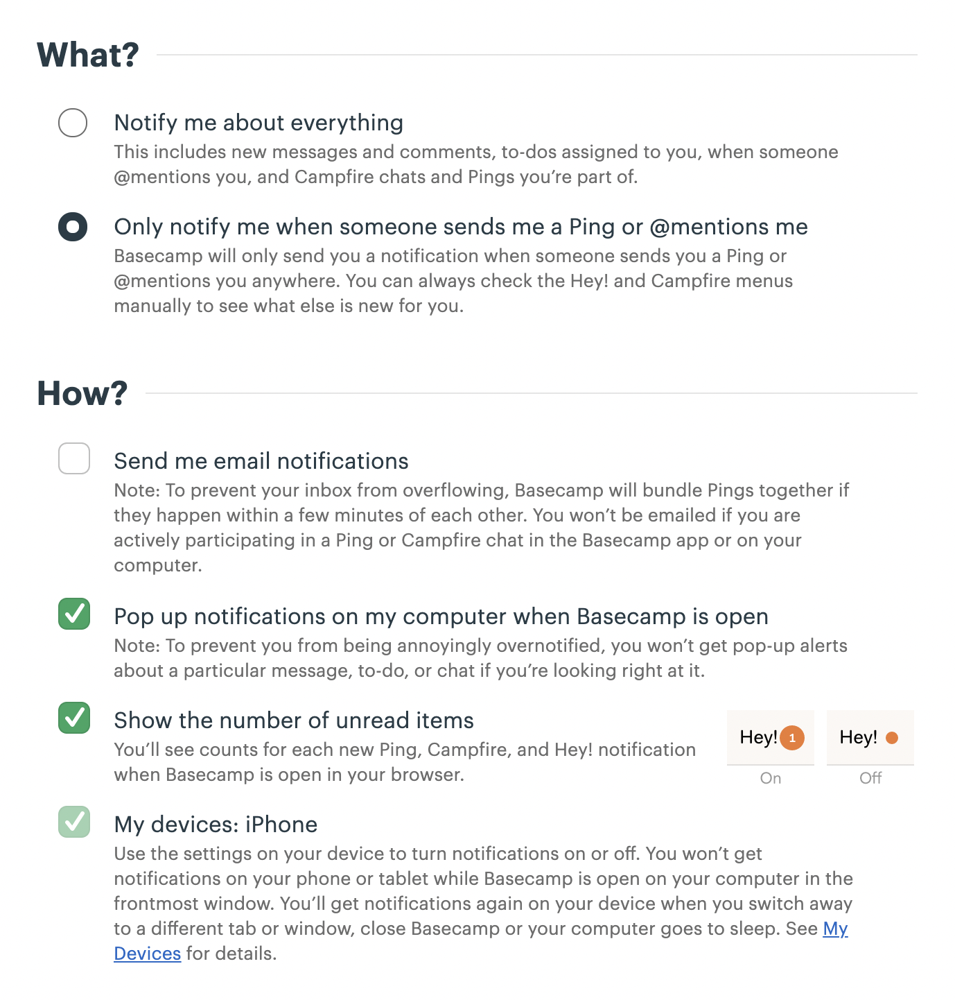
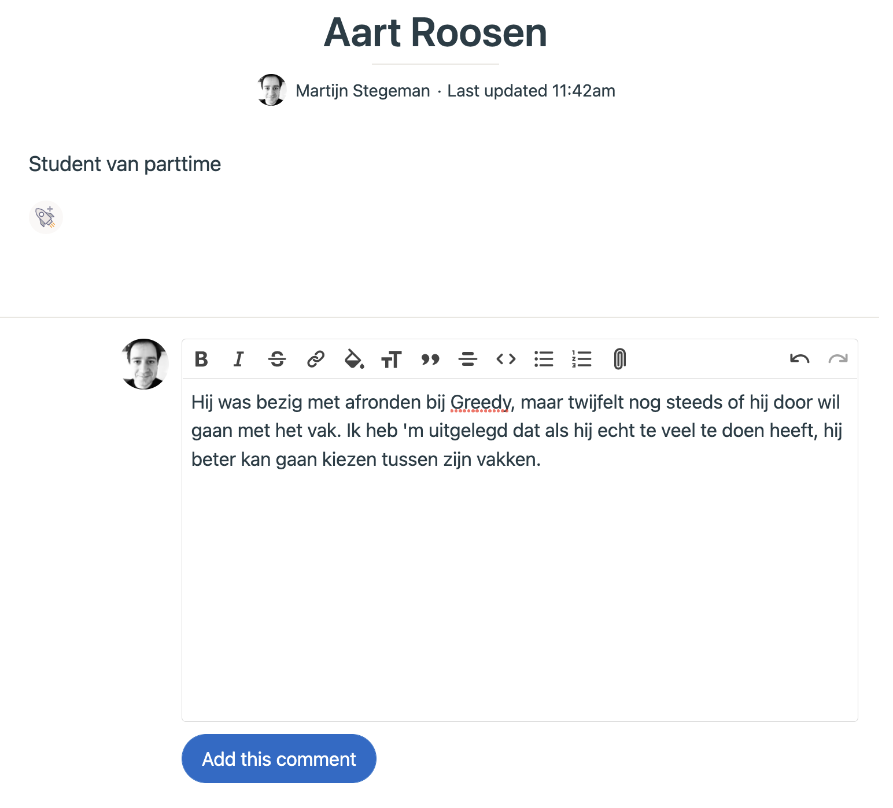
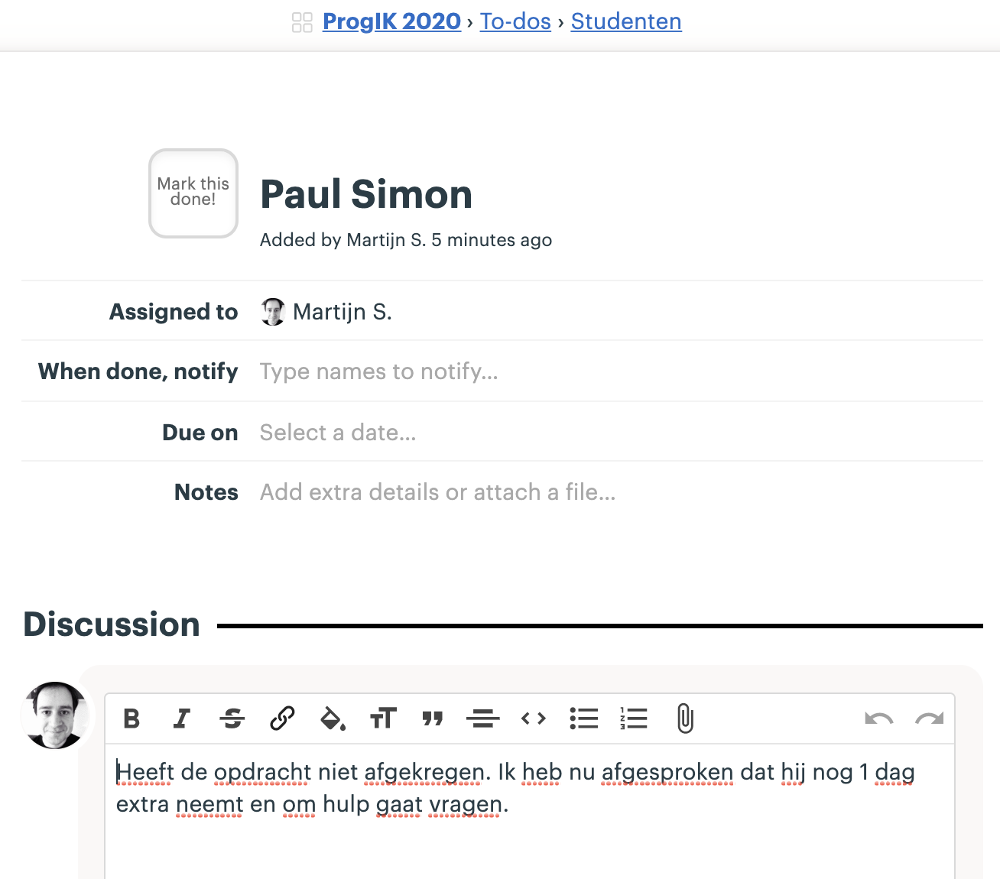
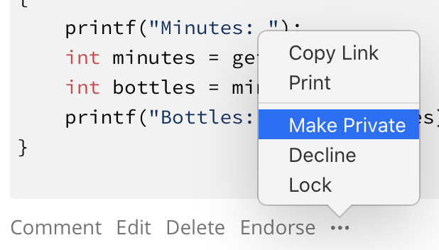
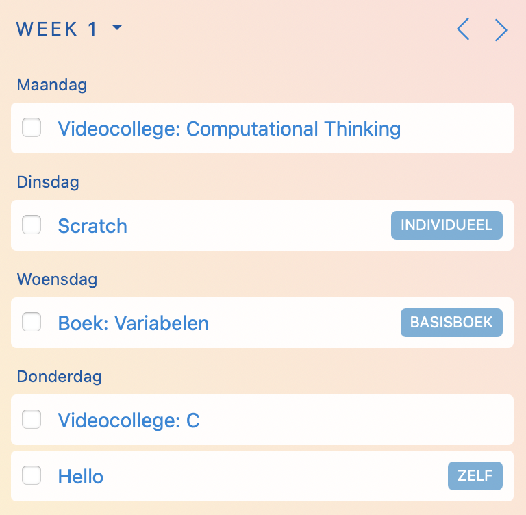

<header markdown="1">

# Assistentenhandboek Minor Programmeren

## <small>Deel A: Algemeen Herfst 2022</small>

<small>Deze versie is gemaakt in 2020--2022 door Martijn Stegeman. Gebaseerd op versie 2016 door Hella Haanstra en de instructies uit 2018 van Wouter Vrielink.</small>

</header>

{: style="display:block; border:0; width:50%"}

Welkom bij de Minor Programmeren! 

Dit jaar is er inhoudelijk weer een hoop veranderd, maar misschien het meest bijzonder is dat we na zo'n 7 jaar gaan vertrekken uit lokaal A1.16 en verhuizen naar het gloednieuwe gebouw Lab42. Hierboven al een bescheiden impressie. We hebben samen met de Minor AI drie lokalen met elk 40 werkplekken.

We hebben alle studenten van de minor al praktische informatie gestuurd die misschien ook leuk is om te lezen. Zie daarvoor <https://welkom.mprog.nl/>.

Voor jou als assistent is deze handleiding met daarin allerlei praktische informatie en tips over hoe je je werk aanpakt. Zorg ervoor dat je de handleiding een paar keer gelezen hebt en kijk er vooral nog even naar als je voor het eerst gaat nakijken of een werkgroep geven. En veel plezier en succes!

P.S. Wil je afwijken van de handleiding? Overleg dan even met je vakcoördinator.

💁 Tip: praat regelmatig met ervaren assistenten en de docenten! We vinden het allemaal leuk om te helpen, niet alleen studenten maar ook collega’s.

# 0 Welkom!

De meeste studenten die onze vakken volgen hebben weinig tot geen ervaring. Precies voor hen is de Minor Programmeren ontworpen. Toch kan het niveau van studenten erg uiteen liggen, en daar moeten we rekening mee houden bij de begeleiding.

Studenten zullen verreweg de meeste tijd besteden aan het maken van grotere **programmeeropdrachten**. Elke cursusmodule bestaat uit enkele van deze opdrachten. Naast de opdrachten worden studenten geacht diverse **oefeningen** te maken. Het doel van de oefeningen is om studenten nadrukkelijk kennis te laten nemen van de basisconcepten van het programmeren. Deze concepten krijgen bij het maken van alleen grote opdrachten vaak minder aandacht.

Programmeren 1 heeft een tentamen, en daarnaast is er systematische plagiaatcontrole, voorlichting naar studenten en de eis om zichtbaar te maken dat men bezig is met de stof, bijvoorbeeld de oefeningen en deelname aan de werkgroepen.

## 0.0 Nieuw 🆕

Er is weer een hoop veranderd natuurlijk. Belangrijkste is dat we dit studiejaar vrijwel zeker helemaal op locatie kunnen doorbrengen. Alle assistentie en ander contact is dus volledig georganiseerd in onze eigen lokalen. Maar er is meer!

- Vorig jaar was Programmeerplatforms nog nieuw, maar dit jaar hebben we de stof van dit vak verdeeld over de andere vakken. In plaats daarvan is er nu het vak **Datarepresentaties** dat studenten parallel aan Programmeren 1 kunnen volgen. Hier maken studenten kennis met allerlei aspecten van data, zonder te programmeren. Alle assistenten gaan helpen bij dit vak! 

- Onderdeel van Datarepresentaties is het **PIDAC-practicum**. Hier maken studenten kennis met een van de laagste niveaus van de werking van de computer: logische schakelingen. Ook leren ze wat het verband met nullen en enen is, en het verband met programmeren in een hogere taal zoals C.

- Het vak **Programmeren 2** start nu direct met Python omdat bij Programmeren 1 wat meer ruimte is gekomen om C geheel af te ronden. We focussen in het vernieuwde vak daarom meer op object-geörienteerd programmeren en datastructuren, samen met een aantal technieken uit de software engineering, zodat studenten geheel zijn voorbereid op het vak Algoritmen en Heuristieken (dat inhoudelijk niet wijzigt maar wel officieel van naam is veranderd).

- Alle **assistentie** voor de Minor Programmeren vindt geheel plaats in lokalen L0.09 en L0.10 van het nieuwe gebouw Lab42. Fulltime-studenten moeten elke ochtend van 9 uur aanwezig zijn, en in de middag mogen zowel fulltime- als parttime-studenten langskomen voor assistentie. Assistentie gaat in principe via de hulp-functie van de website.

- De **toetsing** is enigszins aangepast. Bij zowel Programmeren 1 als 2 is er weer een tentamen. Voor Datarepresentaties en Programmeerproject moeten dagelijkse process books worden bijgehouden waarin studenten laten zien dat ze voortgang maken (en vooral hoe). Algoritmen en Heuristieken wordt afgesloten met eindpresentaties.

# 1 De Minor Programmeren

Het doel van de Minor Programmeren is om studenten die **geen** programmeerervaring hebben een **veilige** omgeving te bieden om te leren **programmeren**, om kennis te maken met ideeën uit de **informatica**, en om ervaring op te doen met **technieken** uit de software engineering.

Het programma is als volgt:

- **Programmeren 1**, de basis van programmeren in C met CS50:

  0. Scratch
  1. Mario/Cash
  2. Readability
  3. Caesar
  3. Find
  4. Whodunit/Anonymize
  5. Speller
  {: start="0"}

- **Datarepresentaties 🆕**, alles over data en web:

  1. Computers
  2. Representaties
  3. Text processing
  4. Structured text
  5. APIs
  6. Web development
  7. Databases
  {: start="0"}

- **Programmeren 2 🆕**, objectgeörienteerd programmeren en Python:

  6. Python
  7. Abstractie
  8. Object-georiënteerd
  9. Abstracte datatypes
  10. Containers
  11. Linked structures
  12. Recursie
  {: start="0"}

- **Programmeerproject**, een nieuw platform leren, bijvoorbeeld:

  - Django
  - Agent-based modeling
  - React

- **Algoritmen en Heuristieken**, een optimalisatieproject met teamwork, bijvoorbeeld:

  - Chips & Circuits
  - RailNL
  - Lecture & Lesroosters

Studenten kiezen bij aanmelding of ze alle vakken volgen of alleen beginnen met Programmeren 1 en 2, zodat ze er nog een ander vak naast kunnen doen. Programmeertheorie wordt uitsluitend in de 4-weekse periodes in januari en juni aangeboden en is dus voor alle studenten een fulltime-commitment.

# 2 Contact en aanwezigheid

Er zijn diverse manieren waarop studenten actief betrokken worden bij de cursus: werkgroepen, practica, checkups en assistentie. Deze worden hier kort besproken. Over al deze onderwerpen staat uitleg voor studenten in de studiewijzer.

## 2.1 Practicum en assistentie

Voor studenten is een werkplek gereserveerd gedurende de practicumuren. Bij fulltime is er in principe voor elke student dagelijks van 9 tot 13 uur een plek en dus verplichte aanwezigheid. Zowel fulltime- als parttimestudenten kunnen tussen 13 en 17 ook terecht voor assistentie. Ook parttime-studenten worden geacht om minstens één keer per week naar het practicum te komen. En wie achterloopt moet verplicht komen.

## 2.2 Werkgroepen

Werkgroepen worden georganiseerd door mentoren (zie volgende hoofdstuk). In de werkgroepen krijgen studenten de kans om samen de voortgang te bespreken, de oefeningen door te nemen, tips uit te wisselen over het aanpakken van problemen en medestudenten en mentor beter te leren kennen. Mentoren krijgen inhoud voor de werkgroepen aangereikt via een bijlage van deze handleiding.

## 2.3 Checkups

Fulltimestudenten doen elke dag om 9:00 een checkup met hun mentorgroep, maar zonder de mentor. De bedoeling is om kort te reviewen hoe iedereen ervoor staat met de opdrachten en wat de plannen voor vandaag zijn. Dit is ook het moment waarop studenten weer even met elkaar kunnen afspreken, bijvoorbeeld om elkaar te helpen. Aanwezigheid kan niet gecontroleerd worden anders dan er regelmatig naar vragen. De mentor doet dit.

## 2.4 PIDAC-practicum

Alle studenten van Datarepresentaties volgen in week 2, 3 en 4 een PIDAC-practicum. Dit gaat in teams van 2 studenten. Het vindt plaats in één van onze eigen lokalen en de overige aanwezigheid wordt er omheen gepland.

# 3 Taakverdeling

Bij de uitvoering van de cursus zijn de verantwoordelijkheden verdeeld over de verschillende medewerkers.

**Studentassistent**

- Je hebt allereerst de verantwoordelijkheid om een aantal uur per week studenten uit de hele groep te assisteren met hun programmeeropdrachten.
- Daarnaast ben je voor een vaste groep studenten de mentor. Als mentor ben je het eerste aanspreekpunt voor de studenten in jouw groep. Het is daarom belangrijk dat je als mentor precies weet hoe de cursus in elkaar steekt en welke regels van toepassing zijn, voor zover die in de studiewijzer vermeld staan.
- Je leert de studenten uit je groep goed kennen en houdt nauwkeurig hun voortgang bij---zij melden bijvoorbeeld ziekte allereerst bij jou.
- Dit is bovendien de groep studenten van wie je het werk nakijkt.

**Coördinator**

- Deze werkt met de mentoren om de voortgang van alle studenten bij te houden. De coördinatie kan gedelegeerd zijn aan één of meer docenten of ervaren assistenten, bijvoorbeeld als het vak is opgedeeld in grotere groepen.
- De coördinator heeft toegang tot de resultaten en inzendingen van alle groepen, en kan zo de verschillen goed zien en makkelijk de lastigere gevallen vinden. Voor inlichtingen over studenten zal altijd de mentor worden geraadpleegd.
- De coördinator is ook degene die assistenten helpt om goed hun werk te kunnen doen en heeft wekelijks contact met ze. Zo wordt het nakijkwerk altijd even nagelopen voordat de coördinator dit publiceert, en zo nodig worden assistenten om aanpassingen gevraagd.
- Tot slot verzorgt de coördinator de wekelijkse plagiaatcheck en eventuele gesprekken met studenten hierover.

**Examinator**

- Deze heeft het totaaloverzicht over hoe de cursus in elkaar zit en heeft de verantwoordelijkheid om te zorgen dat elke student de cursus goed kan doorlopen en daarvoor uiteindelijk een passend cijfer ontvangt.
- Ook kan de examinator studenten helpen die niet goed meekomen en tussentijds hun plannen willen omgooien.
- De examinator dient bovendien als contactpersoon voor studieadviseurs en examencommissie.

⚠️ Let op: alleen de coördinator kan uitzonderingen geven op de regels in de studiewijzer. Als een student iets bijzonders heeft zorg jij dat deze student **zelf** contact opneemt met de coördinator. Hiervoor zijn twee opties: samen de coördinator opzoeken of de student een mail laten sturen. Ga hier nooit tussenin zitten: student en coördinator moeten zo snel mogelijk in direct contact komen en in bijna alle gevallen moet de student het contact leggen.

# 4 Interne communicatie

Voor bijna al het contact tussen docenten en assistenten is er [Basecamp](https://www.basecamp.com/). De verwachting is dat je zeker niet altijd, maar wel regelmatig kijkt wat er te doen is.

Om je werk goed te kunnen doen is het belangrijk dat je twee principes aanhoudt:

- Het is verplicht om **Basecamp-notifications te volgen** op dagen dat je assisteert en rondom de nakijkdeadline. De makkelijkste manier is om de Basecamp-app te installeren op je telefoon of Basecamp open te hebben op je laptop. In Basecamp kun je aangeven op welke dagen je werkt en dus notifications kunt ontvangen. Als je de app niet kunt installeren dan kun je e-mail notifications aanzetten.

- Het is verplicht om **tijdig te reageren** op: verzoeken (todo's), berichten die specifiek aan jou zijn gericht, en vragen die aan jou of iedereen gericht zijn. Als je een verzoek krijgt geef je duidelijk aan wanneer je denkt de taak te kunnen afhandelen; dus je stelt een deadline voor jezelf. Bij algemene berichten waarin bijvoorbeeld aanpassingen worden aangekondigd reageer je even met een 👍 zodat duidelijk is dat je bij bent en je studenten goed voorlicht.

Samengevat betekent dat: zorg dat de communicatie soepel verloopt en hou bij wat er gebeurt rondom de cursus.

## 4.1 Notifications aanzetten

Je kunt Basecamp als volgt configureren, zodat je alleen notifications krijgt als het bericht specifiek voor jou bedoeld is.

{: style="max-width:50%; margin: 0 auto; display: block;"}

Als je geen notifications op je mobiel wil/kan hebben, zorg dan dat je altijd "Send me e-mail notifications" aan zet. Het mag namelijk niet zo zijn dat je dagenlang niet bereikbaar bent via Basecamp: dit is echt de enige tool voor onze communicatie. Als we achter je aan moeten bellen dan is het ruim te laat.

Blijkt dit toch nog te chaotisch voor jou, dan moet je een gesprek aangaan met de vakcoördinator om te kijken of je de instellingen nog kan tunen of dat we je werk op een andere manier inrichten.

## 4.2 Gebruik

Je ontvangt een uitnodiging kort voordat de cursus start. Je krijgt dan toegang tot het team waarin we alles delen over de cursussen van de Minor Programmeren: *MinProg Herfst '22*. Topics gaan over de **inhoud** van de cursus, bijvoorbeeld als je toelichting nodig hebt bij een bepaalde opdracht. Andere topics gaan over **studenten** in de cursus, bijvoorbeeld waar je een vraag over hebt of die achter lopen.

{: style="max-width:50%; margin: 0 auto; display: block;"}

- Heb je een vraag, wil je iets ter discussie stellen, heb je een mooi voorstel: schrijf een **Message** in één van de Basecamp-projecten. En liever een vraag te veel gesteld dan te weinig.

- Heeft een student een probleem dat niet over het programmeren zelf gaat, of heb je een concreet verzoek om iets gedaan te krijgen, dan moet iemand anders iets voor jou doen. Schroom dan niet en maak direct een **Todo** aan. Stel een deadline in en geef aan voor wie deze Todo is.

- Heb je wat achtergrond-informatie over een student of heeft de vakcoördinator een afspraak gemaakt of uitzondering gegeven? Dan vind je dit per student in een documentje in de sectie **Studenten**. Je mag hier altijd zelf posten. Documenten worden niet actief met iedereen dus je kunt een @mention doen voor de coördinator of een andere collega.

- Wil je even snel afstemmen met collega's die ook nu aan het werk zijn? Gebruik dan de **Campfire** tijdens het assisteren of nakijken. Dit is alleen voor berichten die nooit teruggezocht hoeven worden. Alle vragen en antwoorden stuur je via een Message en niet via Campfire.

- Heb je zelf persoonlijke problemen die je liever niet aan de grote klok hangt? Alleen dan **Ping** je de coördinator of Martijn en spreek even af. Gebruik de Pings niet voor iets anders.

Met name het aanmaken van **Todo**'s voor iemand anders is misschien even wennen. Maar het is helemaal OK! We hebben nu eenmaal elk onze eigen verantwoordelijkheden. Maak dus geen Todo aan zonder deze te assignen, meestal aan je coördinator. Het is juist de manier om te zorgen dat studenten niet vergeten worden maar tegelijk iedereen de dingen op een zelfgekozen moment kan afhandelen. En zit er een deadline aan, stel deze dan ook gerust in!

Belangrijkste is dat je Basecamp niet gebruikt alsof het Whatsapp is: je kunt zogenaamde "Pings" sturen naar collega's, maar dit is geen handige manier van werken omdat dan niks is terug te vinden. Bovendien zal bijna elke vraag of opmerking relevant of leerzaam zijn voor je mede-assistenten, dus wordt van jou verwacht dat je je berichten **zoveel mogelijk met het hele team deelt** (via een Message). Ook vragen we jou om te reageren op berichten van anderen als je het antwoord weet.

## 4.3 Privacy

Het is belangrijk dat we informatie over studenten delen met het team. Alle assistenten en docenten gaan hier discreet mee om, en kunnen bovendien aanvullen met hun eigen kennis over de student. Eventuele details over ziektes en omstandigheden e.d. kun je weglaten als dat een beter idee is, of minder relevant om te delen.

⚠️ Hou er rekening mee dat je account weer verwijderd wordt zodra je een paar weken niet meer assisteert. Het is dan ook de bedoeling dat je alle informatie vernietigt die je zelf nog hebt bijgehouden of opgeslagen.

## 4.4 Informatievergaring

Het contact dat we met studenten hebben is een belangrijke bron van informatie over hun persoonlijke voortgang en welzijn, op basis waarvan we hulp kunnen bieden. Maar we horen van studenten natuurlijk ook of de cursus goed werkt voor ze en duidelijk is. Assistenten moeten daarom deze informatie delen met de andere assistenten en docenten. Of het nu feiten zijn of vermoedens, dat maakt niet uit. Alles om de cursus beter te maken en studenten beter te helpen.

⚠️ Het is een essentieel onderdeel van je werk dat je deze signaleringsfunctie vervult.

- **Verslaglegging over individuele studenten** doe je via het <u>Document</u> op <u>Basecamp</u> voor deze student. Het doel is om later terug te kunnen lezen hoe het gaat.
    - Omstandigheden van de student uitleggen (mentor).
    - Ziekmelding van een student (mentor of docent).
    - Verslag na assisteren: waar zat de student (echt) mee, hoe heb je geholpen, zijn er nog losse eindjes.

- **Urgente problemen van individuele studenten** meld je via een <u>To-do</u> op <u>Basecamp</u> en wordt overgenomen door de coördinator.
    - Student komt niet opdagen.
    - Student houdt zich niet aan een speciale afspraak.
    - Student mist meermaals de normale deadline.

- **Verslaglegging over de cursus**, ofwel zaken die op meerdere studenten betrekking hebben of zelfs de hele groep doe je via een <u>Message</u> op <u>Basecamp</u> zodat iedereen kan meedenken.
    - Melding van problemen van diverse studenten bij een opdracht.
    - Het nut van een opdracht ter discussie stellen.
    - Vraag naar de bedoeling van een onderdeel.

- **Vastlopers in de cursus**, ofwel dingen waar "iedereen" in de problemen komt en snel opgelost moeten worden meld je ook via een <u>Message</u> op <u>Basecamp</u>.
    - Opdracht staat niet open.
    - Download werkt niet.
    - Er zijn geen instructies doorgestuurd naar iedereen.

Op de volgende pagina voorbeelden van verslaglegging en probleemmelding over een enkele student.

Verslaglegging in een Basecamp-document:

{: style="max-width:60%; margin: 0 auto; "}

Verzoek om actie in Basecamp:
{: style="margin-top:3rem"}

{: style="max-width:60%; margin: 0 auto; "}

# 5 Mentorschap

Mentoren krijgen een groep van zo'n 15 studenten voor wie zij het eerste aanspreekpunt zijn. Hieronder een uitwerking van de verschillende verantwoordelijkheden van de mentor.

## 5.1 Aanspreekpunt

Als mentor leer je alle studenten uit je mentorgroep goed kennen. Dat betekent dat je na een paar weken het volgende weet over je studenten:

- Eigen hoofdopleiding
- Programmeerervaring
- Comfort met programmeren, naar eigen gevoel
- Kan voldoende/altijd aanwezig zijn
- Werkt graag samen of niet
- Levert tijdig in
- Neemt goed deel aan de cursus en de werkgroepen

Hoewel je als mentor de belangrijke details over je studenten kent, beperkt het contact met je studenten zich wel tot zaken die van belang zijn voor het onderwijs. Wordt het persoonlijker, verwijs dan naar de vakcoördinator of studieadviseur.

Dat je je studenten goed kent maakt je ook het juiste aanspreekpunt voor de cursus. Dat betekent dat studenten zich al gauw bij jou zullen melden als ze een organisatorische vraag hebben waarvoor ze het antwoord niet kunnen vinden. Maar ook bij persoonlijke problemen zullen ze ongetwijfeld naar jou toe komen.

⚠️ Doe geen beloftes aan studenten over het verloop de cursus of regelingen anders dan wat er al letterlijk in de studiewijzer staat. Studenten zullen zeer vaak tussen neus en lippen door even "naar de bekende weg vragen". Maar als het niet in de studiewijzer staat dan beschouwen we dat altijd als een uitzondering. De vakcoördinator neemt dan een beslissing op individuele basis. Ga dus niet in op dit soort vragen en verwijs naar de juiste kanalen.

## 5.2 Doorverwijzen

Jij hoeft je als assistent niet bezig te houden met:

- plagiaat
- serieuze studieproblemen
- problemen op persoonlijk vlak

Komt een van deze dingen naar voren, verwijs dit altijd door naar de cursuscoördinator. Vraag de student **allereerst** om zelf een mail te sturen naar <help@mprog.nl>. Maar studenten vinden het vaak moeilijk om verdere hulp te vragen, dus de mentor moet het ook direct melden (via een Todo in Basecamp). Het is belangrijk dat wij vanaf de eerste vraag om hulp medeverantwoordelijkheid nemen en een student niet aan het lot overlaten.

Bij meer persoonlijke problemen proberen we altijd goed gebruik te maken van de faciliteiten van de universiteit, zoals studieadviseurs en studentendecanen. De examinator weet meer over de mogelijkheden en kan studenten verwijzen. De mentor hoeft dat niet zelf te doen, maar is vaak wel de eerste die de problemen signaleert.

Als we verwijzen naar de studieadviseur zorgen we altijd dat de student een duidelijke en concrete hulpvraag heeft. De studieadviseur is namelijk geen wondermiddel. Blijkt een student bijvoorbeeld heel weinig tijd te hebben, dan moeten we de student wellicht vragen om een moeilijke keuze te maken en te overwegen een vak te laten vallen. De studieadviseur kan vervolgens helpen bij het maken van de juiste keuze.

## 5.3 Signaleren

Mentoren zijn bij uitstek het aanspreekpunt voor klachten en voor grote frustraties die studenten opbouwen tijdens het programmeren. Dit kan naar boven komen tijdens de werkgroepen (en we vragen er ook actief naar). Dat is geen probleem! Zie het niet als een persoonlijke aanval, maar als een noodzakelijke uitlaatklep. Ga er vooral niet in mee, en ga ook zeker niet in de verdediging. Het belangrijkste is dat studenten het kunnen uiten.

## 5.4 Groepsvorming

De belangrijkste elementen voor groepsvorming zitten in de structuur van de cursus: studenten worden geacht samen te werken voor bepaalde opdrachten én de code reviews moeten steeds binnen de mentorgroep gedaan worden. Als mentor kun je bovendien bijdragen door te zorgen dat elke student tijdens de werkgroep aan de beurt komt en zich zo een klein beetje presenteert aan de rest (sommige studenten vermijden dit net iets te veel!).

## 5.5 Werkgroepen organiseren

De werkgroepen zijn een plek om kennis te maken met je studenten, maar vooral om de studenten te helpen elkaar te leren kennen. Er zijn twee hoofdonderwerpen voor de werkgroepen:

- Je hebt een belangrijke rol bij de **planning van het samenwerken**. Voor de samenwerkopdrachten hebben ze een partner nodig die ze in principe zelf kiezen. Voor de code reviews zorg jij voor elke week voor een roulerend schema.

- De werkgroep is de plek waar de **feedback** en de **oefeningen** belangrijk worden gemaakt. Jij zorgt dat studenten van elkaars feedback kunnen leren door een aantal belangrijke patronen aan te stippen. En je bespreekt enkele van de gedane oefeningen (die bovendien vooraf zijn ingeleverd).

In deel B van de handleiding vind je de onderwerpen per werkgroep.

## 5.6 Communicatie met studenten 🆕

Vanaf dit jaar is er **geen Slack** voor de mentoren en studenten. Al het contact vindt zoveel mogelijk plaats tijdens het practicum en de werkgroepen. Daarnaast kunnen studenten jou mailen op je **studentenmail** of je **medewerkersmail**.

Het mailen is beperkt tot bijvoorbeeld dit soort dingen:

- Afmelden voor een werkgroep (met goede reden)
- Vraag wanneer jij aanwezig bent op het practicum, zodat student kan langskomen
- Ideeën voor de volgende werkgroep

Andere dingen doen we juist niet:

- Programmeerhulp geven we helemaal niet per mail, "morgen langskomen bij het practicum"
- Uitzonderingen gaan alleen via <mailto:help@mprog.nl>
- Vragen over de cursus via <mailto:help@mprog.nl>
- Voorlichting en planning kun je waarschijnlijk het best ook doorsturen naar <mailto:help@mprog.nl>

Dat betekent dus in het algemeen dat je <u>niet continu bereikbaar bent via mail</u>. Het is echt alleen bedoeld voor kort afstemmen en studenten mogen niet verwachten dat je hun mail dagelijks bekijkt, maar bijvoorbeeld alleen op de dag van de werkgroep. Het meeste contact moet gewoon mondeling gebeuren, tijdens de werkgroep.

Het is ook absoluut niet de bedoeling om zelf een Slack aan te maken of een Whatsapp-groep te starten met je studenten. Dit is niet jouw verantwoordelijkheid: jij bent er voor hen tijdens de college-uren en niet daarbuiten. Hebben ze een vraag dan kunnen ze altijd naar de vakcoördinator mailen.

Je kunt zelf een mededeling sturen naar je werkgroep via Datanose. Vóórdat je dat doet kun je in Datanose kiezen of je afzender-adres je studentenmail of je werkmail is. Dat kun je door door in te loggen en dan rechtsboven in het beeld op je eigen naam te klikken. Dan krijg je de keuze voor mailadres.

⚠️ Let op dat als je per se je studentenmail wil gebruiken hiervoor, jij alle mails van en met studenten moet weggooien na afloop van de cursus. Jij bent dan verantwoordelijk voor de privacyregels. Daarom is het handiger je medewerkersmail te gebruiken (en niet door te sturen).

<!-- ## 6.6 Communicatietools

Omdat we nog niet zeker weten dat onze studenten altijd 100% aanwezig kunnen zijn, gebruiken de mentoren **Slack** om hun studenten te informeren, om ziekmeldingen te ontvangen en om ze met elkaar te kunnen laten communiceren buiten de groep om.

Maar: mentoren zullen *niet* veel beschikbaar zijn via Slack. Dit wordt in de studiewijzer verteld en jij gaat dit als mentor zelf ook bij de eerste werkgroep duidelijk maken. Coördinatoren zijn zelfs helemaal niet in de Slack te vinden.

Ga als mentor ook niet in een Whatsapp zitten die studenten aanmaken. Geef duidelijk aan dat ze jou alleen via Slack kunnen bereiken en tijdens de werkgroep, en de docenten alleen via e-mail of tijdens een spreekuur. Zo zorg je er zelf voor dat je niet continu bezig hoeft te zijn met je mentorrol.

⚠️ In verband met de normale privacyregels moet je de contactgegevens en zelf-aangemaakte Slack verwijderen na afloop van de cursus.

⚠️ Stuur geen mails naar je studenten via Datanose, omdat hierin niet altijd de goede mailadressen staan. Gebruik Slack voor afstemming met je studenten. -->

# 6 Assisteren

Elke student zou regelmatig hulp nodig moeten hebben tijdens het programmeren (maar niet teveel). Deze assistentie wordt volledig op locatie georganiseerd in lokalen L0.09 en L0.10. Studenten reserveren een plek in de "rij" via de website en assistenten gaan steeds op zoek naar de eerstvolgende student die aan de beurt is.

⚠️ In principe is er dit jaar geen hulp op afstand.

⚠️ Roostering voor het assisteren wordt pas kort voor de start gedaan omdat veel assistenten pas laat horen in welke werkgroepen zij zelf geroosterd zijn. Dat neemt niet weg dat de coördinator zo snel mogelijk moet weten wat jouw rooster is.

Studenten die vastzitten met hun computer, misschien zelfs hardwareproblemen hebben, kunnen ook een mail sturen naar <mailto:help@mprog.nl>. Ze worden dan bijvoorbeeld verwezen naar een moment dat een assistent werkt die veel ervaring heeft met installatie, configuratie en bediening. Het doel is om studenten zo snel mogelijk weer op weg te krijgen en niet te lang te laten hangen bij problemen waar ze weinig van kunnen leren.

<!-- - Vragen plaatsen op het online forum **Ed** kan op elk moment. Medestudenten worden geacht deze vragen zoveel mogelijk te beantwoorden. Waar dat niet lukt zullen assistenten reageren. Het is echter moeilijk om als beginner een goede vraag schriftelijk in te dienen. Dat betekent dat een vraagsteller soms uitgenodigd moet worden voor mondelinge assistentie om tot wederzijds begrip te komen. 

- Elke werkdag tussen 13 en 17 uur is er **video-assistentie**. Studenten geven via de cursuswebsite aan dat ze hulp nodig hebben. Assistenten die aan het werk zijn krijgen inzage in de lijst met vraagstellers en werken deze op volgorde af. Zodra ze aan de beurt zijn krijgen studenten een linkje naar de videochat van de assistent die hen gaat helpen.

- Voor meer technische hulp (bijvoorbeeld met installatie) is het mogelijk een losse afspraak te maken. Hiervoor is een planningstool op **Calendly** beschikbaar. -->

## 6.1 Regel één van assisteren is...

Het doel van assisteren is om studenten **verder te helpen** tijdens het leren. Dat betekent dat we altijd afwegingen moeten maken hoe we iemand helpen; een afweging gebaseerd op hoe de student ervoor staat, of de vraag goed gesteld is, of er nog genoeg tijd is tot de deadline.

Maar de belangrijkste regel is: **we geven het antwoord niet weg**. Dat antwoord kan verschillen: het kan een ontbrekende stap in het ontwerp zijn, het kan een regel code zijn of iets dat verkeerd staat. In plaats van studenten rechtstreeks vertellen wat ze moeten doen, moeten we ze helpen nadenken over wat hun volgende stap is. Welke aanwijzingen hebben ze om verder te komen?

> Maar het varieert wel! Blijkt de vraag in feite over het ontwerp van de oplossing te gaan, dan moet je iemand misschien helpen om een paar stappen terug te doen en de opdracht goed te lezen. Maar gaat de vraag over een technische issue, dan kun je ze misschien wat directer wijzen hoe ze hun probleem kunnen oplossen, bijvoorbeeld door een concrete foutmelding in Google te plakken. Tot slot kan het zijn dat je ziet dat een heel klein deeltje van de oplossing verkeerd is gekozen, of dat ze iets hebben gedaan dat helemaal niet in de cursus zit. Als dat moeilijk te vinden gaat zijn, dan moet je er misschien toch op wijzen.

Hou deze regel altijd in gedachten en maak een **bewuste keuze**. Je mag het ook best zeggen tegen studenten: "ik moet even nadenken hoe ik je het beste kan helpen zonder het antwoord weg te geven". Maar wel vriendelijk!

⚠️ Een consequentie van deze regel is dat we bij het assisteren nooit het toetsenbord van de student aanraken. Heb er vertrouwen in dat je student kán leren en dat het zelf doen de beste manier is om dit te bereiken. Ook je student moet dit vertrouwen krijgen. Is het echt noodzakelijk om even iets voor te doen? Pak dan bij voorkeur je eigen computer erbij. En zorg dat je student het daarna meteen zelf toepast in de eigen code.

## 6.2 Ken je opdrachten

Kijk de opdrachten en bijbehorende lecture notes altijd van te voren nog even door, zodat je goed voor de dag komt. Gebruik eventuele overgebleven tijd om opdrachten te lezen die je nog niet kent.

## 6.3 Soorten vragen

Tijdens het assisteren helpen we studenten op vijf gebieden:

1. probleemdecompositie
2. implementatie
3. procesondersteuning
4. vragen formuleren
5. debugging

Dat betekent dus dat het méér is dan alleen duidelijk gestelde vragen beantwoorden. Nog sterker, bijna geen enkele vraag tijdens het assisteren zal helemaal duidelijk geformuleerd zijn. Dat is ook waarom wij echt wat toe te voegen hebben!

Hieronder vind je de belangrijkste problemen en manieren om daar mee om te gaan.

### Probleem: Wat is de opdracht?

Waarschijnlijk zijn er, zeker in het begin van de cursus, veel vragen die eigenlijk gaan over wat er in de **opdracht** bedoeld wordt. Het is niet altijd makkelijk om een goed overzicht te krijgen van de opdracht. In de walkthrough-filmpjes geeft Brian meestal een mooie (grofmazige) decompositie voor het programma. Tijdens het helpen is het nuttig om te vragen of de student dat even wil opzoeken en dit samen nog even door te lopen.

In veel gevallen is het probleem van een student terug te leiden naar de analyse die een student heeft gedaan van het algoritme waar we naar op zoek zijn. Is er een verkeerde **aanname** gedaan, of is een formule toch niet helemaal **correct**, dan is het vaak nodig om extra voorbeelden (cases) te bedenken en uit te vogelen waar het verkeerd zit. Zorg dat je in dit geval de student vraagt om dat te doen en later nog eens terug te komen als het nodig is.

Vaak zul je merken dat een student **helemaal geen goede analyse** heeft gedaan. Help je student dan een deelprobleem te kiezen en dit te analyseren met hulp van enkele slim gekozen voorbeelden (geef zelf een voorbeeld en laat je student er ook eentje bijdragen).

### Probleem: Het overzicht kwijtgeraakt

Soms heeft je student echt geen **overzicht** meer ("ik weet niet waar ik moet beginnen"). Dan is het soms handig om de student naar het algoritmische deel van de opdracht te sturen, en later pas invoer/uitvoer goed te maken. Dit is een manier om het probleem kleiner te maken.

> _Hoe kun je beginnen bij het algoritmische deel? Bij Cash (Greedy) moet de gebruikersinvoer een float zijn, die vervolgens wordt omgezet naar een `int` vóórdat het algoritme ermee aan de slag gaat. Dat is van zichzelf al best moeilijk en is een groot deel van de opdracht. Maar dan moet het wisselgeld nog berekend worden. Oplossing: dat user input-deel vervangen door een `int input = 42;` waarin je het getal kunt aanpassen om te testen. Het geeft beginners vaak veel lucht als ze zo simpel kunnen beginnen met het moeilijkste deel._

Soms is het vooral **integratie** waar een student hulp bij nodig heeft. Er is een aardig uitgewerkt algoritme, maar het overzicht ontbreekt nog. Hoe koppel je de invoer aan het algoritme en hoe zorg je dat het programma het juiste resultaat uitvoert? Dat kan nog best lastig zijn. Dit is onderdeel van de implementatie. Ook hier is het nuttig om de decompositie uit het walkthrough-filmpje even terug te halen en uit te vogelen waar het probleem zit.

⚠️ Laat je student wel <u>zelf</u> het filmpje opzoeken op de website: dingen waarvan je verwacht dat studenten ze zelf doen laat je ze ook bij het assisteren zelf doen.

### Probleem: Een heuse bug

En natuurlijk zijn er veel situaties waarin er een echte **bug** in het programma zit. Het programma zelf heeft al min of meer de juiste vorm, maar er worden bijvoorbeeld variabelen hergebruikt waardoor het niet goed loopt. Dat is het moment dat je hardop gaat meedenken over debuggingtechnieken. Het is aan assistenten om de student deze vaardigheden aan te leren. Natuurlijk kijk je eerst of de student eigenlijk wel weet hoe het debuggen moet (misschien eerst maar eens checken of alle variabelen de juiste waarde hebben met behulp van `printf`?).

- Zorg dat je weet hoe de debugger in de CS50 IDE werkt! Vraag een mede-assistent of je coördinator als nodig.
- Kijk voor een opfrisser in *Think Python*[^3], hoofdstuk 20: Debugging.

<!-- ## 6.2 Ed

Ed is een vraag- en antwoordforum waar onze studenten in een afgeschermde omgeving vragen kunnen stellen. Er zijn aparte afdelingen voor CS50, voor Scientific Programming, voor Web Development en voor Programmeertheorie. Alle studenten van de cursussen die op CS50 gebaseerd zijn zitten bijvoorbeeld wel bij elkaar.

> Studenten moeten worden uitgenodigd voor Ed. Mocht iemand niet zijn uitgenodigd dan kunnen ze direct zelf de helpdesk mailen via <help@mprog.nl>. Nadat ze hun spam-folder gecontroleerd hebben natuurlijk!

Binnen elke cursus op Ed zijn er **categorieën** voor opdrachten, zoals bijvoorbeeld "Mario". Zo zijn de opdrachten per vraag te filteren.

Helemaal onderaan de pagina van een vraag kan een student, of een assistent, een **antwoord** plaatsen. Is dat het definitieve antwoord, dan is dat zichtbaar met een groen vinkje. Tijdens het plaatsen van een antwoord kun je kiezen voor "Mark as answered", maar je kunt later ook op het vinkje klikken om dit om te zetten.

Een vraag schriftelijk stellen is best moeilijk, dus we moeten studenten helpen om dat op een goede manier te doen. Daarvoor is de makkelijkste manier om een follow-upvraag te stellen via het knopje "**Comment**" (of zoals hierboven "Reply").

Let dus op dat er een verschil is tussen Comments en Answers. Je kunt de één ook naar de andere omzetten. Het is dan ook de taak van de assistenten om de vragen goed te **modereren**. Comments en Answers omzetten, opvolgvragen stellen, een vraag als "Answered" markeren. Als dat allemaal goed gebeurt is het makkelijk om de vragen snel te beantwoorden en bijvoorbeeld de nog niet beantwoorde vragen te vinden.

Prive maken berichten:

 -->

## 6.4 Algemene gesprekstechnieken[^1]

Begrijp dat veel studenten niet gewend zijn om een probleem op te lossen waar meer dan één antwoord voor is. Het proces om dit te leren kan zeer frustrerend voor ze zijn. Neem dus hun frustraties gewoon aan en probeer ze naar een concrete vraag te leiden. 'Waar ben je met de opdracht? Wat heb je al gedaan?'

Geef duidelijke verbale signalen af tijdens het assisteren, met name in de fase waarin jij vragen begint te stellen aan de student om het probleem beter te begrijpen of kennis te checken.

- Kies voor 'heel goed antwoord!', 'zeker weten' of 'precies', etc. Probeer een droog 'ok', 'hmm', 'uhu' te vermijden. Ook als de student een langdradig antwoord geeft, kun je het relevante deel nog een keer samenvatten en herhalen, en daarbij expliciet maken dat dat het goede deel van het antwoord is. Zo help je de gedachten stroomlijnen.

- Probeer expliciete verbanden te leggen als die niet door je student genoemd worden. Als deze bijvoorbeeld een for-loop voorstelt bij `mario.c`, antwoord iets in de trant van: 'heel goed, je ziet dat er een vorm van herhaling nodig is'.

- Probeer voort te bouwen op het antwoord van de student. Als het antwoord dat de student geeft niet helemaal naar wens is, probeer het dan mee te nemen in je volgende vraag. Iets als 'je hebt goed gezien dat je de string moet opdelen, wat is de volgende stap?' werkt motiverend.

- Probeer 'ja, maar...' te vermijden. Dit is een logische reactie op een (deels) fout antwoord, maar kan heel erg demotiverend werken. Probeer duidelijk te scheiden wat goed was en wat fout was en benoem dat neutraal. Je kunt ook de vraag stellen 'hoe ben je daarop gekomen?'; overigens ook als een opmerking van een student wél goed is!

Doe tot slot geen aannames over wat studenten al weten. Een student kan soms met zelfs het makkelijkste probleem in de knel zitten en dan is het erg frustrerend als er wordt gezegd 'probeer eens wat harder na te denken'. Toets wat de student wel weet en bouw daarop voort. Stel open vragen en laat de student zelf het probleem oplossen, probeer niets voor te zeggen!

## 6.5 Werkwijze assisteren

Als assistent zoek je meteen even de gegevens van deze student op, in de juiste cursuswebsite. Vraag dus naar naam en cursus. Op de site vind je notities die bij het eerdere assisteren zijn achtergelaten. Misschien heeft de vorige assistent wel expliciet gevraagd aan de student om iets te doen. Dubbelcheck dat!

Zodra je je student hebt gevonden stel je jezelf kort voor. Zorg dat de student de tijd krijgt om je naam goed te horen en misschien zelfs te onthouden.

> "Hallo, ik ben Martijn en ik kom assisteren. Waar ben je mee bezig?"

### Opstartproblemen
{:.break}

**Situatie: geen concrete vraag.** Juist bij de balie is er een kans dat een student nog geen concrete vraag heeft. Help de student in dat geval de vraag formuleren zoals hierboven uitgelegd (6.3). Sommige studenten kunnen ook nog wat meer tijd gebruiken om zelf wat langer naar hun programma te kijken voordat je ze echt gaat helpen; probeer zelf een juiste inschatting van de situatie te maken om vervolgens te besluiten de student direct te helpen, of een duwtje in de goede richting te geven en later nog even terug te laten komen.

**Situatie: code is onleesbaar.** Is de indentatie totaal niet op orde? Vraag de student dan altijd eerst om deze netjes te maken. Niet alleen omdat het "hoort" maar omdat verkeerde indentatie het probleem heel moeilijk vindbaar kan maken. Met een beetje mazzel is het daarna zo gevonden (studenten in deze fase hebben overigens vaak ook nog een probleem met de analyse van hun probleem, dus kijk daar ook naar). In principe blijft de student bij jou zodat je eventueel kan inspringen 🙃, maar als het echt lang duurt laat je de student straks terugkomen.

### Tijdsbesteding

- Probeer zo'n 10 minuten per student aan te houden. Een absoluut maximum is 20 minuten, alleen in noodgevallen. Duurt het langer, check dan echt de rij en haal er tijdig een expert bij om te zorgen dat iedereen nog geholpen kan worden.

- Als je een student later wil terugzien, vertel dan duidelijk wat je verwachting is en hoe de student zich weer kan melden.

- Kom je er zelf niet uit? Dan kun je natuurlijk altijd even vragen of één van je mede-assistenten mee kan kijken. Het is expliciet de bedoeling dat onervaren assistenten zonodig hulp inschakelen en zich zo verder ontwikkelen.

### Verslag

Na het helpen schrijf je op de website een korte samenvatting van het uiteindelijke probleem en hoe je geholpen hebt. Noteer het ook als je de student hebt gevraagd iets te doen en later terug te komen. De volgende assistent kan deze informatie ook lezen en daar op inspelen.

# 7 Deadlines en ziekmelding

Bij onze cursussen gebruiken we zowel deadlines als een dagschema om te zorgen dat studenten de cursus op tijd af krijgen en wij regelmatig ons nakijkwerk kunnen doen.

Voor programmeeropdrachten in Programmeren 1 is er bovendien altijd een dubbele deadline: één voor de werkende versie en één voor de verbeterde versie.

## 7.1 Dagschema

Voor alle studenten geldt dat de verwachting is dat ze het tempo van het dagschema bijhouden. Hier een voorbeeld van een dagschema voor parttime:

{: style="max-width:40%; margin: 0 auto; display: block;"}

Bij fulltime moeten ze dat schema ook echt dagelijks volgen, bij parttime kunnen ze natuurlijk binnen de week iets schuiven, bijvoorbeeld in verband met deadlines van een ander vak.

## 7.2 Deadlines

Naast het dagschema zijn er ook gewoon deadlines:

- De **implementatie** of uitwerking van alle opdrachten moet steeds aan het eind van de week zijn ingeleverd. De opdrachten moeten dan af zijn, en `check50` moet de uitwerking hebben goedgekeurd waar mogelijk.

- De **verbeterde** versie moet kort na de werkgroep worden ingeleverd. Tijdens de werkgroep is de code review, waarna studenten hun eigen werk binnen korte tijd moeten kunnen verbeteren en opnieuw inleveren op de speciale review-pagina.

Het doel van de deadlines is om te zorgen dat er ook duidelijkheid is in het geval studenten het schema net niet bijhouden. Ze moeten dan binnen de week nog inhalen om de deadline te kunnen halen.

## 7.3 Ziekmelding

Bij ziekte loopt de planning al gauw in de soep. Als een student meerdere dagen niet aan de opdrachten kan werken, dan ligt het voor de hand dat het niet vóór het weekend af is. Daarom willen wij dat studenten zich ziekmelden. Die melding gaat naar de mentor via e-mail.

Als je zo'n melding krijgt dan ga je zo te werk:

- Je wenst je student beterschap en vraagt meteen om even te laten weten als ze weer aan de slag gaan.
- Je meldt het in het document over deze student op Basecamp (maak het document eventueel aan). @mention even de vakcoördinator.

## 7.4 Te-laatmelding

Als de planning dan niet gehaald wordt en de deadline dreigt te worden overschreden, dan verwachten wij ook weer een melding van de studenten. Het maakt daarbij niet uit of het een grote opdracht of een kleine oefening is, studenten moeten actief hun achterstand melden.

In dat geval krijgt de coördinator de verantwoordelijkheid om het contact over te nemen en te kijken of deze student nog op de rails te krijgen is. Stuur de mail dus door naar <mailto:help@mprog.nl> om verder af te handelen.

Als je de vraag krijgt of het nog zin heeft om een opdracht te maken is het antwoord altijd "ja", want om het vak te halen moeten alle opdrachten gedaan zijn. Tegelijk meld je dat ze dit echt met de docent moeten bespreken. Ze moeten dan dus direct een mail sturen.

⚠️ Zoals je hierboven kunt afleiden geef jij als mentor in feite geen uitzonderingen of uitstel. In plaats daarvan zorg je voor goede communicatie en doorverwijzing.

## 7.5 Uitstel verbeterde versie

De verbeterde versie van opdrachten worden gemaakt op basis van de code review die tijdens de werkgroep begint. Mocht een student ziek zijn tijdens de werkgroep dan stuurt deze jou (hopelijk) een e-mail met een afmelding. Vraag dan de student dan om zo snel mogelijk zelfstandig een review te doen en de code definitief in te sturen, en stuur een cc naar <help@mprog.nl>. Dat hoeft dan niet een review met iemand anders te zijn. Dit zou je kunnen sturen:

  > *Beterschap! Als het lukt kun je binnenkort zelf nog een keer goed je code bekijken, netjes maken en dan de definitieve versie insturen. Stuur dan nog even een berichtje dat het gedaan is, zodat ik kan nakijken. Mocht dat nou niet binnen een paar dagen lukken, laat het dan alsjeblieft even weten. De deadline voor de volgende opdracht zal namelijk blijven staan. Je moet dan zo snel mogelijk met de vakcoördinator afspraken maken over je planning.*

Dit is dus een uitstel dat jij als mentor geeft. Voor alle andere deadlines mag jij geen uitstel geven.

Mocht iemand voor de tweede keer een werkgroep missen (of zich niet afmelden!) maak dan direct een To-do op Basecamp voor de vakcoördinator. Die neemt contact op met de studenten om harde afspraken te maken voor het vervolg.

<!--
(╯°□°）╯ﾐ ┻━┻
{: style="text-align: center; padding:10rem 0;"}
-->

# 8 Nakijken

Het eindcijfer voor Programmeren 1 wordt bepaald door het totaal aantal punten voor de modules. De puntenscore leidt tot een cijfer tussen 1 en 10. De Scratch-module word "afgetekend" en telt niet mee in het eindcijfer. Bovendien zijn er extra opdrachten die nog een punt kunnen opleveren. In de studiewijzer staan alle componenten van het eindcijfer opgesomd.

## 8.1 Nakijkdeadline

De nakijkdeadline is afhankelijk van de deadlines voor studenten, en valt op een vaste dag, tenzij anders afgesproken. Zodra jij klaar bent wordt het nakijkwerk nog nagelopen door de coördinator, jij doet op verzoek eventuele aanpassingen, en vervolgens wordt alles gepubliceerd.

## 8.2 Feedback

Voor elke student schrijf je feedback naar aanleiding van het ingeleverde werk. Je inhoudelijke feedback is redelijk kort, to the point en bevat goede suggesties voor acties om te ondernemen. De feedback bevat geen spelfouten en is geschreven in (korte) volzinnen. Heb je hulp nodig bij het formuleren van prettige feedback? Bespreek het met je coördinator!

Bekijk eens deze feedback waarin vijf feedbackpunten zijn verwerkt. Dit is een voorbeeld van feedback zoals we die graag zien.

> **greedy**
> 
> - De uitwerking is erg netjes! De comments zijn veel begrijpelijker zo. ⓵
> - Probeer volgende keer de variabelenamen zoals `amt` volledig uit te schrijven. ⓶
> - Comments zijn to the point, heel goed. ⓷
> 
> **mario**
> 
> - Oef, erg veel functies! Zo wordt het programma, dat
> in feite heel eenvoudig is, erg ingewikkeld om te lezen. Kijk volgende
> keer maar eens of je de gulden middenweg kunt vinden. ⓸
> - De verdere aspecten zijn mooi gedaan, net als bij greedy. ⓹
{: style="background-color: #eee; padding: 0.5rem 1rem; margin-left: 0"}

Hieronder vind je een aantal aanwijzingen over het schrijven van feedback. Op enkele plekken verwijzen we weer naar de feedbackpunten uit het voorbeeld.

### Toon

Vergeet niet ook positieve feedback te geven! Feedback wordt veel prettiger verwerkt als ook de positieve punten worden aangestipt. De makkelijkste manier om dit te doen is om vóór het nakijken even de uitlegpagina's over de aspecten van de week door te nemen en daar niet alleen de negatieve maar ook de positieve voorbeelden uit te halen. Zie als voorbeeld de eerste zin van ⓵, en ook ⓷ en ⓹. En ondanks deze grote hoeveelheid positieve opmerkingen staan er toch ook twee zeer concrete verbeterpunten in de feedback.

Daarnaast moet je een scherp oog ontwikkelen voor de goede intenties van studenten. Er zijn maar weinig studenten die expres geen aandacht besteden aan het schrijven van nette code. Veel vaker zijn studenten helemaal overladen met informatie en het gewoon vergeten. Of ze waren zo blij dat het eindelijk werkte... En er zijn studenten die gewoon helemaal los gaan met een nieuwe techniek en de balans uit het oog verliezen. Zie bij ⓸ hoe de feedback niet te negatief probeert te zijn, maar wel duidelijk een probleem signaleert.

En dan nog een paar concrete dingen om te vermijden:

- Stel geen (retorische) vragen in de feedback. Deze kunnen zonder uitzondering met een naar toontje gelezen worden, zelfs als je het goed bedoelt. Dat is zonde. Veel retorische vragen beginnen met "Waarom...".

- Gebruik om dezelfde reden nooit woorden zoals "jammer", "helaas", "slecht". Je bent er om studenten te helpen, niet om ze terecht te wijzen.

- Vermijd het woord "echter" en andere overmatig formele woorden.

### Inhoud

Inhoudelijk maak je de feedback zo concreet mogelijk door problemen te benoemen, tips te geven en de leesbaarheid en begrijpelijkheid code te analyseren.

- Probeer bij de feedback het niveau van de individuele student mee te nemen. Vergelijk de student met zichzelf: in hoeverre heeft de student de feedback van voorgaande weken toegepast en is de kwaliteit vooruitgegaan? Zie ⓵. Dit zou van zichzelf weinig tot geen invloed moeten hebben op het cijfer maar is goed om te benoemen.

- Geef altijd feedback op het product, of het proces, maar niet op de student zelf. Dit is ook al kort aangestipt bij gesprekstechnieken voor assisteren. Directe feedback op de persoon is veel minder effectief dan feedback op het proces[^5] omdat dit vaak zeer negatief geïnterpreteerd wordt. Geef daarom in de feedback goed aan waarom iets goed of minder goed is (zie ⓸, en ook het gebruik van "de uitwerking" bij ⓵).

- Bied simpele tips aan, zodat de student de volgende keer de knelpunten beter kan aanpakken. Zie ⓶ en ⓸. Deze kunnen soms wat "obvious" overkomen maar dat geeft wel houvast.

### Opmaak

De feedback moet lichtjes opgemaakt worden met behulp van Markdown. Hier een voorbeeld van hoe het zou moeten:

      **greedy**⏎
      ⏎
      - De uitwerking is erg netjes!⏎
      - Probeer volgende keer de variabelenamen zoals `amt` volledig uit te schrijven.⏎
      - Comments zijn to the point, heel goed.⏎
      ⏎
      **mario**⏎
      ⏎
      - Oef, erg veel functies! Zo wordt het programma, dat⏎
        in feite heel eenvoudig is, erg ingewikkeld om te lezen. Kijk volgende⏎
        keer maar eens of je de gulden middenweg kunt vinden.⏎
      - De verdere aspecten zijn mooi gedaan, zoals bij greedy.⏎

Bovenstaande zal omgezet worden naar HTML en netjes leesbaar zijn voor studenten. Let op dat er geen Markdown-kopjes gebruikt worden (deze worden veel te groot) en dat er witregels boven de lijstjes staan.

## 8.3 Becijfering
{:.break}

Alle modules kunnen 1--6 punten opleveren. Voor elke module zijn diverse aspecten aangegeven op basis waarvan de punten voornamelijk (maar niet uitsluitend) worden bepaald. De aspecten gaan over codekwaliteit, en specifiek over **leesbaarheid** en **begrijpelijkheid**. De schaal is als volgt:

6. uitzonderlijk goede kwaliteit op basis van een doordacht ontwerp
5. zeer goede kwaliteit, beperkt ruimte voor verbetering
4. degelijke kwaliteit op de genoemde aspecten, met ruimte voor verbetering
3. net voldoende aandacht voor de genoemde aspecten, erg veel ruimte voor verbetering
2. enige zichtbare aandacht voor een beperkt aantal aspecten
1. onvoldoende zichtbare aandacht voor de kwaliteitsaspecten
{: start="6" reversed=""}

In deze schaal zitten een aantal patronen verborgen die het---met enige ervaring---makkelijker moeten maken om een inzending te beoordelen. Het is moeilijk om deze patronen tijdens de cursus al helemaal aan de studenten over te brengen, maar zorg dat jij ze helemaal begrijpt en toepast.

- 1--4 punten gaat specifiek over de *genoemde* aspecten, dus de aspecten die deze week expliciet aan de opdracht gekoppeld zijn. Bij 4 punten is de student redelijkerwijs waar we iedereen willen hebben. Onze aandacht bij het nakijken gaat dus vooral naar de studenten uit die lager dan 4 scoren! Zij moeten snel beter worden.

- Bij 3 punten zie je dat iemand wel de aspecten heeft "afgewerkt" maar niet heel consequent. Er is dus wel bewijs dat de student het kán, maar deze doet het niet overal. Het wordt 4 punten als de aspecten wel grotendeels consequent ("degelijk") zijn toegepast.

- Bij 3--4 punten (en hoger) wordt gevraagd dat naar álle aspecten is gekeken. Het is dus niet zo dat studenten de aspecten onderling kunnen compenseren! Zijn er hele goede namen maar staat er geen commentaar, dan is het meteen 2 punten.

- 5--6 punten gaat over goede kwaliteit, zonder de aspecten te noemen. Studenten die hoog willen scoren moeten dus namelijk zelf aan de bak met uitzoeken hoe je goede code schrijft---alleen de regels volgen voldoet dan niet meer. Dit is om te voorkomen dat eigenwijze studenten hacker-achtige code schrijven en hoge cijfers opeisen omdat het formeel aan de aspecten voldoet.

- 6 punten heeft het ook over *ontwerp*, waarvoor duidelijk moet blijken dat een student een heel eigen idee voor de code heeft bedacht en dit mooi leesbaar heeft uitgewerkt; maar pas op, iets als "extra functies gebruiken" kan heel mooi worden, maar dan moeten ze goed gekozen zijn en de namen ook goed zijn, dus veel ideeën zijn niet zomaar goed!

Het is absoluut niet de bedoeling dat studenten **meerdere keren** minder dan 3 punten halen. Daarom heeft tijdige feedback de hoogste prioriteit, en specifiek feedback die de student helpt volgende keer direct 3 of 4 punten te halen. We nemen hier als docenten en assistenten dus medeverantwoordelijkheid!

Als de opdrachten **niet af** zijn (volgens `check50`), dan kan er in feite nog niet nagekeken worden en zal er uiteindelijk ook geen eindcijfer komen. We gebruiken eventueel het invoeren van 0 punten om dit te signaleren, maar de mentor zou op dat moment, samen met de coördinator, al actie moeten hebben ondernomen (student achterna zitten en hulp bieden).

## 8.4 Extra opdrachten

Er wordt een extra punt toegekend als een student de **extra opdracht** van de module werkend heeft ingeleverd. Dit punt wordt automatisch toegekend op basis van een automatische `check50` en staat niet vermeld bij het nakijkwerk. Je geeft dus ook geen formele feedback op deze opdracht, maar zorg dat je er wel iets van aandacht aan besteedt bij de student die het goed doet!

## 8.5 Tips en trucs

Het is handig om na het nakijken nog even terug te gaan naar de eerste paar inzendingen die je hebt nagekeken, omdat je vaak in de loop van het nakijken op andere dingen gaat letten. Het is daarnaast handig om steeds dezelfde opdracht in een rijtje na te kijken. Kijk wel steeds in een andere volgorde na, omdat je meestal de laatste iets strenger beoordeelt.

In het begin zal het nakijken wat moeizaam gaan, maar probeer maximaal 10--15 minuten per student te spenderen.  Nadat je wat ervaring hebt opgebouwd zul je zien dat het nakijken sneller gaat (vraag anders om hulp!). Probeer in je geschreven feedback niet in herhaling te vallen, maar verwijs kort naar je eerdere feedback. Daarbij telt ook mee dat sommige van de studenten de feedback nauwelijks lezen terwijl andere studenten juist veel uit je commentaar halen. Pas je feedback dus ook aan op basis van wat studenten ermee doen en de vragen die je er over krijgt.

Dat gezegd hebbende, als je merkt dat een student de feedback negeert, spreek hem of haar hier dan even persoonlijk op aan (bijvoorbeeld een kort gesprekje na de werkgroep). Grote kans dat ze het vergeten zijn of niet doorhebben hoe veel ze eraan kunnen hebben.

Tot slot: je schrijft uiteindelijk op je eigen manier. Daarom is het zinvol om tijdens de werkgroepen af en toe expliciet jouw manier van feedback geven wat meer toe te lichten. Dan kun je ook noemen dat studenten altijd mogen vragen als ze iets niet begrijpen of niet weten hoe ze het beter kunnen maken.

## 8.6 Plagiaat

Bovenaan de opdrachten staat duidelijk bij welke wordt samengewerkt en bij welke niet. Bovendien is het helemaal prima als studenten elkaar helpen. Het allerbelangrijkste is dat de student die geholpen wordt nooit voorbeeldcode te zien krijgt of zodanig wordt geïnstrueerd dat de code gedeeltelijk door een ander bedacht is.

Het kan gebeuren dat tijdens het nakijken blijkt dat een opdracht verdacht veel op de opdracht van een andere student lijkt, of oplossingen bevat die ook op het internet te vinden zijn. Indien je serieus plagiaat vermoedt, meld dit altijd bij de coördinator. Ter aanvulling wordt na elke inleverronde een plagiaatcheck gedaan.

Scoort iemand hoog wat betreft plagiaat dan neemt de coördinator contact op met deze student. Het gesprek bestaat uit voorlichting en een aanbod om te helpen met de beste aanpak om het vak te halen. Van belang is dat studenten zich niet teveel zorgen maken hierover. Aantoonbaar plagiaat moet natuurlijk naar de examencommissie, maar ons doel is vooral om te zorgen dat studenten de cursus alsnog zelfstandig halen.

> **Vragen** over plagiaat moeten studenten zelf stellen aan de coördinator, via <help@mprog.nl>. Een persoonlijk gesprek is altijd mogelijk.

# 9 Checklist opstarten

Je moet diverse accounts aanmaken om goed te kunnen assisteren. Volg de stappen hieronder en zorg vooral dat je alle diensten goed **uittest**, om latere stress te voorkomen!

- Voor **Basecamp** krijg je een uitnodiging via het bekende e-mailadres (je kunt dit dus niet zelf starten). Maak direct dit account aan.

<!-- - Ook voor **Ed** wordt je uitgenodigd. Heb je geen uitnodiging terwijl de cursus gestart is? Post dan een to-do op Basecamp voor je coördinator met een verzoek om een nieuwe uitnodiging. -->

- Maak eind augustus een account voor **Programmeren 1** via <https://prog1.mprog.nl/>. Na enige tijd krijg je extra rechten, zodat je de gegevens van je studenten kunt inzien en hun werk kunt nakijken.

- Lees de **studiewijzer** van je eerste vak heel nauwkeurig door zodat je deze niet tegenspreekt. Mis je iets in de studiewijzer of heb je een vraag? Post dan meteen een vraag in Basecamp bij het team "CS50x Herfst '22".

- Zorg dat je een **medewerkerspas** aanvraagt via <https://www.mijnuvapas.nl/>. Je kunt hier inloggen als medewerker zodra je aanstelling is geregeld (je zou dan een brief moeten ontvangen per mail om dit te bevestigen). Deze pas heb je nodig als je het lokaal om 9 uur moet openen of aan het eind van de dag afsluiten.

<!-- - Maak zelf een nieuwe **Slack** aan via <https://slack.com/get-started#/create>. Deze gebruik je voor informeel contact met je mentorgroep. Ken je Slack nog niet? Kijk dan bij [Slack 101](https://slack.com/intl/en-nl/resources/slack-101/set-up-slack) voor de basis. Zorg in verband met privacy dat de groep alleen voor hen is en dat deze weer wordt verwijderd zodra je geen mentor van deze groep meer bent. -->

<!-- - Maak een account voor **Zoom** via <https://zoom.us/signup>. Dit is een videodienst die het beste werkt met een eigen applicatie. Deze gebruik je (soms) voor assisteren. Zorg dat je een account maakt op basis van je UvA-medewerkersadres. Dan krijg je onbeperkte minuten. -->

# Eindnoten

[^1]: A. Hadwin and S. Wilcox, "A handbook for teaching assistants," Instructional Development Centre Queens University, Kingston, Ontario, K7L 3N6, 1999--2000.
[^2]: D. J. Malan, [cs50.harvard.edu](https://cs50.harvard.edu/), 2007--2021.
[^3]: A. B. Downey, Think Python. O'Reilly Media, 2012.
[^5]: J. Hattie and H. Timperley, "The power of feedback," Review of Educational Research, vol. 77, no. 1, pp. 81--112, 2007.
[^6]: https://basecamp.com/handbook/10-how-we-work
