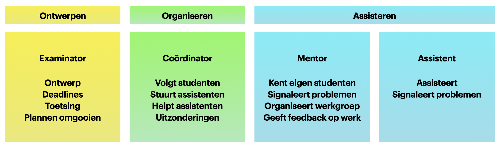
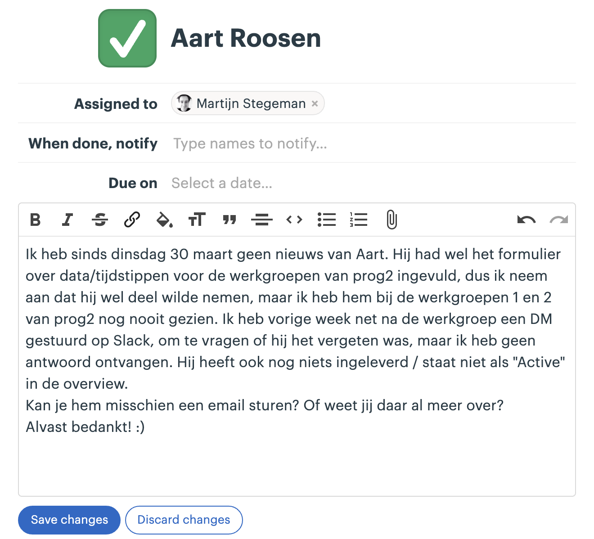

<header markdown="1">

# Assistentenhandboek Minor Programmeren

## <small>Deel A: Algemeen Herfst 2021</small>

<small>Deze versie is gemaakt in 2020--2021 door Martijn Stegeman. Gebaseerd op versie 2016 door Hella Haanstra en de instructies uit 2018 van Wouter Vrielink.</small>

</header>

Welkom bij de Minor Programmeren! We gaan dit studiejaar weer lesgeven op locatie, en dat betekent dat iedereen weer even moet wennen. Gelukkig hebben we als vanouds een vaste plek op onze faculteit, en daarbij gaan we ook nog assisteren vanuit een vast lokaal: de studenten komen naar ons toe in plaats van andersom! Daarover verderop meer.

Maar ondanks dat het misschien een beetje spannend is om weer naar onze eigen stek te komen zal het ongetwijfeld wel heel leuk worden. Zo zijn er de studenten die geen idee hebben wat ze kunnen verwachten en binnen een paar weken veel verder zijn dan ze durfden te denken. En studenten die veel hulp nodig hebben maar stukje bij beetje er doorheen buffelen. Allemaal zeer dankbaar voor de begeleiding en assistentie die we ze geven. En ja, dan zijn er de eigenwijzen die eigenlijk al kunnen programmeren en het beter weten. Maar we gaan elkaar helpen om de moeilijke gevallen op de beste manier toch wat te leren.

We hebben alle studenten van de minor al praktische informatie gestuurd die misschien ook leuk is om te lezen. Zie daarvoor <https://welkom.mprog.nl/>. Eerstejaars informatiekunde en kunstmatige intelligentie worden juist last-minute helemaal voorgelicht over hoe het er aan toe gaat.

Voor jou als assistent is deze handleiding met daarin allerlei pratkische informatie en tips over hoe je je werk aanpakt. Zorg ervoor dat je de handleiding een paar keer gelezen hebt en kijk er vooral nog even naar als je voor het eerst gaat nakijken of een werkgroep geven. En veel plezier en succes!

💁 Tip: praat regelmatig met ervaren assistenten en de docenten! We vinden het allemaal leuk om te helpen, niet alleen studenten maar ook collega’s.

# 0 What's new

Voor assistenten die er vorig jaar bij waren, maar ook voor studenten die nieuw komen assisteren.

- De invulling van **Programmeerplatforms** is geheel nieuw. Studenten maken vanaf nu kennis met allerlei technologieën en technieken die ze als developer nodig hebben: uitgebreidere UNIX-kennis, databases, dataverwerking in Python en natuurlijk git en Markdown.

- Alle **assistentie** is gecentraliseerd bij de "balie" in lokaal A1.24. Studenten maken bij voorkeur een afspraak, maar voor kleine vragen kunnen ze ook binnenlopen. Eén assistent ontvangt steeds de studenten die hulp nodig hebben en verwijst ze naar de assistenten die helpen.

- De **lokalen** van de Minor fulltime en van IK/KI zijn daardoor meer voor "eigen gebruik" van de studenten. Aanwezigheid is nog steeds verplicht en dat is ook logisch i.v.m. de vele samenwerkopdrachten die in de cursus zitten. De docenten (niet assistenten) gaan regelmatig langs bij de lokalen.

- Het **curriculum** van Programmeren IK en Programmeren voor KI is nu hetzelfde; er is ook meer overlap met Programmeren 1. Beide eindigen ze met "Climate."

- De **code reviews** vinden nu altijd plaats tijdens de werkgroep. Voor alle werkgroepen is er een uitgebreid draaiboek met de onderdelen die besproken gaan worden (deel B van deze handleiding).

- Bij Programmeren 1 is er weer een **tentamen**, vergelijkbaar met het intermezzo uit de lente van 2021. Hierin gaan studenten met een aantal niet te ingewikkelde opdrachtjes aan de slag, waarbij ze zelf de oplossing van begin af aan moeten ontwerpen. Er zullen oefententamens en/of een oefendag zijn.

# 1 De Minor Programmeren

Het doel van de Minor Programmeren is om studenten die **geen** programmeerervaring hebben een **veilige** omgeving te bieden om te leren **programmeren**, om kennis te maken met ideeën uit de **informatica**, en om ervaring op te doen met **technieken** uit de software engineering.

Het programma is als volgt:

- **Programmeren 1**

  0. Scratch
  1. Mario/Cash
  2. Readability/Caesar
  3. Find
  {: start="0"}

- **Programmeren 2**

  4. Whodunit/Anonymize
  5. Speller
  6. DNA
  7. Hangman/Adventure
  {: start="4"}

- **Programmeerplatform**

  1. Databases
  2. Python in-depth
  3. Tabulaire data
  4. Markdown, git en UNIX
  {: start="8"}

- **Programmeerproject**: een nieuw platform leren aan de hand van een project

- **Programmeertheorie**: een project uit de heuristiekencatalogus, met teamwork

De meeste vakken kunnen naar keuze in fulltime of parttime gevolgd worden. Studenten maken deze keuze al bij de aanmelding. Alleen Programmeertheorie wordt uitsluitend in de 4-weekse periodes in januari en juni aangeboden en is dus voor alle studenten fulltime.

# 2 Wat is CS50?

CS50 is een cursus *Introduction to Computer Science* van Harvard[^2]. Bij de minor Programmeren splitsen we de cursus in twee delen waarvoor studenten zich afzonderlijk inschrijven: Programmeren 1 en Programmeren 2. Ook bieden we enkele vakken buiten de minor aan die op dit materiaal gebaseerd zijn. In deze handleiding gaan we voornamelijk in op de wijze van assisteren die voor deze vakken van belang is, omdat beginnende assistenten allereerst bij deze vakken aan de slag gaan.

- Programmeren 1 is een echte inleiding tot het programmeren, waar basisconcepten zoals loops, arrays en algoritmen voorbij komen. Er wordt geoefend met **problemen oplossen** en met de werking van een **programmeertaal** (C).

- Programmeren 2 behandelt de basis van **datastructuren** en **objectgeoriënteerd** programmeren. Eerst datastructuren "met de hand" opbouwen in C, en dan kijken hoe Python een heleboel kant-en-klaar aanbiedt.

- Daarnaast zijn er enkele aangepaste versies van de cursus die ingekort zijn, of waar het tweede deel vervangen is door andere Python-opdrachten (Programmeren Beta-gamma, Programmeren IK, Introductie in Programmeren).

De meeste studenten die onze vakken volgen hebben weinig tot geen ervaring met programmeren. Precies voor hen is CS50 ontworpen. Toch kan het niveau van studenten erg uiteen liggen, en daar moeten we rekening mee houden bij de begeleiding.

Studenten zullen verreweg de meeste tijd besteden aan het maken van grotere **programmeeropdrachten**. Elke cursusmodule bestaat uit enkele van deze opdrachten. Naast de opdrachten worden studenten geacht diverse **oefeningen** te maken. Het doel van de oefeningen is om studenten nadrukkelijk kennis te laten nemen van de basisconcepten van het programmeren. Deze concepten krijgen bij het maken van alleen grote opdrachten vaak minder aandacht.

Programmeren 1 heeft een tentamen, en daarnaast is er systematische plagiaatcontrole, voorlichting naar studenten en de eis om zichtbaar te maken dat men bezig is met de stof, bijvoorbeeld de oefeningen en deelname aan de werkgroepen.

# 3 Contact

Er zijn vier manieren waarop studenten actief betrokken worden bij de cursus: werkgroepen, practica, checkups en assistentie. Deze worden hier kort besproken. Over al deze onderwerpen staat uitleg voor studenten in de studiewijzer.

## 3.1 Werkgroepen

Werkgroepen worden georganiseerd door mentoren (zie volgende hoofdstuk). In de werkgroepen krijgen studenten de kans om samen de voortgang te bespreken, de oefeningen door te nemen, tips uit te wisselen over het aanpakken van problemen en medestudenten en mentor beter te leren kennen. Mentoren krijgen inhoud voor de werkgroepen aangereikt via een bijlage van deze handleiding.

## 3.2 Practica (alleen Fulltime en IK/KI)

Voor studenten is een werkplek gereserveerd gedurende de practicumuren. Bij Fulltime is er in principe voor elke student de hele week een plek. Bij IK/KI zijn er practicumuren geroosterd die verschillen per groep. Ze staan in Datanose.

🆕 Anders dan vorige jaren zijn we als team bijna niet aanwezig bij de practica. Het is allereerst een plek voor studenten om bij elkaar te komen, elkaar te helpen, en vooral ook om te werken aan de samenwerkopdrachten.

## 3.3 Checkups (alleen Fulltime)

Fulltimestudenten doen elke dag om 9:00 een checkup met hun mentorgroep, maar zonder de mentor. De bedoeling is om kort te reviewen hoe iedereen ervoor staat met de opdrachten en wat de plannen voor vandaag zijn. Dit is ook het moment waarop studenten weer even met elkaar kunnen afspreken, bijvoorbeeld om elkaar te helpen. Aanwezigheid kan niet gecontroleerd worden anders dan er regelmatig naar vragen. De mentor doet dit.

## 3.4 Assistentie

Elke student zou regelmatig hulp nodig moeten hebben tijdens het programmeren (maar niet teveel). Daarvoor komen studenten naar de programmeerbalie in lokaal A1.24.

# 4 Taakverdeling

Bij de uitvoering van de cursus zijn de verantwoordelijkheden verdeeld over de verschillende medewerkers. Als assistent heb je allereerst de verantwoordelijkheid om een aantal uur per week studenten uit de hele groep te **assisteren** met hun programmeeropdrachten. Daarnaast ben je voor een vaste groep studenten de **mentor**. Als mentor ben je het eerste aanspreekpunt voor de studenten in jouw groep. Het is daarom belangrijk dat je als mentor precies weet hoe de cursus in elkaar steekt en welke regels van toepassing zijn, voor zover die in de studiewijzer vermeld staan. Je leert de studenten uit je groep goed kennen en houdt nauwkeurig hun voortgang bij---zij melden bijvoorbeeld ziekte allereerst bij jou. Dit is bovendien de groep studenten van wie je het werk nakijkt.

De **coördinator** van een cursus werkt met de mentoren om de voortgang van alle studenten bij te houden. De coördinatie kan gedelegeerd zijn aan één of meer docenten of ervaren assistenten. De coördinator heeft toegang tot de resultaten en inzendingen van alle groepen, en kan zo de verschillen goed zien en makkelijk de lastigere gevallen vinden. Voor inlichtingen over studenten zal altijd de mentor worden geraadpleegd. De coördinator is ook degene die assistenten helpt om goed hun werk te kunnen doen en heeft wekelijks contact met ze. Zo wordt het nakijkwerk altijd even nagelopen voordat de coördinator dit publiceert, en zo nodig worden assistenten om aanpassingen gevraagd. Tot slot verzorgt de coördinator de wekelijkse plagiaatcheck en eventuele gesprekken met studenten hierover.

De **examinator** heeft het totaaloverzicht over hoe de cursus in elkaar zit en heeft de verantwoordelijkheid om te zorgen dat elke student de cursus goed kan doorlopen en daarvoor uiteindelijk een passend cijfer ontvangt. Ook kan de examinator studenten helpen die niet goed meekomen en tussentijds hun plannen willen omgooien. De examinator dient bovendien als contactpersoon voor studieadviseurs en examencommissie.

# 5 Mentoren

Mentoren krijgen een groep van 10--17 studenten (afhankelijk van de snelheid van de cursus) voor wie zij het eerste aanspreekpunt zijn. Hieronder een uitwerking van de verschillende verantwoordelijkheden.

## 5.1 Aanspreekpunt

Mentoren leren alle studenten uit hun mentorgroep goed kennen. Dat betekent dat ze na een paar weken het volgende weten over deze studenten:

- Eigen hoofdopleiding
- Programmeerervaring
- Comfort met programmeren, naar eigen gevoel
- Kan voldoende/altijd aanwezig zijn
- Werkt graag samen of niet
- Levert tijdig in
- Neemt goed deel aan de cursus en de werkgroepen

Hoewel mentoren de belangrijke details over hun studenten kennen, beperkt het contact met hun studenten zich wel tot zaken die van belang zijn voor het onderwijs.

Dat je je studenten goed kent maakt je ook het juiste aanspreekpunt voor de cursus. Dat betekent dat studenten zich al gauw bij jou zullen melden als ze een organisatorische vraag hebben waarvoor ze het antwoord niet kunnen vinden. Maar ook bij persoonlijke problemen zullen ze ongetwijfeld naar jou toe komen.

⚠️ Doe geen beloftes aan studenten over het verloop de cursus of regelingen anders dan wat er al letterlijk in de studiewijzer staat. Studenten zullen zeer vaak tussen neus en lippen door even "naar de bekende weg vragen". Ga daar niet op in en verwijs naar de juiste kanalen.

## 5.2 Doorverwijzen

Jij hoeft je als assistent niet bezig te houden met:

- plagiaat
- serieuze studieproblemen
- problemen op persoonlijk vlak

Komt een van deze dingen naar voren, verwijs dit altijd door naar de cursuscoördinator. Vraag de student **allereerst** om zelf een mail te sturen naar <help@mprog.nl>. Maar studenten vinden het vaak moeilijk om verdere hulp te vragen, dus de mentor moet het ook direct melden (via een Todo in Basecamp). Het is belangrijk dat wij vanaf de eerste vraag om hulp medeverantwoordelijkheid nemen en een student niet aan het lot overlaten.

Bij meer persoonlijke problemen proberen we altijd goed gebruik te maken van de faciliteiten van de universiteit, zoals studieadviseurs en studentendecanen. De examinator weet meer over de mogelijkheden en kan studenten verwijzen. De mentor hoeft dat niet zelf te doen, maar is vaak wel de eerste die de problemen signaleert.

Als we verwijzen naar de studieadviseur zorgen we altijd dat de student een duidelijke en concrete hulpvraag heeft. De studieadviseur is namelijk geen wondermiddel. Blijkt een student bijvoorbeeld heel weinig tijd te hebben, dan kunnen we de student vragen om een keuze te maken en te overwegen een vak te laten vallen. De studieadviseur kan vervolgens helpen bij het nemen van deze beslissing.

## 5.3 Signaleren

Mentoren zijn bij uitstek het aanspreekpunt voor klachten en voor grote frustraties die studenten opbouwen tijdens het programmeren. Dit kan naar boven komen tijdens de werkgroepen (en we vragen er ook actief naar). Dat is geen probleem! Zie het niet als een persoonlijke aanval, maar als een noodzakelijke uitlaatklep. Ga er vooral niet in mee, en ga ook zeker niet in de verdediging. Het belangrijkste is dat studenten het kunnen uiten.

## 5.4 Groepsvorming

De belangrijkste elementen voor groepsvorming zitten in de structuur van de cursus: studenten worden geacht samen te werken voor bepaalde opdrachten én de code reviews moeten steeds binnen de mentorgroep gedaan worden. Als mentor kun je bovendien bijdragen door te zorgen dat elke student tijdens de werkgroep aan de beurt komt en zich zo een klein beetje presenteert aan de rest (sommige studenten vermijden dit een beetje!).

## 5.5 Werkgroepen organiseren

De werkgroepen zijn een plek om kennis te maken met je studenten, maar vooral om de studenten te helpen elkaar te leren kennen. Er zijn twee hoofdonderwerpen voor de werkgroepen:

- Je hebt een belangrijke rol bij de **planning van het samenwerken**. Voor de samenwerkopdrachten hebben ze een partner nodig die ze in principe zelf kiezen. Voor de code reviews zorg jij voor elke week voor een roulerend schema.

- De werkgroep is de plek waar de **feedback** en de **oefeningen** belangrijk worden gemaakt. Jij zorgt dat studenten van elkaars feedback kunnen leren door een aantal belangrijke patronen aan te stippen. En je bespreekt enkele van de gedane oefeningen (die bovendien vooraf zijn ingeleverd).

In de bijlage vind je de onderwerpen per werkgroep.

## 5.5 Communicatie

Omdat we nog niet zeker weten dat onze studenten altijd 100% aanwezig kunnen zijn, gebruiken de mentoren **Slack** om hun studenten te informeren, om ziekmeldingen te ontvangen en om ze met elkaar te kunnen laten communiceren buiten de groep om.

Maar: mentoren zullen *niet* veel beschikbaar zijn via Slack. Dit wordt in de studiewijzer verteld en jij gaat dit als mentor zelf ook bij de eerste werkgroep duidelijk maken. Coördinatoren zijn zelfs helemaal niet in de Slack te vinden.

Ga als mentor ook niet in een Whatsapp zitten die studenten aanmaken. Geef duidelijk aan dat ze jou alleen via Slack kunnen bereiken en tijdens de werkgroep, en de docenten alleen via e-mail of tijdens een spreekuur. Zo zorg je er zelf voor dat je niet continu bezig hoeft te zijn met je mentorrol.

⚠️ In verband met de normale privacyregels moet je de contactgegevens en zelf-aangemaakte Slack verwijderen na afloop van de cursus.

⚠️ Stuur geen mails naar je studenten via Datanose, omdat hierin niet altijd de goede mailadressen staan. Gebruik Slack voor afstemming met je studenten.

# 6 Assisteren

Elke student zou regelmatig hulp nodig moeten hebben tijdens het programmeren (maar niet teveel). 🆕 Deze assistentie wordt volledig op locatie georganiseerd vanuit lokaal A1.24. Studenten kunnen op twee manieren hulp inschakelen:

- Zij kunnen via onze website een tijd reserveren om hulp te krijgen. Ze geven aan over welke opdracht het gaat en of ze eventueel de docent zouden willen spreken. Op de aangegeven tijd melden ze zich bij lokaal A1.24, waar één assistent (de "greeter") ze ontvangt en zorgt dat ze snel en door de juiste persoon geholpen worden (op enig moment kunnen er 1--5 assistenten aanwezig zijn).

- Zij kunnen ook zomaar binnenlopen binnen de openingstijden om te kijken of er nog een plekje is. Dit is vooral als ze ergens technisch mee vastzitten (installatie, configuratie, gebruik van de IDE). De assistent die de ontvangst doet kijkt of er nog genoeg ruimte is en beslist of wachten zin heeft. Deze assistent kan met snelle vragen ook zelf even helpen.

🆕 Het hands-systeem wordt dus <u>niet</u> gebruikt. Wel wordt elk contact met een student geregistreerd waarbij een kleine status-update wordt gegeven.

⚠️ Als veel studenten afwezig moeten zijn in verband met verkoudheidsklachten zal er ook meer op afstand geassisteerd moeten worden. We streven er naar wél de assistenten altijd vanuit A1.24 te laten werken. We gaan in de eerste weken merken hoe we er mee omgaan als een <u>assistent</u> door verkoudheidsklachten niet mag komen.

<!-- - Vragen plaatsen op het online forum **Ed** kan op elk moment. Medestudenten worden geacht deze vragen zoveel mogelijk te beantwoorden. Waar dat niet lukt zullen assistenten reageren. Het is echter moeilijk om als beginner een goede vraag schriftelijk in te dienen. Dat betekent dat een vraagsteller soms uitgenodigd moet worden voor mondelinge assistentie om tot wederzijds begrip te komen. 

- Elke werkdag tussen 13 en 17 uur is er **video-assistentie**. Studenten geven via de cursuswebsite aan dat ze hulp nodig hebben. Assistenten die aan het werk zijn krijgen inzage in de lijst met vraagstellers en werken deze op volgorde af. Zodra ze aan de beurt zijn krijgen studenten een linkje naar de videochat van de assistent die hen gaat helpen.

- Voor meer technische hulp (bijvoorbeeld met installatie) is het mogelijk een losse afspraak te maken. Hiervoor is een planningstool op **Calendly** beschikbaar. -->

## 6.1 Informatievergaring

Het contact dat we met studenten hebben is een belangrijke bron van informatie over hun persoonlijke welzijn, op basis waarvan we hulp kunnen bieden. We horen via hen bovendien hoe het met de cursus gaat, op basis waarvan we meer algemene aanpassingen kunnen doen. Assistenten moeten daarom deze informatie (vermoedens/feiten) delen met hun coördinator via Basecamp.

Het is essentieel dat je deze signaleringsfunctie vervult. In paragraaf 6.5 staat hoe je verslag legt na het helpen van een student en hoe je meer urgente zaken via Basecamp kunt delen.

## 6.2 Regel één van assisteren is...

Het doel van assisteren is om studenten **verder te helpen** tijdens het leren. Dat betekent dat we altijd afwegingen moeten maken hoe we iemand helpen; een afweging gebaseerd op hoe de student ervoor staat, of de vraag goed gesteld is, of er nog genoeg tijd is tot de deadline.

Maar de belangrijkste regel is: **we geven het antwoord niet weg**. Dat antwoord kan verschillen: het kan een ontbrekende stap in het ontwerp zijn, het kan een regel code zijn of iets dat verkeerd staat. In plaats van studenten rechtstreeks vertellen wat ze moeten doen, moeten we ze helpen nadenken over wat hun volgende stap is. Welke aanwijzingen hebben ze om verder te komen?

> Maar het varieert wel! Blijkt de vraag in feite over het ontwerp van de oplossing te gaan, dan moet je iemand misschien helpen om een paar stappen terug te doen en de opdracht goed te lezen. Maar gaat de vraag over een technische issue, dan kun je ze misschien wat directer wijzen hoe ze hun probleem kunnen oplossen, bijvoorbeeld door een concrete foutmelding in Google te plakken. Tot slot kan het zijn dat je ziet dat een heel klein deeltje van de oplossing verkeerd is gekozen, of dat ze iets hebben gedaan dat helemaal niet in de cursus zit. Als dat moeilijk te vinden gaat zijn, dan moet je er misschien toch op wijzen.

Hou deze regel altijd in gedachten en maak een **bewuste keuze**. Je mag het ook best zeggen tegen studenten: "ik moet even nadenken hoe ik je het beste kan helpen zonder het antwoord weg te geven". Maar wel vriendelijk!

⚠️ Een consequentie van deze regel is dat we bij het assisteren nooit het toetsenbord van de student aanraken. Heb er vertrouwen in dat je student kán leren en dat het zelf doen de beste manier is om dit te bereiken. Ook je student moet dit vertrouwen krijgen. Is het echt noodzakelijk om even iets voor te doen? Pak dan bij voorkeur je eigen computer erbij. En zorg dat je student het daarna meteen zelf toepast in de eigen code.

## 6.3 Ken je opdrachten

Kijk de opdrachten en bijbehorende lecture notes altijd van te voren nog even door, zodat je goed voor de dag komt. Gebruik eventuele overgebleven tijd om opdrachten te lezen die je nog niet kent.

## 6.4 Soorten vragen

Tijdens het assisteren helpen we studenten op vijf gebieden:

1. probleemdecompositie
2. implementatie
3. procesondersteuning
4. vragen formuleren
5. debugging

Dat betekent dus dat het méér is dan alleen duidelijk gestelde vragen beantwoorden. Nog sterker, bijna geen enkele vraag tijdens het assisteren zal helemaal duidelijk geformuleerd zijn. Dat is ook waarom wij echt wat toe te voegen hebben!

Hieronder vind je de belangrijkste problemen en manieren om daar mee om te gaan.

### Probleem: Wat is de opdracht?

Waarschijnlijk zijn er, zeker in het begin van de cursus, veel vragen die eigenlijk gaan over wat er in de **opdracht** bedoeld wordt. Het is niet altijd makkelijk om een goed overzicht te krijgen van de opdracht. In de walkthrough-filmpjes geeft Brian meestal een mooie (grofmazige) decompositie voor het programma. Tijdens het helpen is het nuttig om te vragen of de student dat even wil opzoeken en dit samen nog even door te lopen.

In veel gevallen is het probleem van een student terug te leiden naar de analyse die een student heeft gedaan van het algoritme waar we naar op zoek zijn. Is er een verkeerde **aanname** gedaan, of is een formule toch niet helemaal **correct**, dan is het vaak nodig om extra voorbeelden (cases) te bedenken en uit te vogelen waar het verkeerd zit. Zorg dat je in dit geval de student vraagt om dat te doen en later nog eens terug te komen als het nodig is.

Vaak zul je merken dat een student **helemaal geen goede analyse** heeft gedaan. Help je student dan een deelprobleem te kiezen en dit te analyseren met hulp van enkele slim gekozen voorbeelden (geef zelf een voorbeeld en laat je student er ook eentje bijdragen).

### Probleem: Het overzicht kwijtgeraakt

Soms heeft je student echt geen **overzicht** meer ("ik weet niet waar ik moet beginnen"). Dan is het soms handig om de student naar het algoritmische deel van de opdracht te sturen, en later pas invoer/uitvoer goed te maken. Dit is een manier om het probleem kleiner te maken.

> _Hoe kun je beginnen bij het algoritmische deel? Bij Cash (Greedy) moet de gebruikersinvoer een float zijn, die vervolgens wordt omgezet naar een `int` vóórdat het algoritme ermee aan de slag gaat. Dat is van zichzelf al best moeilijk en is een groot deel van de opdracht. Maar dan moet het wisselgeld nog berekend worden. Oplossing: dat user input-deel vervangen door een `int input = 42;` waarin je het getal kunt aanpassen om te testen. Het geeft beginners vaak veel lucht als ze zo simpel kunnen beginnen met het moeilijkste deel._

Soms is het vooral **integratie** waar een student hulp bij nodig heeft. Er is een aardig uitgewerkt algoritme, maar het overzicht ontbreekt nog. Hoe koppel je de invoer aan het algoritme en hoe zorg je dat het programma het juiste resultaat uitvoert? Dat kan nog best lastig zijn. Dit is onderdeel van de implementatie. Ook hier is het nuttig om de decompositie uit het walkthrough-filmpje even terug te halen en uit te vogelen waar het probleem zit.

⚠️ Laat je student wel <u>zelf</u> het filmpje opzoeken op de website: dingen waarvan je verwacht dat studenten ze zelf doen laat je ze ook bij het assisteren zelf doen.

### Probleem: Een heuse bug

En natuurlijk zijn er veel situaties waarin er een echte **bug** in het programma zit. Het programma zelf heeft al min of meer de juiste vorm, maar er worden bijvoorbeeld variabelen hergebruikt waardoor het niet goed loopt. Dat is het moment dat je hardop gaat meedenken over debuggingtechnieken. Het is aan assistenten om de student deze vaardigheden aan te leren. Natuurlijk kijk je eerst of de student eigenlijk wel weet hoe het debuggen moet (misschien eerst maar eens checken of alle variabelen de juiste waarde hebben met behulp van `printf`?).

- Zorg dat je weet hoe de debugger in de CS50 IDE werkt! Vraag een mede-assistent of je coördinator als nodig.
- Kijk voor een opfrisser in *Think Python*[^3], hoofdstuk 20: Debugging.

<!-- ## 6.2 Ed

Ed is een vraag- en antwoordforum waar onze studenten in een afgeschermde omgeving vragen kunnen stellen. Er zijn aparte afdelingen voor CS50, voor Scientific Programming, voor Web Development en voor Programmeertheorie. Alle studenten van de cursussen die op CS50 gebaseerd zijn zitten bijvoorbeeld wel bij elkaar.

> Studenten moeten worden uitgenodigd voor Ed. Mocht iemand niet zijn uitgenodigd dan kunnen ze direct zelf de helpdesk mailen via <help@mprog.nl>. Nadat ze hun spam-folder gecontroleerd hebben natuurlijk!

Binnen elke cursus op Ed zijn er **categorieën** voor opdrachten, zoals bijvoorbeeld "Mario". Zo zijn de opdrachten per vraag te filteren.

Helemaal onderaan de pagina van een vraag kan een student, of een assistent, een **antwoord** plaatsen. Is dat het definitieve antwoord, dan is dat zichtbaar met een groen vinkje. Tijdens het plaatsen van een antwoord kun je kiezen voor "Mark as answered", maar je kunt later ook op het vinkje klikken om dit om te zetten.

Een vraag schriftelijk stellen is best moeilijk, dus we moeten studenten helpen om dat op een goede manier te doen. Daarvoor is de makkelijkste manier om een follow-upvraag te stellen via het knopje "**Comment**" (of zoals hierboven "Reply").

Let dus op dat er een verschil is tussen Comments en Answers. Je kunt de één ook naar de andere omzetten. Het is dan ook de taak van de assistenten om de vragen goed te **modereren**. Comments en Answers omzetten, opvolgvragen stellen, een vraag als "Answered" markeren. Als dat allemaal goed gebeurt is het makkelijk om de vragen snel te beantwoorden en bijvoorbeeld de nog niet beantwoorde vragen te vinden.

Prive maken berichten:

 -->

## 6.5 Algemene gesprekstechnieken[^1]

Begrijp dat veel studenten niet gewend zijn om een probleem op te lossen waar meer dan één antwoord voor is. Het proces om dit te leren kan zeer frustrerend voor ze zijn. Neem dus hun frustraties gewoon aan en probeer ze naar een concrete vraag te leiden. 'Waar ben je met de opdracht? Wat heb je al gedaan?'

Geef duidelijke verbale signalen af tijdens het assisteren, met name in de fase waarin jij vragen begint te stellen aan de student om het probleem beter te begrijpen of kennis te checken.

- Kies voor 'heel goed antwoord!', 'zeker weten' of 'precies', etc. Probeer een droog 'ok', 'hmm', 'uhu' te vermijden. Ook als de student een langdradig antwoord geeft, kun je het relevante deel nog een keer samenvatten en herhalen, en daarbij expliciet maken dat dat het goede deel van het antwoord is. Zo help je de gedachten stroomlijnen.

- Probeer expliciete verbanden te leggen als die niet door je student genoemd worden. Als deze bijvoorbeeld een for-loop voorstelt bij `mario.c`, antwoord iets in de trant van: 'heel goed, je ziet dat er een vorm van herhaling nodig is'.

- Probeer voort te bouwen op het antwoord van de student. Als het antwoord dat de student geeft niet helemaal naar wens is, probeer het dan mee te nemen in je volgende vraag. Iets als 'je hebt goed gezien dat je de string moet opdelen, wat is de volgende stap?' werkt motiverend.

- Probeer 'ja, maar...' te vermijden. Dit is een logische reactie op een (deels) fout antwoord, maar kan heel erg demotiverend werken. Probeer duidelijk te scheiden wat goed was en wat fout was en benoem dat neutraal. Je kunt ook de vraag stellen 'hoe ben je daarop gekomen?'; overigens ook als een opmerking van een student wél goed is!

Doe tot slot geen aannames over wat studenten al weten. Een student kan soms met zelfs het makkelijkste probleem in de knel zitten en dan is het erg frustrerend als er wordt gezegd 'probeer eens wat harder na te denken'. Toets wat de student wel weet en bouw daarop voort. Stel open vragen en laat de student zelf het probleem oplossen, probeer niets voor te zeggen!

## 6.6 Werkwijze programmeerbalie

Vanaf dit jaar komen studenten altijd naar de programmeerbalie in A1.24 als ze hulp nodig hebben (tenzij we gedeeltelijk op afstand werken).

### Afspraak maken

Studenten kunnen een hulpvraag indienen via de website. Ze hebben deze keuze uit een beperkt aantal opties: sommige zijn "zo snel mogelijk," hopelijk binnen 2 uur. Andere opties zijn juist morgen. Het is niet mogelijk om ver vooraf een afspraak te maken.

### Ontvangst

Op de afgesproken tijd komen studenten naar lokaal A1.24. De docent of assistent die "greeter" is zal ze daar ontvangen en zonodig even in de wacht houden. Deze persoon kan kleinere problemen ook zelf afhandelen, maar alléén als dat niet teveel afleidt van het organiseren van de korte wachtrij.

### Assisteren

Zodra het kan wordt een student naar één van de assistenten gestuurd. 

Als assistent zoek je meteen even de gegevens van deze student op, in de juiste cursuswebsite. Vraag dus naar naam en cursus. Op de site vind je notities die bij het eerdere assisteren zijn achtergelaten. Misschien heeft de vorige assistent wel expliciet gevraagd aan de student om iets te doen. Dubbelcheck dat!

**Situatie: geen concrete vraag.** Juist bij de balie is er een kans dat een student nog geen concrete vraag heeft. Help de student in dat geval de vraag formuleren zoals hierboven uitgelegd (6.3). Sommige studenten kunnen ook nog wat meer tijd gebruiken om zelf wat langer naar hun programma te kijken voordat je ze echt gaat helpen; probeer zelf een juiste inschatting van de situatie te maken om vervolgens te besluiten de student direct te helpen, of een duwtje in de goede richting te geven en later nog even terug te laten komen.

**Situatie: code is onleesbaar.** Is de indentatie totaal niet op orde? Vraag de student dan altijd eerst om deze netjes te maken. Niet alleen omdat het "hoort" maar omdat verkeerde indentatie het probleem heel moeilijk vindbaar kan maken. Met een beetje mazzel is het daarna zo gevonden (studenten in deze fase hebben overigens vaak ook nog een probleem met de analyse van hun probleem, dus kijk daar ook naar). In principe blijft de student bij jou zodat je eventueel kan inspringen 🙃, maar als het echt lang duurt laat je de student straks terugkomen.

### Tijdsbesteding

- Probeer zo'n 10 minuten per student aan te houden. Een absoluut maximum is 20 minuten, in noodgevallen. Duurt het langer, haal dan de greeter erbij om te zorgen dat de planning niet in de soep loopt.

- Als je een student later wil laten terugkomen, meld dit dan ook bij de greeter. Vertel bovendien duidelijk tegen de student wat je verwachting is en hoe deze zich weer kan melden.

- Kom je er zelf niet uit? Dan kun je natuurlijk altijd even vragen of één van je mede-assistenten of de greeter mee kan kijken. Het is expliciet de bedoeling dat onervaren assistenten zonodig hulp inschakelen en zich zo verder ontwikkelen.

### Verslag

Na het helpen schrijf je op de website een korte samenvatting van het uiteindelijke probleem en hoe je geholpen hebt. Noteer het ook als je de student hebt gevraagd iets te doen en later terug te komen. De volgende assistent kan deze informatie ook lezen en daar op inspelen. Zie hieronder voor een voorbeeld:

{: width="60%" style="margin: 0 auto; display: block;"}

## 6.7 Technische helpdesk

Studenten die vastzitten met hun computer, misschien zelfs hardwareproblemen hebben, of die een zeer concrete technische (debug?)vraag hebben, kunnen ook een afspraak inplannen via de balie. Als ze voor de technische helpdesk kiezen dan kunnen ze terecht op een moment dat een assistent werkt die veel ervaring heeft met installatie, configuratie en bediening. Het doel is om studenten zo snel mogelijk weer op weg te krijgen en niet te lang te laten hangen bij problemen waar ze weinig van kunnen leren.

# 7 Nakijken

Het eindcijfer voor deze cursus wordt bepaald door het totaal aantal punten voor de modules. De puntenscore leidt tot een cijfer tussen 1 en 10. De Scratch-module word "afgetekend" en telt niet mee in het eindcijfer. Bovendien zijn er met name bij Programmeren 1/IK/KI extra opdrachten die nog een punt kunnen opleveren. In de studiewijzer staan alle componenten van het eindcijfer opgesomd.

## 7.1 Deadlines

Voor alle studenten geldt dat de verwachting is dat ze het tempo van het schema bijhouden. Bij fulltime moeten ze dat ook echt dagelijks volgen, bij parttime en IK/KI kunnen ze natuurlijk binnen de week iets schuiven, bijvoorbeeld in verband met deadlines van een ander vak.

Maar studenten hebben daarnaast, voor de individuele programmeeropdrachten, twee harde deadlines:

- De deadline voor de **implementatie**, waarbij studenten de opdrachten "af" moeten hebben, ofwel `check50` moet tevreden zijn. De uitwerkingen hoeven expliciet niet netjes te zijn!

- De deadline voor de **verbeterde uitwerking**, waarbij studenten de opdrachten netjes verbeterd moeten inleveren.

De deadlines staan in de studiewijzer en zijn doorgaans aan het eind van de week.

Voordat studenten hun verbeterde versies inleveren moeten ze een code review doen met een andere student. Dit gebeurt tijdens de werkgroep. Ook nemen ze natuurlijk de feedback van eerdere weken mee in hun verbeteringen.

De **nakijkdeadline** (voor jou!) is afhankelijk van de deadlines voor studenten, en valt op een vaste dag, tenzij anders afgesproken. Zodra jij klaar bent wordt het nakijkwerk nog nagelopen door de coördinator, jij doet op verzoek eventuele aanpassingen, en vervolgens wordt alles gepubliceerd.

## 7.2 Uitzonderingen

🆕 Als mentor kun je <u>geen</u> verder uitstel geven op de deadlines. Deze deadlines zijn namelijk ruim gepland; zo is de wekelijkse deadline altijd iets ná de grote opdracht van de week, en de code reviews na het weekend.

Maar: mocht een student ziek zijn tijdens de werkgroep dan zorg jij er wel voor dat de review zo spoedig mogelijk wordt gedaan (ter plaatse of online). De deadline voor de verbeterde versie kan dan uitgesteld worden, maar je maakt hier wel een harde afspraak over. Deze afspraak vermeld je bij de student op de website.

> **Procedure uitzondering code review:**
> 
> 1. Zoek contact, check of code review snel gedaan kan worden
> 2. Stem ook af met de code review-partner: online review of ter plekke?
> 3. Spreek een duidelijke deadline af (paar dagen later)
> 4. Voer afspraak in op de website bij beide studenten, met reden

Het kan ook zijn dat een student een keer niks inlevert en ook niks meldt. Daarom is het belangrijk dat je vlak na de deadline even in je overzicht kijkt of er nog iets ontbreekt. Neem dan **proactief** contact op met je studenten om te zorgen dat dit snel gecorrigeerd wordt---en ga er in eerste instantie vanuit dat het een foutje is.

## 7.3 Becijfering

Alle modules kunnen 1--6 punten opleveren. Voor elke module zijn diverse aspecten aangegeven op basis waarvan de punten voornamelijk (maar niet uitsluitend) worden bepaald. De aspecten gaan over codekwaliteit, en specifiek over **leesbaarheid** en **begrijpelijkheid**. De schaal is als volgt:

6. uitzonderlijk goede kwaliteit op basis van een doordacht ontwerp
5. zeer goede kwaliteit, beperkt ruimte voor verbetering
4. degelijke kwaliteit op de genoemde aspecten, met ruimte voor verbetering
3. net voldoende aandacht voor de genoemde aspecten, erg veel ruimte voor verbetering
2. enige zichtbare aandacht voor een beperkt aantal aspecten
1. onvoldoende zichtbare aandacht voor de kwaliteitsaspecten
{: start="6" reversed=""}

In deze schaal zitten een aantal patronen verborgen die het---met enige ervaring---makkelijker moeten maken om een inzending te beoordelen. Het is moeilijk om deze patronen tijdens de cursus al helemaal aan de studenten over te brengen, maar zorg dat jij ze helemaal begrijpt en toepast.

- 1--4 punten gaat specifiek over de *genoemde* aspecten, dus de aspecten die deze week expliciet aan de opdracht gekoppeld zijn. Bij 4 punten is de student redelijkerwijs waar we iedereen willen hebben. Onze aandacht bij het nakijken gaat dus vooral naar deze studenten uit! Zij moeten snel beter worden.

- Bij 3 punten zie je dat iemand wel de aspecten heeft "afgewerkt" maar niet heel consequent. Er is dus wel bewijs dat de student het kán, maar deze doet het niet overal. Het wordt 4 punten als de aspecten wel grotendeels consequent ("degelijk") zijn toegepast.

- Bij 3--4 punten (en hoger) wordt gevraagd dat naar álle aspecten is gekeken. Het is dus niet zo dat studenten de aspecten onderling kunnen compenseren! Zijn er hele goede namen maar staat er geen commentaar, dan is het meteen 2 punten.

- 5--6 punten gaat over goede kwaliteit, zonder de aspecten te noemen. Studenten die hoog willen scoren moeten dus namelijk zelf aan de bak met uitzoeken hoe je goede code schrijft---alleen de regels volgen voldoet dan niet meer. Dit is om te voorkomen dat eigenwijze studenten hacker-achtige code schrijven en hoge cijfers opeisen omdat het formeel aan de aspecten voldoet.

- 6 punten heeft het ook over *ontwerp*, waarvoor duidelijk moet blijken dat een student een heel eigen idee voor de code heeft bedacht en dit mooi leesbaar heeft uitgewerkt; maar pas op, iets als "extra functies gebruiken" kan heel mooi worden, maar dan moeten ze goed gekozen zijn en de namen ook goed zijn, dus veel ideeën zijn niet zomaar goed!

Het is absoluut niet de bedoeling dat studenten **meerdere keren** minder dan 3 punten halen. Daarom heeft tijdige feedback de hoogste prioriteit, en specifiek feedback die de student helpt volgende keer direct 3 of 4 punten te halen. We nemen hier als docenten en assistenten dus medeverantwoordelijkheid!

Als de opdrachten **niet af** zijn (volgens `check50`), dan kan er in feite nog niet nagekeken worden en zal er uiteindelijk ook geen eindcijfer komen. We gebruiken eventueel het invoeren van 0 punten om dit te signaleren, maar de mentor zou op dat moment, samen met de coördinator, al actie moeten hebben ondernomen (student achterna zitten en hulp bieden).

Er wordt een extra punt toegekend als een student de **extra opdracht** van de module werkend heeft ingeleverd. Dit punt wordt in principe automatisch toegekend op basis van een automatische `check50`. Je geeft dus ook geen formele feedback op deze opdracht, maar zorg dat je er wel iets van aandacht aan besteed bij de student die het goed doet!

## 7.4 Plagiaat

Bovenaan de opdrachten staat duidelijk bij welke wordt samengewerkt en bij welke niet. Bovendien is het helemaal prima als studenten elkaar helpen. Het allerbelangrijkste is dat de student die geholpen wordt nooit voorbeeldcode te zien krijgt of zodanig wordt geïnstrueerd dat de code gedeeltelijk door een ander bedacht is.

Het kan gebeuren dat tijdens het nakijken blijkt dat een opdracht verdacht veel op de opdracht van een andere student lijkt, of oplossingen bevat die ook op het internet te vinden zijn. Indien je serieus plagiaat vermoedt, meld dit altijd bij de coördinator. Ter aanvulling wordt na elke inleverronde een plagiaatcheck gedaan.

Scoort iemand hoog wat betreft plagiaat dan neemt de coördinator contact op met deze student. Het gesprek bestaat uit voorlichting en een aanbod om te helpen met de beste aanpak om het vak te halen. Van belang is dat studenten zich niet teveel zorgen maken hierover. Aantoonbaar plagiaat moet natuurlijk naar de examencommissie, maar ons doel is vooral om te zorgen dat studenten de cursus alsnog zelfstandig halen.

> **Vragen** over plagiaat moeten studenten zelf stellen aan de coördinator, via <help@mprog.nl>. Een persoonlijk gesprek is altijd mogelijk.

## 7.5 Feedback

Voor elke student schrijf je feedback naar aanleiding van het ingeleverde werk. Je inhoudelijke feedback is redelijk kort, to the point en bevat goede suggesties voor acties om te ondernemen. De feedback bevat geen spelfouten en is geschreven in (korte) volzinnen. Heb je hulp nodig bij het formuleren van prettige feedback? Bespreek het met je coördinator!

Bekijk eens deze feedback waarin vijf feedbackpunten zijn verwerkt. Dit is een voorbeeld van feedback zoals we die graag zien.

> **greedy**
> 
> - De uitwerking is erg netjes! De comments zijn veel begrijpelijker zo. ⓵
> - Probeer volgende keer de variabelenamen zoals `amt` volledig uit te schrijven. ⓶
> - Comments zijn to the point, heel goed. ⓷
> 
> **mario**
> 
> - Oef, erg veel functies! Zo wordt het programma, dat
> in feite heel eenvoudig is, erg ingewikkeld om te lezen. Kijk volgende
> keer maar eens of je de gulden middenweg kunt vinden. ⓸
> - De verdere aspecten zijn mooi gedaan, net als bij greedy. ⓹
{: style="background-color: #eee; padding: 0.5rem 1rem;"}

Hieronder vind je een aantal aanwijzingen over het schrijven van feedback. Op enkele plekken verwijzen we weer naar de feedbackpunten uit het voorbeeld.

### Toon

Vergeet niet ook positieve feedback te geven! Feedback wordt veel prettiger verwerkt als ook de positieve punten worden aangestipt. De makkelijkste manier om dit te doen is om vóór het nakijken even de uitlegpagina's over de aspecten van de week door te nemen en daar niet alleen de negatieve maar ook de positieve voorbeelden uit te halen. Zie als voorbeeld de eerste zin van ⓵, en ook ⓷ en ⓹. En ondanks deze grote hoeveelheid positieve opmerkingen staan er toch ook twee zeer concrete verbeterpunten in de feedback.

Daarnaast moet je een scherp oog ontwikkelen voor de goede intenties van studenten. Er zijn maar weinig studenten die expres geen aandacht besteden aan het schrijven van nette code. Veel vaker zijn studenten helemaal overladen met informatie en het gewoon vergeten. Of ze waren zo blij dat het eindelijk werkte... En er zijn studenten die gewoon helemaal los gaan met een nieuwe techniek en de balans uit het oog verliezen. Zie bij ⓸ hoe de feedback niet te negatief probeert te zijn, maar wel duidelijk een probleem signaleert.

En dan nog een paar concrete dingen om te vermijden:

- Stel geen (retorische) vragen in de feedback. Deze kunnen zonder uitzondering met een naar toontje gelezen worden, zelfs als je het goed bedoelt. Dat is zonde. Veel retorische vragen beginnen met "Waarom...".

- Gebruik om dezelfde reden nooit woorden zoals "jammer", "helaas", "slecht". Je bent er om studenten te helpen, niet om ze terecht te wijzen.

- Vermijd het woord "echter" en andere overmatig formele woorden.

### Inhoud

Inhoudelijk maak je de feedback zo concreet mogelijk door problemen te benoemen, tips te geven en de leesbaarheid en begrijpelijkheid code te analyseren.

- Probeer bij de feedback het niveau van de individuele student mee te nemen. Vergelijk de student met zichzelf: in hoeverre heeft de student de feedback van voorgaande weken toegepast en is de kwaliteit vooruitgegaan? Zie ⓵. Dit zou van zichzelf weinig tot geen invloed moeten hebben op het cijfer maar is goed om te benoemen.

- Geef altijd feedback op het product, of het proces, maar niet op de student zelf. Dit is ook al kort aangestipt bij gesprekstechnieken voor assisteren. Directe feedback op de persoon is veel minder effectief dan feedback op het proces[^5] omdat dit vaak zeer negatief geïnterpreteerd wordt. Geef daarom in de feedback goed aan waarom iets goed of minder goed is (zie ⓸, en ook het gebruik van "de uitwerking" bij ⓵).

- Bied simpele tips aan, zodat de student de volgende keer de knelpunten beter kan aanpakken. Zie ⓶ en ⓸. Deze kunnen soms wat "obvious" overkomen maar dat geeft wel houvast.

### Opmaak

De feedback moet lichtjes opgemaakt worden met behulp van Markdown. Hier een voorbeeld van hoe het zou moeten:

      **greedy**⏎
      ⏎
      - De uitwerking is erg netjes!⏎
      - Probeer volgende keer de variabelenamen zoals `amt` volledig uit te schrijven.⏎
      - Comments zijn to the point, heel goed.⏎
      ⏎
      **mario**⏎
      ⏎
      - Oef, erg veel functies! Zo wordt het programma, dat
        in feite heel eenvoudig is, erg ingewikkeld om te lezen. Kijk volgende
        keer maar eens of je de gulden middenweg kunt vinden.⏎
      - De verdere aspecten zijn mooi gedaan, zoals bij greedy.⏎

Bovenstaande zal omgezet worden naar HTML en netjes leesbaar zijn voor studenten. Let op dat er geen Markdown-kopjes gebruikt worden (deze worden veel te groot) en dat er witregels boven de lijstjes staan.

## 7.6 Algemeen

Het is handig om na het nakijken nog even terug te gaan naar de eerste paar inzendingen die je hebt nagekeken, omdat je dan misschien weer nieuwe dingen gezien hebt. Het is daarnaast handig om steeds dezelfde opdracht in een rijtje na te kijken. Kijk wel steeds in een andere volgorde na, omdat je meestal de laatste iets strenger beoordeelt.

In het begin zal het nakijken wat moeizaam gaan, maar probeer maximaal 10--15 minuten per student te spenderen.  Nadat je wat ervaring hebt opgebouwd zul je zien dat het nakijken sneller gaat (vraag anders om hulp!). Probeer in je geschreven feedback niet in herhaling te vallen, maar verwijs kort naar je eerdere feedback. Daarbij telt ook mee dat sommige van de studenten de feedback nauwelijks lezen terwijl andere studenten juist veel uit je commentaar halen. Pas je feedback dus ook aan op basis van wat studenten ermee doen en de vragen die je er over krijgt.

Dat gezegd hebbende, als je merkt dat een student de feedback negeert, spreek hem of haar hier dan even persoonlijk op aan (bijvoorbeeld een kort gesprekje na de werkgroep). Grote kans dat ze het vergeten zijn of niet doorhebben hoe veel ze eraan kunnen hebben.

Tot slot: je schrijft uiteindelijk op je eigen manier. Daarom is het zinvol om tijdens de werkgroepen af en toe expliciet jouw manier van feedback geven wat meer toe te lichten. Dan kun je ook noemen dat studenten altijd mogen vragen als ze iets niet begrijpen of niet weten hoe ze het beter kunnen maken.

# 8 Interne communicatie

Voor bijna al het contact tussen docenten en assistenten is er [Basecamp](https://www.basecamp.com/).

- Zorg dat je tijdens het je ingeroosterde assistentie-uren eventuele Basecamp-berichten direct ontvangt met een notification.
- Zorg dat je regelmatig Basecamp-berichten naleest, zeker rondom (nakijk-)deadlines. Dit zodat onduidelijke situaties snel verhelderd kunnen worden.

Je moet Basecamp als volgt configureren:

- Stel je notifications in op "Only notify me when someone pings or @mentions me".
- Als je de Basecamp app niet op je telefoon hebt, zet dan "Send me e-mail notifications" aan.
- Meer info: <https://3.basecamp-help.com/article/86-how-notifications-work>

Je ontvangt een uitnodiging zodra je bij een vak aan de slag gaat. Je krijgt dan toegang tot een aantal kanalen:

- *Programming Lab HQ* is het team waar alle medewerkers aan deelnemen. Je kunt hier onderwijsgerelateerde linkjes delen via de chat (Campfire) of een bericht schrijven. Dit kanaal is low-traffic. Gaat het over de cursus zelf, dan moet je hier niet zijn.
- *CS50x Herfst 2021* is het algemene team voor iedereen die aan een CS50-gerelateerde cursus werkt. Topics gaan over de **inhoud** van de cursus, bijvoorbeeld als je toelichting nodig hebt bij een bepaalde opdracht.
- En dan zijn er vakspecifieke projecten waarvoor je uitgenodigd wordt: *Fulltime Herfst 2021*, *Parttime Herfst 2021*, *ProgIK 2021*, *ProgKI 2021*. Hier kun je alles kwijt over specifieke studenten en je kunt afstemmen met mede-assistenten en docenten.

Het kan zijn dat je post wordt verplaatst als je deze beter op een andere plek had kunnen plaatsen (kwestie van oefenen!).

## Asynchroon

De gedachte achter Basecamp is om zoveel mogelijk **asynchrone** communicatie te stimuleren terwijl snelle heen-en-weer communicatie wel mogelijk blijft. Hier is hoe zij dat intern beschrijven[^6]:

> *It's far better for everyone's concentration and sanity if you collaborate as though most things will get an answer eventually, but not necessarily right this second. Your first choice of action should be to post a message, a todo, or a document about what you need to explain or need to know. Then others can read it on their schedule, when the natural lulls of the day allow it, rather than being interrupted right in their peak flow time.*
>
> *Don't take that as gospel, though. Some times you really DO need to tightly collaborate with someone for an extended period of time, and that's fine. We have pings, hangouts, screensharing, or even in-person collaboration for when nothing else will do. (But most of the time something else will).*

Hoe gebruik je de verschillende tools?

- Heb je een Grote Vraag of een kleine vraag, wil je iets ter discussie stellen, heb je een mooi voorstel: schrijf dan een **Message** in één van de Basecamp-projecten.
- Heb je informatie over een student, een concreet verzoek om iets gedaan te krijgen, dan moet iemand anders iets voor jou doen. Schroom dan niet en maak direct een **Todo** aan.
- Heb je een urgent en concreet probleem, bijvoorbeeld tijdens het assisteren, dan kan iedereen je potentieel helpen en schrijf je dus een bericht in de **Campfire** van jouw cursus.
- Heb je zelf persoonlijke problemen die je liever niet aan de grote klok hangt? **Ping** dan je coördinator of Martijn en spreek even af.
- Heb je gewoon zin om wat te delen met de rest van het team (bijvoorbeeld een meme) dan kun je dat ook doen in de **Campfire** van jouw cursus.

Met name het aanmaken van **Todo**'s voor iemand anders is misschien even wennen. Maar maak geen Todo aan zonder deze te assignen! Het is juist de manier om te zorgen dat studenten niet vergeten worden maar tegelijk iedereen de dingen op een zelfgekozen moment kan afhandelen. Zit er een deadline aan, stel deze dan ook in!

Berichten over **specifieke studenten** plaats je ook als Todo in het project van jouw vak. Het is belangrijk dat we deze informatie delen met het team. Andere assistenten en docenten gaan hier natuurlijk discreet mee om, en kunnen bovendien aanvullen met hun eigen kennis over de student. Eventuele details over ziektes en omstandigheden e.d. kun je weglaten als dat een beter idee is.

{: width="60%" style="margin: 0 auto; display: block;"}

<!-- ## Zoom instellen

Zoom account
Maak een Zoom account aan op zoom.us/signup. Doe dit met een @uva.nl e-mailadres, dat is bij voorkeur je medewerkersemail en anders je studentenemail. De UvA heeft namelijk een contract met Zoom en zo heb je geen last van Zoom's 40 minuten grens bij gratis accounts.

Zoom instellen
Stel het volgende in op zoom.us/profile/setting:

Host video: ON
Participant video: ON
Join before host: OFF
Use Personal Meeting ID (PMI) when scheduling a meeting: OFF
Require a password when scheduling new meetings: OFF
Mute participants upon entry: OFF
Upcoming meeting reminder: ON
Screen sharing: ON
Who can share: All Participants

Zoom bij het assisteren

Bij het assisteren delen studenten hun Zoom meeting bij het stellen van een vraag. Voor jou is het dus een kwestie van in de meeting springen. Mocht de meeting niet meer bestaan, of is de student niet aanwezig, zet dan de vraag uit de queue.

Zoom bij de werkgroepen

Voor de werkgroepen kan je het beste zelf een meeting aanmaken. Dat doe je hier: zoom.us/meeting/schedule. Daarna kan je de link van de meeting delen met je studenten via Slack. -->

## Afsluiting

Hou er rekening mee dat je account weer verwijderd wordt zodra je een paar weken niet meer assisteert. Dit is om de privacyrichtlijnen goed aan te houden.

# 9 Checklist opstarten

Je moet diverse accounts aanmaken om goed te kunnen assisteren. Volg de stappen hieronder en zorg vooral dat je alle diensten goed **uittest**, om latere stress te voorkomen! (Bijvoorbeeld als het delen van een Zoom-linkje niet blijkt te werken.)

- Voor **Basecamp** krijg je een uitnodiging via het bekende e-mailadres (je kunt dit dus niet zelf starten). Maak direct dit account aan.

<!-- - Ook voor **Ed** wordt je uitgenodigd. Heb je geen uitnodiging terwijl de cursus gestart is? Post dan een to-do op Basecamp voor je coördinator met een verzoek om een nieuwe uitnodiging. -->

- Maak een account voor **Programmeren 1** via <https://prog121.mprog.nl/> of **Programmeren IK** via <https://progik21.mprog.nl/>. Kies fulltime of parttime afhankelijk van waar je assisteert. Na enige tijd krijg je extra rechten, zodat je de gegevens van je studenten kunt inzien en hun werk kunt nakijken.

    (Let op: deze websites worden kort voor de start hernoemd naar prog1.mprog.nl en progik.mprog.nl. Je registratie blijft dan gewoon behouden.)

- Lees de **studiewijzer** van je eerste vak heel nauwkeurig door zodat je deze niet tegenspreekt. Mis je iets in de studiewijzer of heb je een vraag? Post dan meteen een vraag in Basecamp bij het team "CS50x Herfst 2021".

- Maak zelf een nieuwe **Slack** aan via <https://slack.com/get-started#/create>. Deze gebruik je voor informeel contact met je mentorgroep. Ken je Slack nog niet? Kijk dan bij [Slack 101](https://slack.com/intl/en-nl/resources/slack-101/set-up-slack) voor de basis. Zorg in verband met privacy dat de groep alleen voor hen is en dat deze weer wordt verwijderd zodra je geen mentor van deze groep meer bent.

- Maak een account voor **Zoom** via <https://zoom.us/signup>. Dit is een videodienst die het beste werkt met een eigen applicatie. Deze gebruik je (soms) voor assisteren.

# Eindnoten

[^1]: A. Hadwin and S. Wilcox, "A handbook for teaching assistants," Instructional Development Centre Queens University, Kingston, Ontario, K7L 3N6, 1999--2000.
[^2]: D. J. Malan, [cs50.harvard.edu](https://cs50.harvard.edu/), 2007--2021.
[^3]: A. B. Downey, Think Python. O'Reilly Media, 2012.
[^5]: J. Hattie and H. Timperley, "The power of feedback," Review of Educational Research, vol. 77, no. 1, pp. 81--112, 2007.
[^6]: https://basecamp.com/handbook/10-how-we-work
