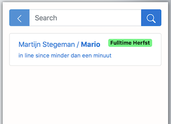

---
---

<meta http-equiv="Content-type" content="text/html;charset=UTF-8">

# Assistentenhandboek Programmeren NS

### Martijn Stegeman & Ivo van Vulpen versie Herfst 2022

<small>Gebaseerd op versie 2016 door Hella Haanstra en de instructies uit 2018 van Wouter Vrielink.</small>

# Voordat je begint

Lees allereerst even goed de [Studiewijzer](https://progns.proglab.nl/syllabus) die een groot deel van de regels van het vak vastlegt.

# 1 Assisteren

Zoals uitgelegd in de studiewijzer kunnen studenten om assistentie vragen via het <u>Hands</u>-systeem. We gaan er daarbij vanuit dat jij en de studenten aanwezig zijn in hetzelfde lokaal.

## 1.1 Regel één van assisteren is...

Het doel van assisteren is om studenten **verder te helpen** tijdens het leren. Dat betekent dat we altijd afwegingen moeten maken hoe we iemand helpen; een afweging gebaseerd op hoe de student ervoor staat, of de vraag goed gesteld is, of er nog genoeg tijd is tot de deadline.

Maar de belangrijkste regel is: **we geven het antwoord niet weg**. Dat antwoord kan verschillen: het kan een ontbrekende stap in het stappenplan zijn, het kan een regel code zijn of iets dat verkeerd staat. In plaats van studenten rechtstreeks vertellen wat ze moeten doen, moeten we ze helpen nadenken over wat hun volgende stap is.

> Maar het varieert wel! Blijkt de vraag in feite over het ontwerp van de oplossing te gaan, dan moet je iemand misschien helpen om een paar stappen terug te doen in het stappenplan. Maar gaat de vraag over een technische issue, dan kun je ze misschien wat directer wijzen hoe ze hun probleem kunnen oplossen, bijvoorbeeld door een foutmelding in Google te plakken. Tot slot kan het zijn dat je ziet dat een heel klein deeltje van de oplossing verkeerd is gekozen. Als dat moeilijk te vinden gaat zijn, dan moet je er misschien toch op wijzen.

Hou deze regel altijd in gedachten en maak een **bewuste keuze**. Je mag het ook best zeggen tegen studenten: "ik moet even nadenken hoe ik je het beste kan helpen zonder het antwoord weg te geven". Maar wel vriendelijk!

## 1.2 Soorten vragen

Tijdens het assisteren helpen we studenten op vijf gebieden:

1. probleemdecompositie (fase 1 van het stappenplan)
2. implementatie (fase 2 van het stappenplan)
3. procesondersteuning (het stappenplan zelf)
4. vragen formuleren
5. debugging

Waarschijnlijk zijn er, zeker in het begin van de cursus, veel vragen die eigenlijk gaan over wat er in de **opdracht** bedoeld wordt. Het is niet altijd makkelijk om een goed overzicht te krijgen van de opdracht. In de walkthrough-filmpjes geeft Zamyla meestal een mooie decompositie voor het programma. Tijdens het helpen is het nuttig om te vragen of de student dat even wil opzoeken en dit samen nog even door te lopen. Meestal is het handig om de student naar het algoritmische deel van de opdracht te sturen, en later pas invoer/uitvoer goed te maken.

> Hoe kun je de invoer overslaan? Bij Greedy moet de gebruikersinvoer een float zijn, die vervolgens wordt omgezet naar een `int` vóórdat het algoritme ermee aan de slag gaat. Dus dat hele deel kun je vervangen door een `int input = 42;` waarin je het getal kunt aanpassen om te testen. Het geeft beginners vaak veel lucht als ze zo simpel kunnen beginnen met het moeilijkste deel.

In veel gevallen is het probleem van een student terug te leiden naar de eerste fase van het stappenplan. Hier wordt een ontwerp gemaakt van het algoritme waar we naar op zoek zijn. Dit wordt gedaan met zelfverzonnen voorbeelden en een nauwkeurige studie van hoe uit een invoer de uitvoer wordt "berekend". Is er een verkeerde **aanname** gedaan, of is een formule toch niet helemaal **correct**, dan is het vaak nodig om extra voorbeelden te bedenken en uit te vogelen waar het verkeerd zit. Zorg dat je in dit geval de student vraagt om dat te doen en later nog eens af te spreken.

Soms is het vooral **integratie** waar een student hulp bij nodig heeft. Er is een aardig uitgewerkt algoritme, maar het overzicht ontbreekt nog. Hoe koppel je de invoer aan het algoritme en hoe zorg je dat het programma het juiste resultaat uitvoert? Dat kan nog best lastig zijn. Dit is onderdeel van de implementatie. Ook hier is het nuttig om de decompositie uit het walkthrough-filmpje even terug te halen (laat de student dit zelf opzoeken) en uit te vogelen waar het probleem zit.

En natuurlijk zijn er veel situaties waarin er een echte **bug** in het programma zit. Het programma zelf heeft al min of meer de juiste vorm, maar er worden bijvoorbeeld variabelen hergebruikt waardoor het niet goed loopt. Dat is het moment dat je hardop gaat meedenken over debuggingtechnieken. Het is aan assistenten om de student deze vaardigheden aan te leren. Natuurlijk kijk je eerst of de student eigenlijk wel weet hoe het debuggen moet (misschien eerst maar eens checken of alle variabelen de juiste waarde hebben met behulp van `printf`?).

> - Kijk voor een opfrisser in *Think Python*[^3], hoofdstuk 20: Debugging.

## 1.3 Assistentie

Studenten kunnen een hulpvraag indienen via de website. Deze "hands" verschijnen voor de assistenten in een lijst op de website. Je kiest de bovenste student om deze te "claimen", waarna de student een popup ontvangt. **Op dat moment "roep" je de naam van de student zodat deze bij jou kan komen.** Zodra je bij een student geweest bent en de vraag beantwoord hebt, teken je het verzoek af. Je komt dan weer in de lijst en kunt een nieuwe student uitkiezen om te helpen.

Er is een kans dat een student nog geen concrete vraag heeft. Help de student in dat geval de vraag formuleren zoals hierboven uitgelegd (1.2). Sommige studenten kunnen ook nog wat meer tijd gebruiken om **zelf** wat langer naar hun programma te kijken; probeer zelf een juiste inschatting van de situatie te maken om vervolgens te besluiten de student direct te helpen, of een duwtje in de goede richting te geven en later nog even terug te komen.

Ziet de code er **slecht** uit? Is de indentatie totaal niet op orde? Vraag de student dan altijd eerst om deze netjes te maken. Niet alleen omdat het "hoort" maar omdat verkeerde indentatie het probleem heel moeilijk vindbaar kan maken. Met een beetje mazzel is het daarna zo gevonden (studenten in deze fase hebben overigens vaak ook nog een probleem met de formulering hun oplossing, dus kijk daar ook naar).

Het is mogelijk om een student **terug in de lijst** te plaatsen. Het kan namelijk zijn dat je deze student zelf korte tijd later nog even wil spreken. Vertel dit duidelijk tegen de student. Deze kan namelijk in de tussentijd ook geen andere vraag indienen! Vergeet het zelf ook niet.

Probeer gemiddeld 5--10 minuten per student aan te houden. Een absoluut maximum is 15 minuten. Duurt het langer, neem dan contact op met de coördinator om te kijken wat de beste aanpak is.

## 1.4 Laptophelpdesk

Studenten die vastzitten met hun computer, misschien zelfs hardwareproblemen hebben, kunnen contact opnemen met de laptophelpdesk. Er zijn enkele momenten per week beschikbaar. De assistenten die gewend zijn om voor dit soort problemen een snelle diagnose te stellen kunnen hierbij helpen. Het doel is om studenten zo snel mogelijk weer op weg te krijgen en niet te lang te laten hangen bij problemen waar ze weinig van kunnen leren.

Locatie laptophelpdesk: B1.19A (op eerste verdieping, dicht bij de centrale hal). Beschikbaar in de eerste weken tussen 10 en 16 uur.

## 1.5 Nazorg

Als het niet lukt een student goed te helpen en je hebt het idee dat deze student in de problemen gaat komen of blijven, dan meld je dit door het aanmaken van een Todo in Basecamp. De coördinator kan dan kijken of er extra hulp geboden moet worden, of bijvoorbeeld een verwijzing naar de studieadviseur. Geef voldoende informatie om het probleem te begrijpen.

{:width="50%"}

## 1.6 Algemene gesprekstechnieken[^1]

- Complimenteer de student op een duidelijke manier. Kies voor 'heel goed antwoord!', 'zeker weten' of 'precies', etc. Probeer een droog 'ok', 'hmm', 'uhu' te vermijden. Ook als de student een langdradig antwoord geeft, probeer iets te vinden waar je positieve feedback op kunt geven.

- Laat je feedback betrekken op het specifieke antwoord van de student. Als de student bijvoorbeeld een for-loop voorstelt bij `mario.c`, antwoord iets in de trant van: 'inderdaad, er is een vorm van herhaling nodig'.

- Probeer voort te bouwen op het antwoord van de student. Als het antwoord dat de student geeft niet helemaal naar wens is, probeer het dan mee te nemen in je volgende vraag. Iets als 'je hebt goed gezien dat je de String moet opdelen, wat is de volgende stap?' werkt motiverend.

- Probeer 'ja, maar...' te vermijden. Dit is een logische reactie op een (deels) fout antwoord, maar kan heel erg demotiverend werken. Probeer duidelijk te scheiden wat goed was en wat fout was en beloon daar ook naar. Je kunt ook de vraag stellen 'hoe ben je daarop gekomen?'; dit is tevens een vraag die je kunt stellen als het antwoord wel goed is!

- Doe geen aannames over wat studenten al weten. Een student kan soms met zelfs het makkelijkste probleem in de knel zitten en dan is het erg frustrerend als er wordt gezegd 'probeer eens wat harder na te denken'. Toets wat de student wel weet en bouw daarop voort. Stel open vragen en laat de student zelf het probleem oplossen, probeer niets voor te zeggen!

# 2 Nakijken

Het cijfer voor elke module is het gemiddelde van de **correctheid** en de **kwaliteit** van de ingeleverde oplossingen. De correctheid wordt automatisch beoordeeld, en de kwaliteit wordt bepaald door de assistenten.

## 2.1 Becijfering

Alle modules kunnen 1--6 punten opleveren. Voor elke module zijn diverse aspecten aangegeven op basis waarvan de punten voornamelijk (maar niet uitsluitend) worden bepaald. De aspecten gaan over codekwaliteit, en specifiek over **leesbaarheid** en **begrijpelijkheid**. De schaal is als volgt:

6. uitzonderlijk goede kwaliteit op basis van een doordacht ontwerp
5. zeer goede kwaliteit, beperkt ruimte voor verbetering
4. degelijke kwaliteit op de genoemde aspecten, met ruimte voor verbetering
3. net voldoende aandacht voor de genoemde aspecten, erg veel ruimte voor verbetering
2. enige zichtbare aandacht voor een beperkt aantal aspecten
1. onvoldoende zichtbare aandacht voor de kwaliteitsaspecten
{: start="6" reversed=""}

In deze schaal zitten een aantal patronen verborgen die het---met enige ervaring---makkelijker moeten maken om een inzending te beoordelen.

- 1--4 punten gaat specifiek over de *genoemde* aspecten, dus de aspecten die deze week expliciet aan de opdracht gekoppeld zijn. Bij 4 punten is de student redelijkerwijs waar we iedereen willen hebben. Onze aandacht bij het nakijken gaat dus vooral naar deze studenten uit! Zij moeten snel beter worden.

- Bij 3 punten zie je dat iemand wel de aspecten heeft "afgewerkt" maar niet heel consequent. Er is dus wel bewijs dat de student het kán, maar deze doet het niet overal. Bij 4 punten gaat het om een consequente ("degelijke") toepassing.

- Bij 3--4 punten (en hoger) wordt gevraagd dat naar álle aspecten is gekeken. Het is dus niet zo dat studenten de aspecten onderling kunnen compenseren! Zijn er hele goede namen maar staat er geen commentaar, dan is het meteen 2 punten.

- 5--6 punten gaat over goede kwaliteit, zonder de aspecten te noemen. Studenten die hoog willen scoren moeten dus namelijk zelf aan de bak met uitzoeken hoe je goede code schrijft---alleen de regels volgen voldoet dan niet meer. Dit is om te voorkomen dat eigenwijze studenten hacker-achtige code schrijven en hoge cijfers opeisen omdat het formeel aan de aspecten voldoet.

- 6 punten heeft het ook over *ontwerp*, waarvoor duidelijk moet blijken dat een student een heel eigen idee voor de code heeft bedacht en dit mooi leesbaar heeft uitgewerkt; maar pas op, iets als "extra functies gebruiken" kan heel mooi worden, maar dan moeten ze goed gekozen zijn en de namen ook goed zijn, dus veel ideeën zijn niet zomaar goed!

Het is absoluut niet de bedoeling dat studenten **meerdere keren** minder dan 3 punten halen. Daarom heeft tijdige feedback de absolute prioriteit, en specifiek feedback die de student helpt volgende keer direct 3 of 4 punten te halen.

Er wordt een extra punt toegekend als een student de **extra opdracht** van de module werkend heeft ingeleverd.

## 2.2 Plagiaat

Het is helemaal prima als studenten elkaar helpen. Het allerbelangrijkste is dat de student die geholpen wordt nooit voorbeeldcode te zien krijgt of zodanig wordt geïnstrueerd dat de code gedeeltelijk door een ander bedacht is.

Het kan gebeuren dat tijdens het nakijken blijkt dat een opdracht verdacht veel op de opdracht van een andere student lijkt, of oplossingen bevat die ook op het internet te vinden zijn. Indien je serieus plagiaat vermoedt, meld dit altijd bij de coördinator. Ter aanvulling wordt na elke inleverronde een plagiaatcheck gedaan.

Scoort iemand hoog wat betreft plagiaat dan neemt de coördinator contact op met deze student. Het gesprek bestaat uit voorlichting en een aanbod om te helpen met de beste aanpak om het vak te halen. Van belang is dat studenten zich niet teveel zorgen maken hierover. Aantoonbaar plagiaat moet natuurlijk naar de examencommissie, maar ons doel is vooral om te zorgen dat studenten de cursus alsnog zelfstandig halen.

> **Vragen** over plagiaat moeten studenten zelf stellen aan de coördinator, via <progns@mprog.nl>. Een persoonlijk gesprek is altijd mogelijk.

## 2.3 Feedback

Voor elke student schrijf je feedback naar aanleiding van het ingeleverde werk. Je inhoudelijke feedback is redelijk kort, to the point en bevat goede suggesties voor acties om te ondernemen. De feedback bevat geen spelfouten en is geschreven in (korte) volzinnen.

### Toon

Vergeet niet ook positieve feedback te geven! Feedback wordt veel prettiger verwerkt als ook de positieve punten worden aangestipt. De makkelijkste manier om dit te doen is om te beginnen met de aspecten van de week en daar niet alleen de negatieve maar ook de positieve voorbeelden uit te halen. Daarnaast moet je een scherp oog ontwikkelen voor de goede intenties van studenten.

### Inhoud

- Probeer bij de feedback het niveau van de individuele student mee te nemen. Vergelijk de student met zichzelf: in hoeverre heeft de student de feedback van voorgaande weken toegepast en is hij of zij vooruitgegaan? Dit zou echter weinig tot geen invloed moeten hebben op het cijfer.

- Geef altijd feedback op het product, of het proces, maar niet op de student. Dit is ook al kort aangestipt bij gesprekstechnieken voor assisteren. Directe feedback op de persoon is veel minder effectief dan feedback op het proces[^5]. Geef daarom in de feedback goed aan waarom iets goed of minder goed is. Bied daarbij tips aan, zodat de student de volgende keer de knelpunten beter kan aanpakken. Tijdens de wekelijkse bespreking van de feedback tijdens werkgroepen kun je de feedback wat meer toelichten.

- Stel geen (retorische) vragen in de feedback. Deze kunnen zonder uitzondering met een naar toontje gelezen worden, zelfs als je het goed bedoelt. Dat is zonde.

- Gebruik om dezelfde reden nooit woorden zoals "jammer", "helaas", "slecht". Je bent er om studenten te helpen, niet om ze terecht te wijzen.

### Opmaak

De feedback moet lichtjes opgemaakt worden met behulp van Markdown. Hier een voorbeeld van hoe het zou moeten:

      **greedy**
      
      - De uitwerking is erg netjes!
      - Probeer volgende keer de variabelenamen zoals `amt` volledig uit te schrijven.
      - Comments zijn to the point, heel goed.
      
      **mario**
      
      - Oef, erg veel functies! Zo wordt het programma, dat
        in feite heel eenvoudig is, erg ingewikkeld om te lezen. Kijk volgende
        keer maar eens of je de gulden middenweg kunt vinden.
      - De verdere aspecten zijn mooi gedaan, zoals bij greedy.

Bovenstaande zal omgezet worden naar HTML en netjes leesbaar zijn voor studenten. Let op dat er geen Markdown-kopjes gebruikt worden (deze worden veel te groot) en dat er lege regels rondom de lijstjes staan.

## 2.4 Algemeen

Het is handig om na het nakijken nog even terug te gaan naar de eerste paar inzendingen die je hebt nagekeken, omdat je dan misschien weer nieuwe dingen gezien hebt. Het is daarnaast handig om steeds dezelfde opdracht in een rijtje na te kijken (bijvoorbeeld eerst alle `recover.c`). Kijk ook steeds in een andere volgorde na, omdat je meestal de laatste iets strenger beoordeelt.

In het begin zal het nakijken wat moeizaam gaan, maar probeer maximaal 10--15 minuten per student te spenderen.  Nadat je wat ervaring hebt opgebouwd zul je zien dat het nakijken sneller gaat. Probeer in je geschreven feedback niet in herhaling te vallen, maar verwijs kort naar je eerdere feedback. Daarbij telt ook mee dat sommige van de studenten de feedback nauwelijks lezen terwijl andere studenten juist veel uit je commentaar halen. Kies op basis daarvan dus ook je prioriteiten en verspil niet al te veel tijd aan ongelezen feedback.

Dat gezegd hebbende, als je merkt dat een student de feedback negeert, spreek hem of haar hier dan op aan (bijvoorbeeld een kort gesprekje via Slack). Grote kans dat ze het vergeten zijn of niet doorhebben hoe veel ze eraan kunnen hebben.

# 3 Interne communicatie

Voor bijna al het onderling contact is er [Basecamp](https://www.basecamp.com/). Je ontvangt een uitnodiging zodra je bij een vak aan de slag gaat. Je krijgt dan toegang tot het kanaal **ProgNS 2022**.

Lees het volgende even goed door zodra je de uitnodiging hebt gekregen, zodat je weet wat waar staat en moet staan.

## Asynchroon

De gedachte achter Basecamp is om zoveel mogelijk **asynchrone** communicatie te stimuleren terwijl snelle heen-en-weer communicatie wel mogelijk blijft. Hier is hoe zij dat intern beschrijven[^6]:

> *It's far better for everyone's concentration and sanity if you collaborate as though most things will get an answer eventually, but not necessarily right this second. Your first choice of action should be to post a message, a todo, or a document about what you need to explain or need to know. Then others can read it on their schedule, when the natural lulls of the day allow it, rather than being interrupted right in their peak flow time.*
>
> *Don't take that as gospel, though. Some times you really DO need to tightly collaborate with someone for an extended period of time, and that's fine. We have pings, hangouts, screensharing, or even in-person collaboration for when nothing else will do. (But most of the time something else will).*

Hoe gebruik je de verschillende tools?

- Heb je een Grote Vraag of een kleine vraag, wil je iets ter discussie stellen, heb je een mooi voorstel: schrijf dan een **Message** in één van de Basecamp-projecten.
- Heb je informatie over een student, maak dan direct een **Todo** aan of vul een bestaande Todo aan met nieuwe informatie.
- Heb je een urgent en concreet probleem, bijvoorbeeld tijdens het assisteren, dan kan iedereen je potentieel helpen en schrijf je dus een bericht in de **Campfire** van jouw cursus.
- Heb je zelf persoonlijke problemen die je liever niet aan de grote klok hangt? **Mail** dan naar Ivo en Martijn.

Berichten over **specifieke studenten** plaats je dus als Todo in het project van jouw vak. Het is belangrijk dat we deze informatie delen met het team. Andere assistenten en docenten gaan hier natuurlijk discreet mee om, en kunnen bovendien aanvullen met hun eigen kennis over de student. Eventuele details over ziektes en omstandigheden e.d. kun je weglaten.

{: width="50%"}

## Afsluiting

Let op dat je account weer verwijderd wordt zodra je een paar weken niet meer assisteert. Dit is om de privacyrichtlijnen goed aan te houden.

# 4 Checklist opstarten

Je moet diverse accounts aanmaken om goed te kunnen assisteren. Volg de stappen hieronder en zorg vooral dat je alle diensten goed **uittest**, om latere stress te voorkomen! (Bijvoorbeeld als het delen van een Zoom-linkje niet blijkt te werken.)

- Voor **Basecamp** krijg je een uitnodiging via het bekende e-mailadres (je kunt dit dus niet zelf starten). Maak direct dit account aan.

- Maak een account voor **Programmeren NS** via <https://progns.proglab.nl/>. Na enige tijd krijg je extra rechten, zodat je de gegevens van je studenten kunt inzien en hun werk kunt nakijken.

- Lees de **studiewijzer** van je vak heel nauwkeurig door zodat je deze niet tegenspreekt. Mis je iets in de studiewijzer of heb je een vraag? Post dan meteen een vraag in Basecamp.

# Noten

[^1]: A. Hadwin and S. Wilcox, "A handbook for teaching assistants," Instructional Development Centre Queens University, Kingston, Ontario, K7L 3N6, 1999--2000.
[^2]: D. J. Malan, "CS50," 2016.
[^3]: A. B. Downey, Think Python. O'Reilly Media, 2012.
[^5]: J. Hattie and H. Timperley, "The power of feedback," Review of Educational Research, vol. 77, no. 1, pp. 81--112, 2007.
[^6]: https://basecamp.com/handbook/10-how-we-work
